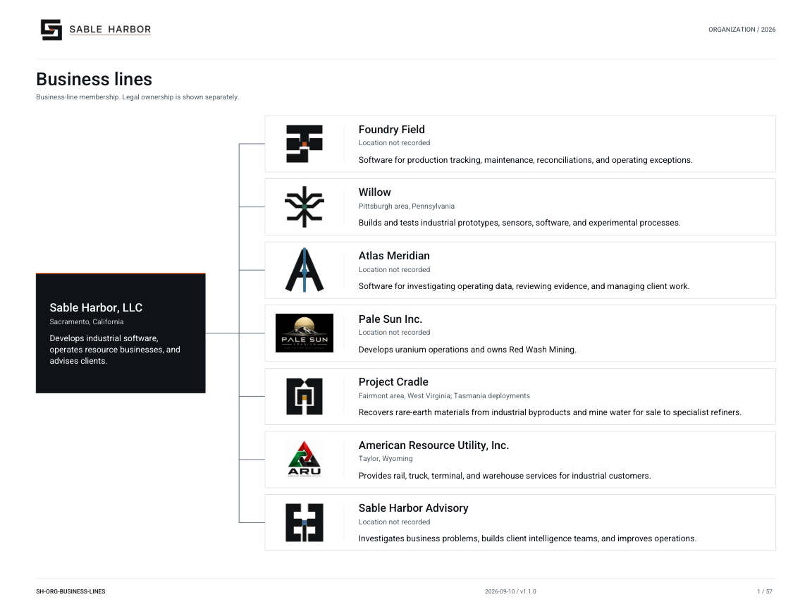

# SABLE HARBOR

[Facility and floor-plan atlas](geospatial/facilities/README.md) · [Interactive index](geospatial/maps/index.html) · [Individual plans](geospatial/maps/facilities/ARTIFACT_INDEX.md)

Sable Harbor is the canonical synthetic enterprise and reusable business-world sandbox for mining, natural resources, industrial systems, enterprise software, assurance, analytics, finance, governance, security, incident response, and professional training.

**Industrial case:** the [Pale Sun / Red Wash / ARU / BS&T package](industrial/README.md) implements the selected corporate, transaction, operating and financial successor. Its [decision record](docs/canon/INDUSTRIAL_CLOSEOUT_2026-09-05.md) controls this scope; its retrospective case cutoff is September 5, 2026.

**Start here:** the [controlled document index](docs/CONTROLLED_DOCUMENT_INDEX.md) distinguishes current authority, generated representations, and preserved historical records.

**Maintainers:** use [MAINTAINERS.md](MAINTAINERS.md) before changing canon, generated publications, structured catalogs, validators, public-repository boundaries, or issue state.

**September 6 canon closeout:** the [decision addendum](docs/canon/DECISION_REGISTER_ADDENDUM_2026-09-06_CLOSEOUT.md) records Daniel Mercer, Semaphore precedence, planned Alexandria AR/VR integration, and the [repository delivery and packaging policy](docs/governance/REPOSITORY_DELIVERY_AND_PACKAGING_POLICY.md). Accepted repository canon is the source of truth. A conversation, attachment, draft branch, or completion statement alone is not delivery or closeout. The [validation record](docs/internal/validation/CANON_CLOSEOUT_2026-09-06.md) and PR #97 provide implementation evidence.

It is modeled as a company that would exist independently of any audit or benchmark. Business activity creates systems, records, contracts, communications, controls, mistakes, experiments, operating consequences, and evidence; downstream tools consume deliberate, versioned exports.

## Canon states

- **LOCKED** — accepted canon;
- **PROVISIONAL** — accepted working direction pending exact implementation;
- **OPEN** — unresolved and not to be silently invented;
- **SUPERSEDED** — preserved prior direction that no longer controls current canon.

## Advisory and Atlas

The [September 8 closeout](docs/canon/ADVISORY_ATLAS_MERIDIAN_CLOSEOUT_2026-09-08.md) establishes the three-practice Advisory common bench, independent matter/value governance, serving-J2 boundary and separate Atlas product organization. The [September 9 Tier 1 addendum](docs/canon/DECISION_REGISTER_ADDENDUM_2026-09-09_ADVISORY_TIER1.md) completes the operating architecture: professional hierarchy, carry design, quality tiers, pricing policy, conflict/IP doctrine, matter delivery system and Atlas Meridian commercial product model. The integrated [Advisory Firm Manual](docs/advisory/SABLE_HARBOR_ADVISORY_FIRM_MANUAL_2026-09-09.md) is the executive operating artifact; detailed standards remain controlling where more specific.

Atlas Meridian is a product organization and commercial/professional platform, not an Advisory staffing pool. Atlas Product owns platform engineering, roadmap, reliability and product support; Advisory owns professional judgment, matter outcomes, intervention and transfer. Foundry Field remains the flagship deployable operational product.

See the [Advisory source package](docs/advisory/README.md).

## Current business development

The [September 11 CCF prebuild audit](docs/internal/development/CCF_PREBUILD_REPOSITORY_AUDIT_2026-09-11.md) inventories accepted controls and implementations, identifies remaining development, and proposes a dependency-ordered build. It is an assessment and backlog, not new canon or an effectiveness conclusion.

The [seven business dossiers](docs/business-lines/README.md) connect operating lifecycles, finances, authority, evidence and remaining decisions. Use the [source crosswalk](docs/business-lines/CURRENT_SOURCE_CROSSWALK.md) to distinguish current canon from preserved financial releases and the [interface record](docs/business-lines/BUSINESS_FINANCE_AND_ALEXANDRIA_INTERFACES.md) for business/Finance access boundaries.

The [business-driven financial successor](enterprise/business/README.md) supplies causal 2027–2031 Core economics, preserved industrial integration and seven reconciled unit evidence packages. See the [release index](docs/releases/BUSINESS_FINANCE_RELEASES.md).

The [third-party services and internal operations assessment](docs/internal/development/THIRD_PARTY_SERVICES_ASSESSMENT_2026-09-09.md) and [build plan / voice-session agenda](docs/internal/development/THIRD_PARTY_SERVICES_BUILD_PLAN_2026-09-09.md) are OPEN planning proposals. They prepare sourcing, staffing, facilities and financial decisions; they do not establish selected vendors or deployed capabilities.

## Current canon

The controlling September 2–9, 2026 layer begins with [`SABLE_HARBOR_CORPORATE_LORE_CANON_v0.3.1.md`](docs/canon/SABLE_HARBOR_CORPORATE_LORE_CANON_v0.3.1.md) and is extended by the [decision register](docs/canon/DECISION_REGISTER_v0.3.1.md), [September 3 decision-register addendum](docs/canon/DECISION_REGISTER_ADDENDUM_2026-09-03.md), [corporate headquarters closeout](docs/canon/CORPORATE_HEADQUARTERS_CLOSEOUT_2026-09-03.md), [September 5 Red Wash addendum](docs/canon/DECISION_REGISTER_ADDENDUM_2026-09-05_RED_WASH.md), [Red Wash transaction and operating record](docs/canon/RED_WASH_TRANSACTION_OPERATING_RECORD_2026-09-05.md), [September 6 canon closeout addendum](docs/canon/DECISION_REGISTER_ADDENDUM_2026-09-06_CLOSEOUT.md), [September 8 Advisory/Atlas closeout](docs/canon/ADVISORY_ATLAS_MERIDIAN_CLOSEOUT_2026-09-08.md), [September 9 Advisory Tier 1 addendum](docs/canon/DECISION_REGISTER_ADDENDUM_2026-09-09_ADVISORY_TIER1.md), [v0.3 changelog](docs/canon/CANON_CHANGELOG_v0.3.md), [Red Wash closeout changelog](docs/canon/RED_WASH_CLOSEOUT_CHANGELOG_2026-09-05.md), and [board approval records](docs/governance/board-records/README.md).

The September 6 addendum supersedes conflicting older statements within its stated scope; the [current board doctrine is v1.0.1](docs/governance/BOARD_AND_CAPITAL_GOVERNANCE_v1.0.1.md). The finance-pinned v0.3 lore, base decision register, and board v1.0.0 source retain their original bytes for reproducible historical finance builds. Their superseded surname statements do not override the accepted Daniel Mercer decision.

The September 3 headquarters closeout locks the ESS umbrella, Internal Audit independence, J2 establishment, Orientation selection/tenure, People & Culture doctrine, Enterprise Technology Services doctrine, authority/capital/planning/executive rhythm, professional-practice model, portfolio architecture, and Sacramento headquarters physical direction. The [SHMS doctrine](docs/governance/SABLE_HARBOR_MANAGEMENT_SYSTEM.md) is now locked; its [development framework](docs/governance/SABLE_HARBOR_MANAGEMENT_SYSTEM_FRAMEWORK.md) is retained as superseded history. Issue #87 is closed.

Inherited canon and provenance remain available as history:

- [`docs/canon/SABLE_HARBOR_CANONICAL_ARCHITECTURE_HANDOVER.md`](docs/canon/SABLE_HARBOR_CANONICAL_ARCHITECTURE_HANDOVER.md)
- [`docs/canon/SABLE_HARBOR_CORPORATE_LORE_CANON_v0.2.md`](docs/canon/SABLE_HARBOR_CORPORATE_LORE_CANON_v0.2.md)
- [`docs/canon/SABLE_HARBOR_CONTINUITY_AUDIT_v0.2.md`](docs/canon/SABLE_HARBOR_CONTINUITY_AUDIT_v0.2.md)
- [`docs/canon/CANON_CHANGELOG_v0.2.md`](docs/canon/CANON_CHANGELOG_v0.2.md)

Historical branch names are provenance only; they are not current work instructions or authority.

## Governance, headquarters, J2, Alexandria, and controls

- [Controlled document index](docs/CONTROLLED_DOCUMENT_INDEX.md)
- [Corporate headquarters closeout](docs/canon/CORPORATE_HEADQUARTERS_CLOSEOUT_2026-09-03.md)
- [Governance package](docs/governance/README.md)
- [People & Culture doctrine](docs/governance/PEOPLE_AND_CULTURE_DOCTRINE.md)
- [Enterprise Technology Services doctrine](docs/governance/ENTERPRISE_TECHNOLOGY_SERVICES_DOCTRINE.md)
- [Enterprise authority, capital, and executive rhythm](docs/governance/ENTERPRISE_AUTHORITY_CAPITAL_AND_EXECUTIVE_RHYTHM.md)
- [J2 package](docs/j2/README.md)
- [Alexandria package](docs/j2/alexandria/README.md)
- [Common Controls Framework index](docs/controls/CCF_FOUNDATION_BUILD_INDEX_v0.1.md)
- [Open canon and hygiene issue index](docs/internal/OPEN_CANON_AND_HYGIENE_ISSUE_INDEX.md)

## Organization at a glance

The [company-wide chart suite](docs/organization/README.md) covers seven business lines, legal ownership, headquarters, J2, enterprise systems, facilities and all 51 current named people.

[Board and Chief Executive](docs/organization/charts/people-board.md) · [Legal ownership](docs/organization/charts/industrial-ownership.md) · [Headquarters](docs/organization/charts/corporate-headquarters.md) · [Complete wording inventory](docs/organization/DISPLAY_INVENTORY.md)

## Pale Sun and Red Wash

The [industrial case](industrial/README.md) contains Pale Sun's formation and leadership history, Red Wash and ARU transaction files, the BS&T network and operating registers, monthly financial books, capital/funding schedules and intercompany eliminations. The [participant guide](industrial/CASE_GUIDE.md) and [release index](docs/releases/INDUSTRIAL_CASE_RELEASES.md) identify the selected corpus and dated distribution.

The [industrial planning and enterprise successor](industrial/planning/README.md) adds 2027–2031 monthly scenarios, incremental capital appraisal, linked transaction evidence, legal and operating-unit consolidation, and an offline case browser. Future funding and expansion remain conditional; the prior release remains preserved.

The [Red Wash package](red_wash/README.md) retains the standalone mine comparison and its historical sources. Current mine maps use the Sweetwater County anchor at 42.22° N, 108.18° W. The [interface record](red_wash/logistics/ARU_BST_INTERFACE_AND_DEPENDENCY_RECORD.md) selects $8.5 million of phase-one capital and a partial 2026 start-up. Qualified external carriers remain authoritative for 2025 movements and current uranium transport.

## Headquarters

Sable Harbor headquarters is in **Sacramento, California**. The canonical physical direction is a beautiful, formidable long-duration research/industrial campus rather than a conventional glass tower or gaudy corporate palace. The [recovered approved R01 campus and floor references](docs/facilities/references/sacramento-hq/r01-approved/README.md) control the R02 four-building, ten-floor planning successor. The separate September 3 exterior image remains a distinct recovery item; it does not make the approved R01 plans unavailable. The integrated atlas also reuses the three runtime sites accepted through PR #119 at `b83e4be2182a5e4143808a3dab5f8d929a133caf`; see the [runtime bridge](geospatial/facilities/RUNTIME_BRIDGE.json). Combined coverage is 19 location packages, 18 buildings, 25 floors and 70 facility/runtime plates, plus eleven preserved rc4 maps. The accepted atlas and workbench releases preserve their own validation and delivery records.

## Blackridge status

Blackridge remains the upstream founding wound and a separate executable case universe. The public/private scenario boundary and Alexandria Control migration are tracked separately; repository architecture work must not rewrite Blackridge or corporate canon merely for implementation convenience.

## Quantitative operating model

A prior `architecture/corporate-operating-model-v0.1` branch remains historical/noncontrolling. September 3 canon now establishes several **institutional design points** that supersede the old blanket statement that all headquarters/headcount architecture is open, including the 237-billet J2 establishment and the headquarters/ESS/People & Culture/Technology/authority model.

Exact enterprise-wide 2026 total headcount, revenue, product P&Ls, unrelated businesses’ legal mechanics, and some named leadership details remain open unless separately controlled elsewhere. The industrial successor locks its own legal identities and jurisdictions. The selected standalone Red Wash case now controls its 140-FTE, physical, transaction, closure, and modeled economic inputs without silently changing the released enterprise finance-platform v0.1 perimeter.

## Public repository and wiki

Repository policy supports a browsable institutional archive and a GitHub wiki presentation layer. Repository administration and wiki publication remain tracked work; this README does not claim a live wiki unless repository settings and publication evidence show one.

The versioned documents under `docs/canon/` and the controlled document index remain the controlling source of truth. The wiki is a presentation/navigation layer and does not independently create canon.

There is **no standalone Easter-egg index, decoder, or exhaustive explanation page**. Hidden benchmark truth, evaluation oracles, credentials, unreleased scenario answers, and other material whose value depends on nonpublic access must not be committed to the public repository or wiki.

Private evaluator control-plane materials live in `SABLEHARBOR-ALEXANDRIA-CONTROL`; see the [Alexandria Control boundary](docs/internal/ALEXANDRIA_CONTROL_BOUNDARY.md). This repository remains the observable in-world surface and does not expose that private repository's contents.

See [`docs/governance/PUBLIC_REPOSITORY_AND_WIKI_POLICY.md`](docs/governance/PUBLIC_REPOSITORY_AND_WIKI_POLICY.md).

## Separation from NAILEX

NAILEX is a separate proprietary project. It should consume explicit, versioned Sable Harbor exports or benchmark packages rather than silently depending on the entire lore repository.

## License and use

No open-source license is granted. Repository visibility does not grant permission to copy, modify, distribute, sublicense, or commercialize the contents. All rights are reserved unless a specific file states otherwise.

## Klein historical identity — September 7 update

**Klein** is the name of Gid Voss's historical Pittsburgh outpost, rechartered as Willow in 2022. The [name and identity decision](docs/canon/KLEIN_NAME_AND_IDENTITY_2026-09-07.md), [Willow/Klein closeout](docs/canon/WILLOW_KLEIN_CLOSEOUT_2026-09-06.md), [corporate record](docs/organization/WILLOW_KLEIN_CORPORATE_RECORD.md) and [approved logo](assets/brand/logos/klein__primary-horizontal.png) control the update. Earlier names survive only in preserved source history and supersession records. The v0.3.1 sources are current naming successors; dated addenda retain precedence.

## Geographic framework

The [reconciled Geo package](geospatial/README.md) combines current enterprise canon with the accepted industrial geography. Open the [atlas](geospatial/maps/SABLE_HARBOR_Geographic_Framework_Atlas_v0.1.0-rc4.pdf), [QGIS project](geospatial/qgis/sable_harbor_master.qgz), and [remaining-work matrix](geospatial/docs/PROGRAM_CLOSEOUT_MATRIX.md). Source and geometry status govern each representation.

[Facility planning workbench](geospatial/maps/workbench.html) · [Scenario, readiness and evidence guide](geospatial/facilities/workbench/README.md).

[Spatial review: 3D buildings, sections, elevations, roofs and revision comparison](geospatial/facilities/spatial/README.md).
