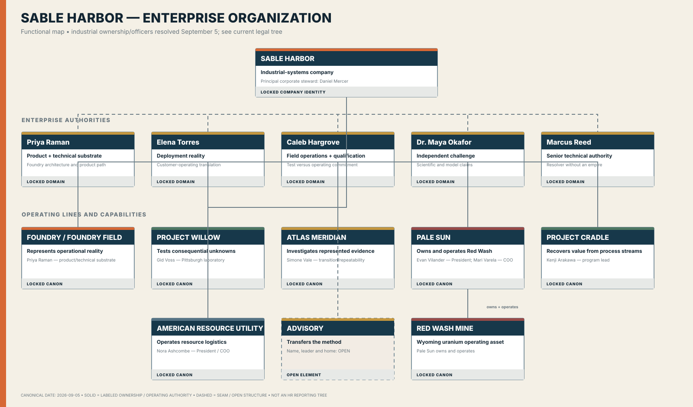

# SABLE HARBOR

Sable Harbor is the canonical synthetic enterprise and reusable business-world sandbox for mining, natural resources, industrial systems, enterprise software, assurance, analytics, finance, governance, security, incident response, and professional training.

It is modeled as a company that would exist independently of any audit or benchmark. Business activity creates systems, records, contracts, communications, controls, mistakes, experiments, operating consequences, and evidence; downstream tools consume deliberate, versioned exports.

## Canon states

- **LOCKED** — accepted canon;
- **PROVISIONAL** — accepted working direction pending exact implementation;
- **OPEN** — unresolved and not to be silently invented;
- **SUPERSEDED** — preserved prior direction that no longer controls current canon.

## Corporate lore v0.2

The `canon/corporate-lore-v0.2` branch contains the reconciled corporate-history package:

- [`docs/canon/SABLE_HARBOR_CANONICAL_ARCHITECTURE_HANDOVER.md`](docs/canon/SABLE_HARBOR_CANONICAL_ARCHITECTURE_HANDOVER.md) — preserved inherited canon and operating instructions.
- [`docs/canon/SABLE_HARBOR_CORPORATE_LORE_CANON_v0.2.md`](docs/canon/SABLE_HARBOR_CORPORATE_LORE_CANON_v0.2.md) — complete reconciled corporate lore through August 31, 2026.
- [`docs/canon/SABLE_HARBOR_CONTINUITY_AUDIT_v0.2.md`](docs/canon/SABLE_HARBOR_CONTINUITY_AUDIT_v0.2.md) — Blackridge and timeline continuity review.
- [`docs/canon/CANON_CHANGELOG_v0.2.md`](docs/canon/CANON_CHANGELOG_v0.2.md) — explicit inherited-canon clarifications and supersessions.
- [`docs/canon/DECISION_REGISTER.md`](docs/canon/DECISION_REGISTER.md) — LOCKED, PROVISIONAL, OPEN, and SUPERSEDED decision index.

## Organization at a glance

This is the canon-derived August 31, 2026 **functional enterprise organization chart**. It shows company-wide authorities, operating lines, named leaders and known ownership/component relationships. Exact HR reporting lines and final legal entities remain deliberately open.

The full package contains dedicated charts for [leadership and authority](docs/organization/2026_LEADERSHIP_AND_AUTHORITY_MAP.md), [Foundry Field](docs/organization/FOUNDRY_FIELD_ORGANIZATION.md), [Project Willow](docs/organization/WILLOW_ORGANIZATION.md), [Atlas Meridian](docs/organization/ATLAS_MERIDIAN_BRIDGE_ORGANIZATION.md), [Pale Sun and Red Wash](docs/organization/PALE_SUN_RED_WASH_ORGANIZATION.md), [Project Cradle](docs/organization/PROJECT_CRADLE_ORGANIZATION.md), [ARU and BS&T](docs/organization/ARU_BST_ORGANIZATION.md), and [the Original Eight](docs/organization/ORIGINAL_EIGHT.md).

### Official organization briefing

The briefing-grade publication package uses the approved production logo system and includes one rendered 16:9 image per chart, an editable PowerPoint deck, a PDF, a packaged ZIP, a source builder, and a validation manifest.

- [Organization briefing index](docs/organization/briefing/README.md)
- [Editable PowerPoint](docs/organization/briefing/SABLE_HARBOR_Organization_Briefing_v1.0.pptx)
- [Briefing PDF](docs/organization/briefing/SABLE_HARBOR_Organization_Briefing_v1.0.pdf)
- [Complete briefing package](docs/organization/briefing/SABLE_HARBOR_Organization_Briefing_v1.0.zip)

## Blackridge status

Blackridge remains the upstream founding wound and a separate executable case universe. The current connected repository branches expose only limited Blackridge scaffolding; the complete detailed Blackridge build must be imported and rechecked before it replaces the handover summary as the controlling source.

## Quantitative operating model

The prior `architecture/corporate-operating-model-v0.1` branch is a noncontrolling first-pass draft. It must be revised in a separate workstream to account for Willow, Red Wash/Pale Sun, Project Cradle, American Resource Utility, the Blood, Sweat & Tears Railway, emerging Advisory, and Emberline's historical status.

No 2026 headcount, revenue, funding, office, legal-entity, reporting-line, or product-P&L value is locked by the corporate-lore branch.

## Public repository and wiki

This repository is intentionally public so Sable Harbor can support a browsable institutional archive and a public GitHub wiki. This decision supersedes the preserved architecture handover's earlier description of the canonical repository as private.

The versioned documents under `docs/canon/` remain the controlling source of truth. The wiki is a public-facing reference and navigation layer; it may summarize canon, but it does not independently create or change canon.

There will be **no standalone Easter-egg index, decoder, or exhaustive explanation page**. Easter eggs remain embedded in the history, names, artifacts, and operating lore for readers to encounter naturally.

Hidden benchmark truth, evaluation oracles, credentials, unreleased scenario answers, and other material whose value depends on nonpublic access must not be committed to this public repository or published in the wiki.

See [`docs/governance/PUBLIC_REPOSITORY_AND_WIKI_POLICY.md`](docs/governance/PUBLIC_REPOSITORY_AND_WIKI_POLICY.md).

## Separation from NAILEX

NAILEX is a separate proprietary project. It should consume explicit, versioned Sable Harbor exports or benchmark packages rather than silently depending on the entire lore repository.

## License and use

No open-source license is granted. Repository visibility does not grant permission to copy, modify, distribute, sublicense, or commercialize the contents. All rights are reserved unless a specific file states otherwise.