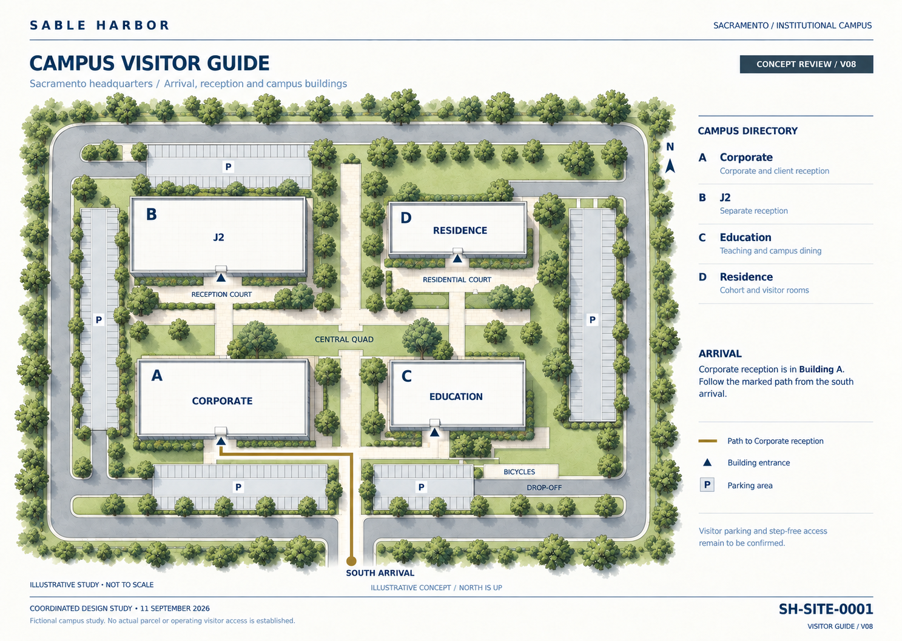

# SABLE HARBOR

Welcome to Sable Harbor: a fictional company you can get to know through its people, workplaces and working records. It develops industrial software, operates resource businesses and provides professional services. Here you can follow an invoice, investigate an acquisition, explore a mine or find out who makes a decision—and who checks the work.

The company is fictional; the questions are practical. Its archive brings together contracts, accounts, organization charts, operating records, controls and facility plans. You can read the documents and workbooks without installing anything.

**[Meet the company](https://github.com/SquirmyWormy275/SABLEHARBOR/wiki)** · **[Start here](docs/wiki/Start-Here.md)** · **[Try an audit exercise](docs/wiki/Audit.md)** · **[All files](https://github.com/SquirmyWormy275/SABLEHARBOR/wiki/Files)**

## Find what interests you

There is no need to read the archive from beginning to end. Pick a question, meet the people involved and follow the records as far as you need.

| Your starting point | A route through the company |
|---|---|
| The businesses and their people | Visit the [company index](docs/wiki/Home.md), then explore the [organization charts](docs/organization/README.md) and [departments](docs/wiki/Home.md#departments-and-institutions). |
| Accounting or audit study | Begin with [audit practice](docs/wiki/Audit.md) or the [finance exercises](docs/finance/READER_EXERCISES.md). The [interactive workspace](docs/audit-suite/LOCAL_WORKSPACE.md) lets you work through an engagement. |
| An acquisition or investment | Follow the [industrial case guide](industrial/CASE_GUIDE.md) into the [planning models](docs/releases/INDUSTRIAL_CASE_RELEASES.md) and [legal records](docs/reader/transactions/README.md). |
| Operations and supply chains | Explore [industrial operations](industrial/operations/README.md), [ARU's transport business](docs/wiki/businesses/American-Resource-Utility.md), [Red Wash](docs/wiki/businesses/Pale-Sun-Red-Wash.md) or [Cradle](docs/wiki/businesses/Cradle.md). |
| Controls, security or recovery | Use the [control procedures](enterprise/ccf/PROCEDURES.md), [assessment workbench](enterprise/ccf/assurance/README.md) and [technology estate](enterprise/runtime/README.md). |
| Workplaces and facilities | Start with [locations](docs/wiki/Locations.md), then open the [maps and floor plans](geospatial/maps/facilities/ARTIFACT_INDEX.md) or [facility atlas](geospatial/facilities/README.md). |
| Data and reproducible models | Follow the [database guide](db/README.md) and the build instructions for the model you are using. |

## Open an exercise

For a first visit, try [tracing an invoice](docs/reader/exercises/INVOICE.md). It connects a contract, dated movements and journal entries, giving you a manageable piece of the company to investigate. The [exercise index](docs/reader/exercises/README.md) also offers an [acquisition review](docs/reader/exercises/ACQUISITION.md) and a [contract review](docs/reader/exercises/CONTRACTS.md).

For a broader view, download the [operating review workbook](enterprise/operations/publications/operating-review-v1.0.0.xlsx). Start with **Results** or **Cash obligations**, then use the [finance guide](docs/finance/READER_EXERCISES.md) to follow the supporting transactions. The [accounting evidence packages](docs/finance/evidence/coverage/README.md) provide source records, reconciliations and CSV/SQLite extracts.

The [audit workspace](docs/audit-suite/LOCAL_WORKSPACE.md) takes the next step: request company evidence, collect originals, select samples and prepare workpapers in separate CLEAN and MESSY cases. Its setup guide explains how to run it locally.

Each [exercise guide](docs/reader/USE_CASES.md) tells you what to open, what to do and what to produce. Keep the release, scenario and period together; a missing record is something to investigate, not something to fill in by guesswork.

## Take a look around

Explore the Sacramento campus plan in the [visitor PDF](geospatial/facilities/visitor/v08/artifacts/visitor-map-v08.pdf), or browse the [facility atlas PDF](geospatial/maps/SABLE_HARBOR_Facility_Atlas_v0.2.0.pdf). Plans include proposed work; the [location guide](docs/wiki/Locations.md) explains the difference between an operating site and a planned facility.

## Read and download

Read Markdown on GitHub, open PDFs for formatted documents and download Excel workbooks for calculations. The [document library](docs/wiki/Library.md) groups publications by subject; the [full-text reading room](https://github.com/SquirmyWormy275/SABLEHARBOR/wiki/Reading) brings longer company records into the Wiki.

Looking for a particular file? Open **[All files](https://github.com/SquirmyWormy275/SABLEHARBOR/wiki/Files)**, choose a collection and select the original. Documents, data, maps, artwork, code and configuration are all included.

The [download guide](docs/reader/USE_CASES.md#downloads-and-tools) lists complete packages and explains how to open them. Interactive maps and offline browsers run from a downloaded package or checkout, not inside GitHub. The [offline technical and site review edition](docs/releases/CLOSEOUT_EVIDENCE_RELEASES.md) also lets you keep review notes locally.

## Dates and status

Some records describe company history; others are forecasts, proposals or earlier editions. Check the date and status when comparing them. A construction plan does not mean the facility has been built, and a test plan does not mean the test was performed.

You do not need to learn the archive's decision codes to explore the company. When you need the history behind a fact, [Records and decisions](docs/wiki/Records-and-Decisions.md) brings it together. The [source and format guide](docs/reader/SOURCES_AND_FORMATS.md) explains what to do when records disagree, and [decisions and remaining work](docs/wiki/Open-Questions.md) distinguishes completed work from what comes next. Released exercises keep their original sources and assumptions.

## Work with the archive

| Folder | What is inside |
|---|---|
| [docs/wiki](docs/wiki/README.md) | Company articles and reading guides. |
| [docs](docs/) | Governance, organization, legal and financial records. |
| [enterprise](enterprise/README.md) | Operating and financial models, controls, technology records and the audit service. |
| [industrial](industrial/README.md) | Industrial operating and investment cases. |
| [geospatial](geospatial/README.md) | Maps, facilities and geographic records. |
| [blackridge](blackridge/README.md) | The separate Blackridge case. |
| [tools](tools/) | Build, publication and review utilities. |

[Contributing](CONTRIBUTING.md) explains how to make changes and check them. [Maintainer rules](MAINTAINERS.md) cover source records and publication. The repository keeps the originals; the Wiki makes them easier to explore.

[Business dossiers](docs/business-lines/README.md) · [Controlled documents](docs/CONTROLLED_DOCUMENT_INDEX.md) · [Brand assets](assets/brand/README.md) · [Wiki publication](docs/wiki/README.md)

Public access does not grant an open-source license. All rights remain reserved unless a specific file states otherwise.
