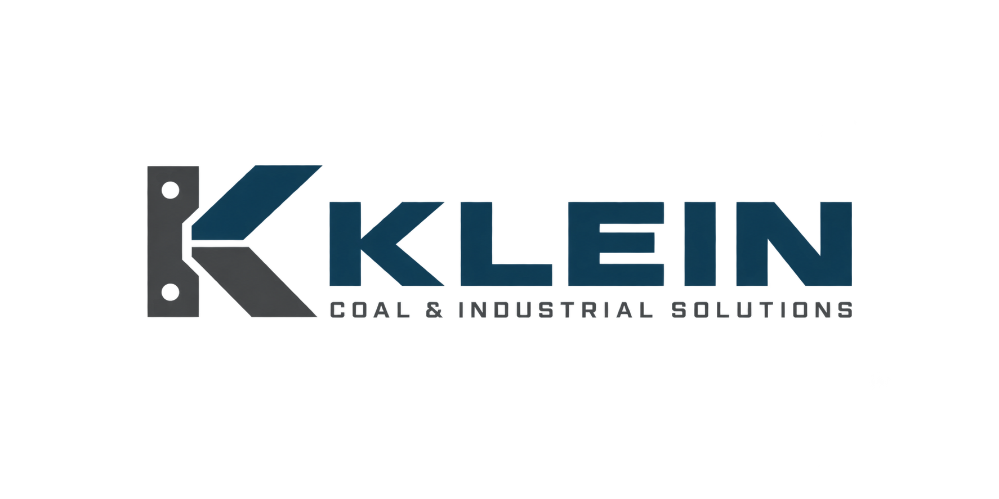

# Klein — approved historical identity

**State:** APPROVED_SOURCE_ARTWORK
**Approval date:** September 7, 2026
**Controlling decision:** [KLEIN-001](../../docs/canon/KLEIN_NAME_AND_IDENTITY_2026-09-07.md)



Klein is Gid Voss's historical Pittsburgh outpost, rechartered as Willow in 2022. Its selected identity combines a mechanical K with the KLEIN wordmark and COAL & INDUSTRIAL SOLUTIONS descriptor. It is not an additional current business line or a separate legal-entity decision.

The user selected Klein and, after viewing this image, requested that the name changes and logo be pushed to the repository. The [visual manifest](klein_visual_manifest.json) binds that approval to this exact PNG. It is 1774 × 887 pixels and 236,847 bytes; SHA-256 is `907036b9121328c49498d1cd4c856e2f52235c792c5b4d49be0b4fee09127f1e`.

The source was generated with the built-in imagegen tool and copied byte-for-byte. No redraw, recompression, cropping or other edit was applied. The PNG is the sole approved form; a vector master and additional variants have not been approved. Earlier artwork under the former name is superseded. Willow and Emberline retain their own identities.

## Original generation prompt

```text
Use case: logo-brand. Create a polished original logo concept for KLEIN, the fictional Pittsburgh industrial services and experimental engineering outpost in the Sable Harbor story, active around 2020–2022 before rechartering as Willow. The exact main wordmark text is "KLEIN" (K L E I N). Exact smaller descriptor: "COAL & INDUSTRIAL SOLUTIONS". Create one confident, finished horizontal identity, centered on a clean warm off-white background, ample breathing room, landscape canvas. A compact, beautifully proportioned abstract K symbol made from interlocking machined forms, evoking an engineering fixture, measurement, and practical heavy industry. Bespoke sturdy geometric sans-serif wordmark, exceptionally good optical spacing. Deep petrol blue and graphite, restrained warm gray if needed. Serious industrial supplier credibility, elegant professional corporate design that belongs on a Pittsburgh shop sign and equipment nameplate. Flat crisp vector-like artwork, no gradients, no 3D, no shadows, no decorative gear, no generic mountain, no AI network motifs, no clip art, no mockups, no presentation labels, no additional text. Entirely original mark and typography, clearly distinct from the real Klein Tools logo: avoid its oval, orange/yellow palette, script and tradesperson imagery. This is a proposed fictional brand identity awaiting user selection, not an imitation of an existing company.
```

The prompt records the request at generation time. The later user instruction establishes approval of the actual displayed output, whose bytes control over descriptive expectations in that prompt. No trademark registration or real-world commercial name clearance is asserted.
