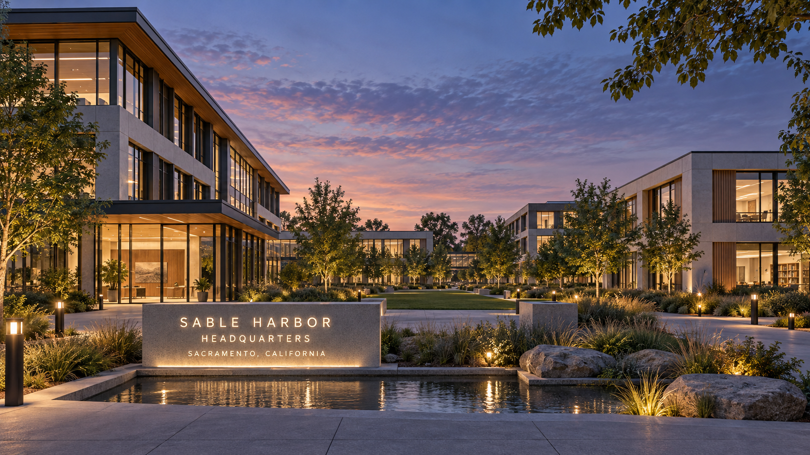

# Sacramento HQ — current exterior source artwork

The owner requested a subagent review of current relevant data and a new image on September 22, 2026, then directed Codex to fix the image after it was delivered. This is the exact newly generated source artwork adopted as the current exterior visual reference by [the dated successor decision](../../../../docs/canon/HEADQUARTERS_IMAGE_SUCCESSOR_2026-09-22.md) when accepted into the repository. It is not the missing September 3 binary and does not match its historical hash.

[Exact prompt](PROMPT.txt) · [Reviewed source hashes and reconciliation](SOURCE_REVIEW.json) · [Image hash and inspection](ARTIFACT.json).

## Source review

Reviewed the current headquarters physical doctrine, original image manifest, September 13 geographic successor, R02 campus source and spatial arrangement, approved R01 addendum and all four original sheets, and the locked V08 visitor illustration. Verified all four R01 hashes against the campus source. The review covers the headquarters-relevant sources, not every company file. No financial, headcount or personnel detail was converted into unsupported architectural capacity.

The accepted geographic successor preserves Sacramento's Railyards / River District setting, the fictional planning footprint and original local frame. Corporate is southwest, J2 northwest, Education southeast and Residence northeast. The model specifies 3/2/2/3 floors and 362 fitted workplaces plus 60 residential rooms; these are design capacities, not simultaneous attendance. Later accepted occupied-HQ doctrine does not establish an exact opening/construction date or acquired parcel. The site study is not a survey or title record.

The September 3 source supplies twilight, glass/metal/concrete/warm wood, landscaping, water and the three-line monument; it records a glass connection. The new camera angle retains four low-rise volumes and the central quad while prioritizing an exterior view. Front floor counts and exact sign text are visible. Rear masses are partly obscured, so this raster does not independently verify rear floor counts or dimensions. Facade rhythm, bridge detailing, reflecting-water layout, plants and lighting are newly visualized interpretations, not adopted engineering facts.

## Preservation and limits

This is separate cinematic artwork, not a replacement R01 technical sheet or V08 visitor map. Their locked bytes and visual system remain unchanged. No Capitol, San Jose setting, dramatic terrain, campus rail line, large data-center plant or people were introduced. No real property, construction, visitor access or external authorization is established by this rendering.

Image synthesis is nondeterministic. Preserve these exact pixels and their hash; publication must not regenerate a lookalike. The original candidate commit remains in Git history. The September 3 image approval remains historical, with its bytes unrecovered; the current visual uses the new artwork under the dated decision.
