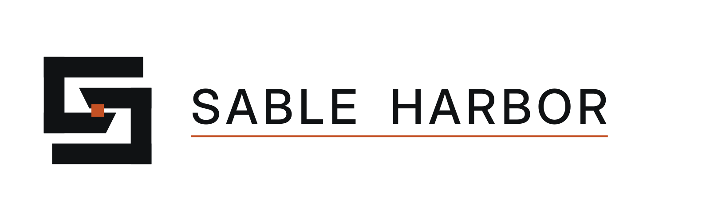
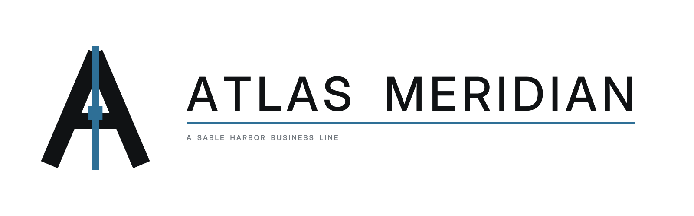
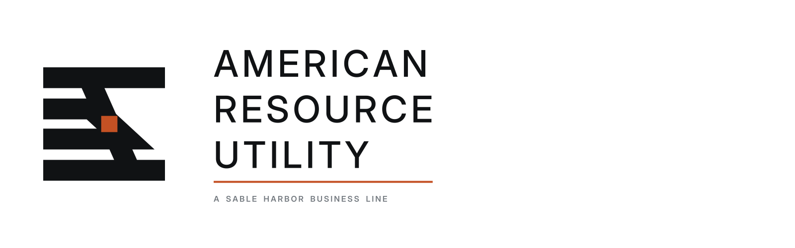
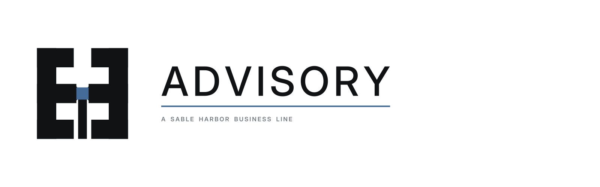
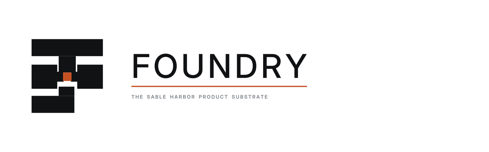
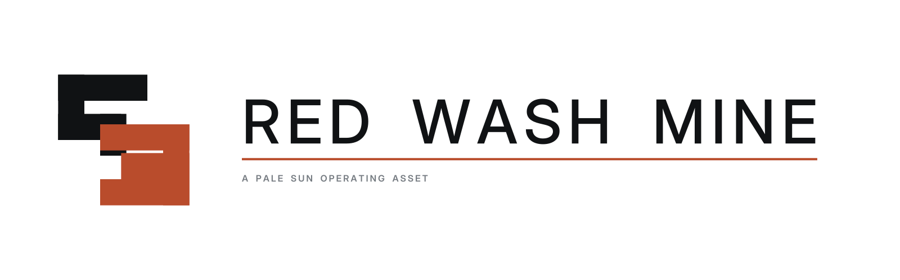
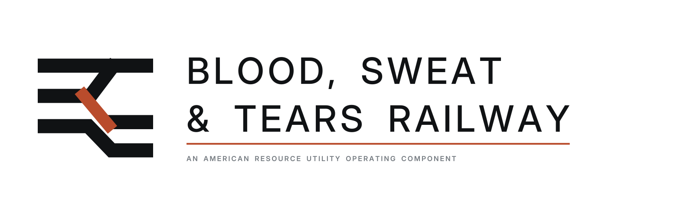
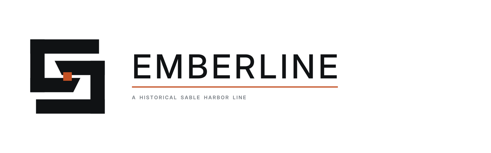
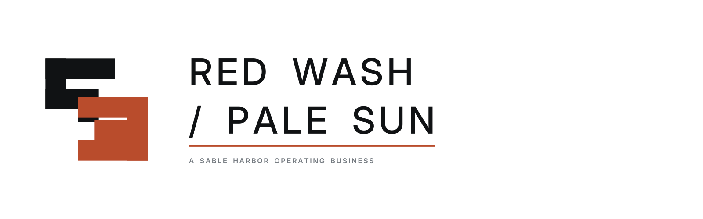

# Sable Harbor Logo Index

This page renders individual source files from `assets/brand/logos/`; it does not use a composite contact sheet.

Business-line names and status remain controlled by `docs/canon/SABLE_HARBOR_CORPORATE_LORE_CANON_v0.2.md`. Artwork does not independently create canon.

## Corporate and canonical 2026 business lines

### Sable Harbor

**Classification:** corporate master brand  
**Files:** [`primary`](../../assets/brand/logos/sable-harbor__primary-horizontal.svg) · [`stacked`](../../assets/brand/logos/sable-harbor__stacked.svg) · [`mark`](../../assets/brand/logos/sable-harbor__mark.svg) · [`reverse`](../../assets/brand/logos/sable-harbor__reverse-horizontal.svg) · [`one-color`](../../assets/brand/logos/sable-harbor__one-color-horizontal.svg)

### Foundry Field

**Classification:** core business line  
**Files:** [`primary`](../../assets/brand/logos/foundry-field__primary-horizontal.svg) · [`stacked`](../../assets/brand/logos/foundry-field__stacked.svg) · [`mark`](../../assets/brand/logos/foundry-field__mark.svg) · [`reverse`](../../assets/brand/logos/foundry-field__reverse-horizontal.svg) · [`one-color`](../../assets/brand/logos/foundry-field__one-color-horizontal.svg)

### Willow

**Classification:** core business line  
**Files:** [`primary`](../../assets/brand/logos/willow__primary-horizontal.svg) · [`stacked`](../../assets/brand/logos/willow__stacked.svg) · [`mark`](../../assets/brand/logos/willow__mark.svg) · [`reverse`](../../assets/brand/logos/willow__reverse-horizontal.svg) · [`one-color`](../../assets/brand/logos/willow__one-color-horizontal.svg)

### Atlas Meridian

**Classification:** core business line  
**Files:** [`primary`](../../assets/brand/logos/atlas-meridian__primary-horizontal.svg) · [`stacked`](../../assets/brand/logos/atlas-meridian__stacked.svg) · [`mark`](../../assets/brand/logos/atlas-meridian__mark.svg) · [`reverse`](../../assets/brand/logos/atlas-meridian__reverse-horizontal.svg) · [`one-color`](../../assets/brand/logos/atlas-meridian__one-color-horizontal.svg)

### Pale Sun

**Classification:** core operating business line  
**Files:** [`primary`](../../assets/brand/logos/pale-sun__primary-horizontal.svg) · [`stacked`](../../assets/brand/logos/pale-sun__stacked.svg) · [`mark`](../../assets/brand/logos/pale-sun__mark.svg) · [`reverse`](../../assets/brand/logos/pale-sun__reverse-horizontal.svg) · [`one-color`](../../assets/brand/logos/pale-sun__one-color-horizontal.svg)

### Project Cradle

**Classification:** core business line  
**Files:** [`primary`](../../assets/brand/logos/project-cradle__primary-horizontal.svg) · [`stacked`](../../assets/brand/logos/project-cradle__stacked.svg) · [`mark`](../../assets/brand/logos/project-cradle__mark.svg) · [`reverse`](../../assets/brand/logos/project-cradle__reverse-horizontal.svg) · [`one-color`](../../assets/brand/logos/project-cradle__one-color-horizontal.svg)

### American Resource Utility

**Classification:** distinct operating company and core line  
**Files:** [`primary`](../../assets/brand/logos/american-resource-utility__primary-horizontal.svg) · [`stacked`](../../assets/brand/logos/american-resource-utility__stacked.svg) · [`mark`](../../assets/brand/logos/american-resource-utility__mark.svg) · [`reverse`](../../assets/brand/logos/american-resource-utility__reverse-horizontal.svg) · [`one-color`](../../assets/brand/logos/american-resource-utility__one-color-horizontal.svg)

### Advisory

**Classification:** core business line  
**Files:** [`primary`](../../assets/brand/logos/advisory__primary-horizontal.svg) · [`stacked`](../../assets/brand/logos/advisory__stacked.svg) · [`mark`](../../assets/brand/logos/advisory__mark.svg) · [`reverse`](../../assets/brand/logos/advisory__reverse-horizontal.svg) · [`one-color`](../../assets/brand/logos/advisory__one-color-horizontal.svg)

## Supplemental identities

### Foundry

**Classification:** product substrate  
**Canon note:** LOCKED distinction: Foundry is the substrate; Foundry Field is the deployable operational product/service configuration.  
**Files:** [`primary`](../../assets/brand/logos/foundry__primary-horizontal.svg) · [`mark`](../../assets/brand/logos/foundry__mark.svg) · [`reverse`](../../assets/brand/logos/foundry__reverse-horizontal.svg)

### Red Wash Mine

**Classification:** operating asset  
**Canon note:** LOCKED fictional mine name under Pale Sun; transaction and legal details remain OPEN.  
**Files:** [`primary`](../../assets/brand/logos/red-wash-mine__primary-horizontal.svg) · [`mark`](../../assets/brand/logos/red-wash-mine__mark.svg) · [`reverse`](../../assets/brand/logos/red-wash-mine__reverse-horizontal.svg)

### Blood, Sweat & Tears Railway

**Classification:** ARU operating component  
**Canon note:** LOCKED name and relationship to ARU; exact legal and route details remain OPEN.  
**Files:** [`primary`](../../assets/brand/logos/blood-sweat-and-tears-railway__primary-horizontal.svg) · [`mark`](../../assets/brand/logos/blood-sweat-and-tears-railway__mark.svg) · [`reverse`](../../assets/brand/logos/blood-sweat-and-tears-railway__reverse-horizontal.svg)

### Emberline

**Classification:** historical business line  
**Canon note:** LOCKED historical status: active through 2025, then absorbed into enduring 2026 work.  
**Files:** [`primary`](../../assets/brand/logos/emberline__primary-horizontal.svg) · [`mark`](../../assets/brand/logos/emberline__mark.svg) · [`reverse`](../../assets/brand/logos/emberline__reverse-horizontal.svg)

### Red Wash / Pale Sun

**Classification:** endorsed operating lockup  
**Canon note:** Supplemental endorsed lockup joining the Pale Sun line to its Red Wash operating asset; does not replace either canonical name.  
**Files:** [`primary`](../../assets/brand/logos/red-wash-pale-sun__primary-horizontal.svg) · [`mark`](../../assets/brand/logos/red-wash-pale-sun__mark.svg) · [`reverse`](../../assets/brand/logos/red-wash-pale-sun__reverse-horizontal.svg)

## Complete package

[Download the complete SVG and PNG package](../../assets/brand/packages/sable-harbor-logo-system-v0.1.0.zip).
