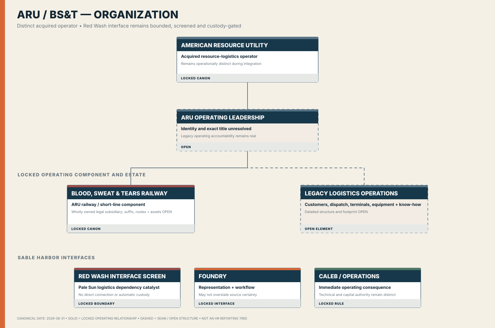

# American Resource Utility

<p align="center">
  
</p>

> **Dossier status: generated release candidate.** The finance branch generates scoped SQLite, financial, source-event, workbook, control, manifest, and checksum evidence for this unit.

[Company](../company/README.md) · [Business lines](README.md) · [Organization](../organization/ARU_BST_ORGANIZATION.md) · [Wiki source](../wiki/American%20Resource%20Utility.md) · [Repository audit](../audit/REPOSITORY_AUDIT_2026-09-01.md)

## Unit control record

| Field | Current record |
|---|---|
| Classification | Current business line |
| Parent | Sable Harbor |
| Operating role | Current distinct operating company and core resource-logistics line; BS&T is an operating component. |
| Canon boundary | LOCKED identity, acquired-operator role, and BS&T relationship; routes, asset counts, terminals, leadership, workforce, exact legal chain, and economics remain OPEN or scenario-controlled. |
| Entity filter | `ARU` |
| Segment filter | `ARU_BST` |
| Site filter | `ARU_HUB` |
| Standalone export | **RELEASE CANDIDATE GENERATED** — `shfin package-business-units`; publication remains acceptance-gated |
| Dossier date | September 1, 2026 |

## Purpose and controlling sources

American Resource Utility is an acquired resource-logistics operator with legacy customers, employees, dispatch practices, terminals, equipment, and operating knowledge. It remains operationally distinct while moving materials and supplies across physical and organizational boundaries.

- [SABLE_HARBOR_CORPORATE_LORE_CANON_v0.2.md](../canon/SABLE_HARBOR_CORPORATE_LORE_CANON_v0.2.md)
- [ARU_BST_AND_ADVISORY.md](../organization/ARU_BST_AND_ADVISORY.md)

This page is a navigation and audit-control layer. It does not create legal entities, titles, locations, asset counts, economics, or other facts left OPEN by canon.

## Identity and letterhead

| Asset | Files |
|---|---|
| Primary logo | [SVG](../../assets/brand/logos/american-resource-utility__primary-horizontal.svg) · [PNG](../../assets/brand/logos/american-resource-utility__primary-horizontal.png) |
| Stacked logo | [SVG](../../assets/brand/logos/american-resource-utility__stacked.svg) · [PNG](../../assets/brand/logos/american-resource-utility__stacked.png) |
| Compact mark | [SVG](../../assets/brand/logos/american-resource-utility__mark.svg) · [PNG](../../assets/brand/logos/american-resource-utility__mark.png) |
| Reverse logo | [SVG](../../assets/brand/logos/american-resource-utility__reverse-horizontal.svg) · [PNG](../../assets/brand/logos/american-resource-utility__reverse-horizontal.png) |
| One-color logo | [SVG](../../assets/brand/logos/american-resource-utility__one-color-horizontal.svg) · [PNG](../../assets/brand/logos/american-resource-utility__one-color-horizontal.png) |
| Unit letterhead | [US Letter SVG](../../assets/brand/collateral/letterhead/business-lines/american-resource-utility-letterhead-us-letter.svg) |
| Standards | [Brand standards](../../assets/brand/BRAND_STANDARDS.md) · [Font provenance](../../assets/brand/FONT_PROVENANCE.md) |

The letterhead is a linked-logo working template with placeholders; editable DOCX/PDF variants remain future generated artifacts.

## Current organization and authority

[](../organization/ARU_BST_ORGANIZATION.md)

The chart is canon-derived and intentionally preserves OPEN leadership, legal, workforce, footprint, and reporting details. It is not represented as a complete HR reporting tree.

## Operations, assets, and inventory

**Modeled operating population:** Waybills, freight movements, carloads, tons, route miles, ton-miles, rates, fuel, crew, custody, customer economics, terminals, equipment, procurement, workforce, and intercompany movement.

**Inventory position:** The current model exposes freight/custody records and shared fixed-asset records. A complete locomotive, railcar, terminal, parts, fuel, tools, and maintenance inventory register is not yet implemented.

| Audit area | Present coverage |
|---|---|
| Workforce | Shared `worker`/payroll records or unit-domain labor records; synthetic/model population, not locked HR canon |
| Assets | Shared `site` and `fixed_asset` records plus unit-domain records; detailed register remains partial |
| Inventory/WIP | Unit-domain records listed below; not yet a complete unit inventory subsystem |
| Source-to-ledger trace | Journal `source_type`/`source_id` and named trace queries |
| Unit-only package | **Absent** |

## Database and finance map

A valid unit audit must filter by the entity, segment, and site keys above **and** by an explicit generation run, scenario, and fact state once those isolation controls are completed. Shared tables must never be treated as unit-exclusive merely because they are linked from this page.

**Relevant tables:** `legal_entity`, `site`, `worker`, `fixed_asset`, `freight_movement`, `waybill`, `vendor`, `purchase_order`, `goods_receipt`, `vendor_bill`, `vendor_payment`, `depreciation_record`, `debt_facility`, `debt_draw`, `interest_accrual`, `journal_entry`, `journal_line`, `scenario_value`

### Named analytical queries

- [`aru_route_customer_margin`](../../db/sql/aru_route_customer_margin.sql)
- [`intercompany_mismatch_elimination`](../../db/sql/intercompany_mismatch_elimination.sql)
- [`fixed_asset_rollforward`](../../db/sql/fixed_asset_rollforward.sql)
- [`vendor_spend_concentration`](../../db/sql/vendor_spend_concentration.sql)
- [`debt_covenant_calculation`](../../db/sql/debt_covenant_calculation.sql)
- [`employee_loaded_cost`](../../db/sql/employee_loaded_cost.sql)
- [`entity_trial_balance`](../../db/sql/entity_trial_balance.sql)
- [`journal_to_source_trace`](../../db/sql/journal_to_source_trace.sql)

### Workbook surfaces

- `SABLE_HARBOR_INDUSTRIAL_OPERATIONS_v0.1.xlsx` — `ARU-BS&T Assumptions`, `ARU-BS&T Volume and Rates`, `ARU-BS&T Operating Cost`, `ARU-BS&T Fleet Assets`, `ARU-BS&T EBITDA Cash Flow`, `Industrial Intercompany`, `Checks`
- `SABLE_HARBOR_GL_CLOSE_AND_SUBLEDGERS_v0.1.xlsx` — `Fixed Assets`, `AP Aging`, `Debt Schedule`, `Intercompany Matches`, `Checks`
- `SABLE_HARBOR_CAPITAL_MA_AND_VALUATION_v0.1.xlsx` — `ARU Acquisition`, `Purchase Price Allocation`, `ARU-BS&T Valuation`, `Sensitivities`, `Checks`

Workbook definitions are in [`src/sable_harbor/workbooks/suite.py`](../../src/sable_harbor/workbooks/suite.py). Generated `.xlsx` files are ignored source outputs and are not durable downloads until CI publishes validated artifacts.

### Reproduce the enterprise model

```bash
uv sync --all-extras
SHFIN_DATABASE_URL=sqlite:///var/release.db uv run alembic upgrade head
SHFIN_DATABASE_URL=sqlite:///var/release.db uv run shfin generate \
  --profile full_history --scenario base --seed 20260831
SHFIN_DATABASE_URL=sqlite:///var/release.db uv run shfin validate
SHFIN_DATABASE_URL=sqlite:///var/release.db uv run shfin workbooks
```

After generation, apply the documented unit filters. Do not label the unfiltered enterprise database as a unit database.

## Standalone-audit acceptance boundary

Before this unit can be called independently auditable, it needs a filtered SQLite/PostgreSQL extract, CSV exports, unit financial statements, inventory/asset register, source-to-ledger reconciliation, intercompany bridge, manifest, checksums, validation report, and CI artifact. See [Unit export specification](../audit/UNIT_EXPORT_SPECIFICATION.md).

Remaining legal, leadership, route/site, asset, workforce, technical, or economic facts stay OPEN or scenario-controlled until deliberately approved.
