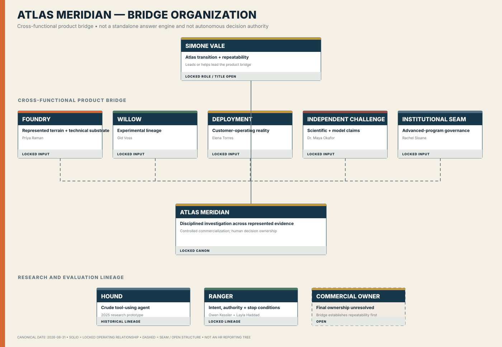

# Atlas Meridian

**Classification:** current core investigation and controlled-commercialization business line  
**Dossier state:** review candidate

Atlas Meridian turns difficult operating questions into controlled investigations and decision support. It does not acquire operating authority merely because it produces analysis.

## Status and scope

- Canon: locked role, lineage, and authority boundary; exact architecture, entitlements, customers, launch timing, staffing, and unit economics remain open.
- Standalone Atlas database, model/evaluation inventory, P&L, and unit letterhead: **NOT MATERIALIZED**

## Canon and history

- [Corporate Lore Canon v0.2](../canon/SABLE_HARBOR_CORPORATE_LORE_CANON_v0.2.md) — Atlas Meridian sections
- [Decision Register](../canon/DECISION_REGISTER.md)
- [Willow and Atlas narrative](../organization/WILLOW_AND_ATLAS_MERIDIAN.md)

## Identity and collateral

- [Primary SVG](../../assets/brand/logos/atlas-meridian__primary-horizontal.svg) · [PNG](../../assets/brand/logos/atlas-meridian__primary-horizontal.png)
- [Stacked SVG](../../assets/brand/logos/atlas-meridian__stacked.svg) · [Mark SVG](../../assets/brand/logos/atlas-meridian__mark.svg)
- [Reverse SVG](../../assets/brand/logos/atlas-meridian__reverse-horizontal.svg) · [One-color SVG](../../assets/brand/logos/atlas-meridian__one-color-horizontal.svg)
- [Corporate collateral](../../assets/brand/collateral/README.md)

## Organization and authority

The bridge view distinguishes analytical recommendation from decision authority and operating execution.

## Financials and accounting

- Entity: `SHI`
- Segments: `ATLAS`, `CORE`
- Tables: `atlas_evaluation`, `customer`, `customer_contract`, `journal_entry`, `journal_line`
- Queries: [`customer_profitability`](https://github.com/SquirmyWormy275/SABLEHARBOR/blob/1f294440a11e724e5f1bdcd3a7f59f7342169bfe/db/sql/customer_profitability.sql), [`assumption_impact`](https://github.com/SquirmyWormy275/SABLEHARBOR/blob/1f294440a11e724e5f1bdcd3a7f59f7342169bfe/db/sql/assumption_impact.sql), [`journal_to_source_trace`](https://github.com/SquirmyWormy275/SABLEHARBOR/blob/1f294440a11e724e5f1bdcd3a7f59f7342169bfe/db/sql/journal_to_source_trace.sql), [`entity_trial_balance`](https://github.com/SquirmyWormy275/SABLEHARBOR/blob/1f294440a11e724e5f1bdcd3a7f59f7342169bfe/db/sql/entity_trial_balance.sql)
- Workbooks: software/services and capital/M&A/valuation suites

Source coverage is on PR #9 and is not an accepted Atlas financial package.

## Inventory, assets, and operations

Evaluation IDs, model versions, investigation questions, validation cost, compute cost, customer fees, authority flags, decisions, and linked journals define the current data perimeter. A complete model registry and compute-asset inventory are not yet released.

## Database and exports

Target: allowlisted `atlas-meridian.sqlite`, evaluation/model registry, customer/economic extracts, governance/authority records, unit statements, validation, manifest, and checksums. Current state: **NOT MATERIALIZED**.

## Audit controls and unresolved facts

Controls must preserve model/version lineage, validation evidence, authority boundaries, customer isolation, source-to-journal trace, and enterprise reconciliation. Open: design partners/customers, architecture and entitlements, launch packaging, leader/headcount, P&L, letterhead, and standalone release.

## Download map

- [Organization bridge](../organization/ATLAS_MERIDIAN_BRIDGE_ORGANIZATION.md)
- [Brand system](../../assets/brand/README.md)
- [Finance register](../data/FINANCE_RELEASE_CANDIDATE.md)
- [Unit package standard](../audit/UNIT_PACKAGE_STANDARD.md)
- [Registry](registry.json)
