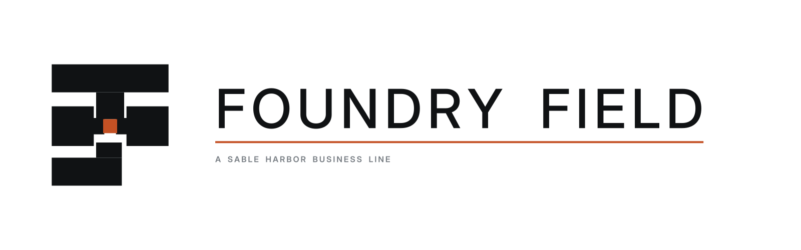
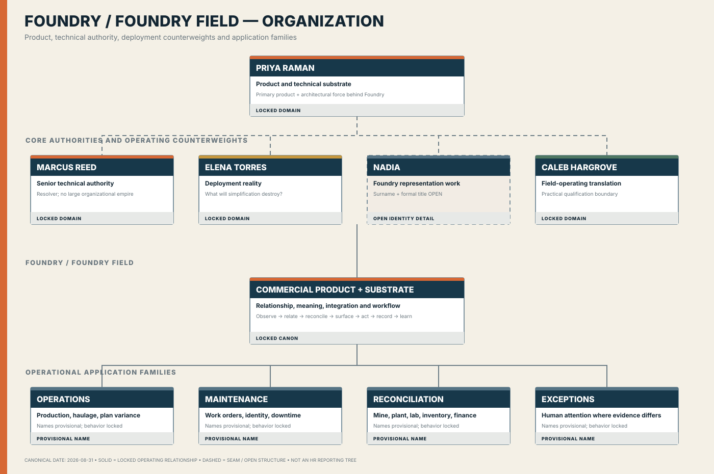

# Foundry Field

<p align="center">
  
</p>

> **Dossier status: generated release candidate.** The finance branch generates scoped SQLite, financial, source-event, workbook, control, manifest, and checksum evidence for this unit.

[Company](../company/README.md) · [Business lines](README.md) · [Organization](../organization/FOUNDRY_FIELD_ORGANIZATION.md) · [Wiki source](../wiki/Foundry%20Field.md) · [Repository audit](../audit/REPOSITORY_AUDIT_2026-09-01.md)

## Unit control record

| Field | Current record |
|---|---|
| Classification | Current business line |
| Parent | Sable Harbor |
| Operating role | Current core business line and principal operating/economic interface. |
| Canon boundary | LOCKED identity and role; exact legal, reporting, headcount, customer, and product-P&L details remain OPEN or scenario-controlled. |
| Entity filter | `SHI` |
| Segment filter | `CORE`, `FOUNDRY_FIELD`, `DELIVERY` |
| Site filter | `SAC` |
| Standalone export | **RELEASE CANDIDATE GENERATED** — `shfin package-business-units`; publication remains acceptance-gated |
| Dossier date | September 1, 2026 |

## Purpose and controlling sources

Foundry Field is the company’s principal interface with operational reality. It encounters and represents variation, connects evidence to workflow, and supports the software-and-services economic engine without claiming authority the source system does not possess.

- [SABLE_HARBOR_CORPORATE_LORE_CANON_v0.2.md](../canon/SABLE_HARBOR_CORPORATE_LORE_CANON_v0.2.md)
- [FOUNDRY_AND_FOUNDRY_FIELD.md](../organization/FOUNDRY_AND_FOUNDRY_FIELD.md)

This page is a navigation and audit-control layer. It does not create legal entities, titles, locations, asset counts, economics, or other facts left OPEN by canon.

## Identity and letterhead

| Asset | Files |
|---|---|
| Primary logo | [SVG](../../assets/brand/logos/foundry-field__primary-horizontal.svg) · [PNG](../../assets/brand/logos/foundry-field__primary-horizontal.png) |
| Stacked logo | [SVG](../../assets/brand/logos/foundry-field__stacked.svg) · [PNG](../../assets/brand/logos/foundry-field__stacked.png) |
| Compact mark | [SVG](../../assets/brand/logos/foundry-field__mark.svg) · [PNG](../../assets/brand/logos/foundry-field__mark.png) |
| Reverse logo | [SVG](../../assets/brand/logos/foundry-field__reverse-horizontal.svg) · [PNG](../../assets/brand/logos/foundry-field__reverse-horizontal.png) |
| One-color logo | [SVG](../../assets/brand/logos/foundry-field__one-color-horizontal.svg) · [PNG](../../assets/brand/logos/foundry-field__one-color-horizontal.png) |
| Unit letterhead | [US Letter SVG](../../assets/brand/collateral/letterhead/business-lines/foundry-field-letterhead-us-letter.svg) |
| Standards | [Brand standards](../../assets/brand/BRAND_STANDARDS.md) · [Font provenance](../../assets/brand/FONT_PROVENANCE.md) |

The letterhead is a linked-logo working template with placeholders; editable DOCX/PDF variants remain future generated artifacts.

## Current organization and authority

[](../organization/FOUNDRY_FIELD_ORGANIZATION.md)

The chart is canon-derived and intentionally preserves OPEN leadership, legal, workforce, footprint, and reporting details. It is not represented as a complete HR reporting tree.

## Operations, assets, and inventory

**Modeled operating population:** Customer, contract, implementation, services-delivery, workforce, billing, collection, and revenue-recognition records.

**Inventory position:** No conventional physical inventory is currently defined for Foundry Field; backlog, engagements, WIP, deployments, contracts, and deferred revenue are the principal auditable operating populations.

| Audit area | Present coverage |
|---|---|
| Workforce | Shared `worker`/payroll records or unit-domain labor records; synthetic/model population, not locked HR canon |
| Assets | Shared `site` and `fixed_asset` records plus unit-domain records; detailed register remains partial |
| Inventory/WIP | Unit-domain records listed below; not yet a complete unit inventory subsystem |
| Source-to-ledger trace | Journal `source_type`/`source_id` and named trace queries |
| Unit-only package | **Absent** |

## Database and finance map

A valid unit audit must filter by the entity, segment, and site keys above **and** by an explicit generation run, scenario, and fact state once those isolation controls are completed. Shared tables must never be treated as unit-exclusive merely because they are linked from this page.

**Relevant tables:** `customer`, `customer_contract`, `performance_obligation`, `invoice`, `invoice_line`, `revenue_recognition`, `cash_receipt`, `engagement`, `project_task`, `time_entry`, `project_cost`, `engagement_invoice_link`, `worker`, `payroll_run`, `payroll_line`, `journal_entry`, `journal_line`, `scenario_value`

### Named analytical queries

- [`customer_arr_bridge`](../../db/sql/customer_arr_bridge.sql)
- [`customer_profitability`](../../db/sql/customer_profitability.sql)
- [`deferred_revenue_rollforward`](../../db/sql/deferred_revenue_rollforward.sql)
- [`engagement_margin_wip`](../../db/sql/engagement_margin_wip.sql)
- [`employee_loaded_cost`](../../db/sql/employee_loaded_cost.sql)
- [`entity_trial_balance`](../../db/sql/entity_trial_balance.sql)
- [`journal_to_source_trace`](../../db/sql/journal_to_source_trace.sql)

### Workbook surfaces

- `SABLE_HARBOR_SOFTWARE_AND_SERVICES_v0.1.xlsx` — `Customer Roster`, `Contract Roster`, `ARR-MRR Bridge`, `Bookings Billings Revenue`, `Deferred Revenue`, `Customer Unit Economics`, `Foundry Revenue Build`, `Foundry Cost Build`, `Implementation Backlog`, `Services Utilization`, `Engagement Margin`, `Checks`
- `SABLE_HARBOR_GL_CLOSE_AND_SUBLEDGERS_v0.1.xlsx` — `AR Aging`, `Deferred Revenue Rollforward`, `Payroll Summary`, `Journal Detail Extract`, `Checks`

Workbook definitions are in [`src/sable_harbor/workbooks/suite.py`](../../src/sable_harbor/workbooks/suite.py). Generated `.xlsx` files are ignored source outputs and are not durable downloads until CI publishes validated artifacts.

### Reproduce the enterprise model

```bash
uv sync --all-extras
SHFIN_DATABASE_URL=sqlite:///var/release.db uv run alembic upgrade head
SHFIN_DATABASE_URL=sqlite:///var/release.db uv run shfin generate \
  --profile full_history --scenario base --seed 20260831
SHFIN_DATABASE_URL=sqlite:///var/release.db uv run shfin validate
SHFIN_DATABASE_URL=sqlite:///var/release.db uv run shfin workbooks
```

After generation, apply the documented unit filters. Do not label the unfiltered enterprise database as a unit database.

## Standalone-audit acceptance boundary

Before this unit can be called independently auditable, it needs a filtered SQLite/PostgreSQL extract, CSV exports, unit financial statements, inventory/asset register, source-to-ledger reconciliation, intercompany bridge, manifest, checksums, validation report, and CI artifact. See [Unit export specification](../audit/UNIT_EXPORT_SPECIFICATION.md).

Remaining legal, leadership, route/site, asset, workforce, technical, or economic facts stay OPEN or scenario-controlled until deliberately approved.
