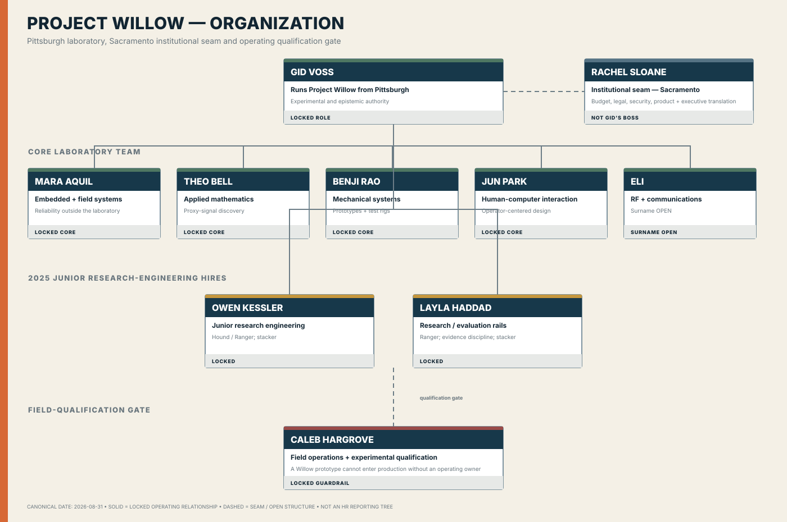

# Willow

**Classification:** current core research and experimental business line  
**Dossier state:** review candidate  
**Historical predecessor:** Evalon

Willow is the present research system descended from Evalon's advanced-engineering outpost. Its job is disciplined inquiry, observation, belief revision, controlled transfer, and governance—not unconstrained commercialization.

## Status and scope

- Canon: locked lineage, purpose, and core boundary; exact charter language, team structure, budgets, facilities, and commercialization details remain partly open.
- Standalone Willow database, budget/P&L, laboratory inventory, and unit letterhead: **NOT MATERIALIZED**

## Canon and history

- [Corporate Lore Canon v0.2](../canon/SABLE_HARBOR_CORPORATE_LORE_CANON_v0.2.md) — Evalon and Willow sections
- [Continuity Audit](../canon/SABLE_HARBOR_CONTINUITY_AUDIT_v0.2.md)
- [Organizational lineage](../organization/ORGANIZATIONAL_LINEAGE_2015_2026.md)
- [Evalon dossier](EVALON.md)

## Identity and collateral

- [Primary SVG](../../assets/brand/logos/willow__primary-horizontal.svg) · [PNG](../../assets/brand/logos/willow__primary-horizontal.png)
- [Stacked SVG](../../assets/brand/logos/willow__stacked.svg) · [Mark SVG](../../assets/brand/logos/willow__mark.svg)
- [Reverse SVG](../../assets/brand/logos/willow__reverse-horizontal.svg) · [One-color SVG](../../assets/brand/logos/willow__one-color-horizontal.svg)
- [Corporate collateral](../../assets/brand/collateral/README.md)

## Organization and authority

The accepted chart is a functional reference. Exact formal leadership, reporting, headcount, and legal structure remain open.

## Financials and accounting

Release-candidate scope:

- Entity: `SHI`
- Segments: `WILLOW`, `CORE`
- Tables: `willow_experiment`, `worker`, `payroll_run`, `payroll_line`, `journal_entry`, `journal_line`
- Queries: [`employee_loaded_cost`](https://github.com/SquirmyWormy275/SABLEHARBOR/blob/1f294440a11e724e5f1bdcd3a7f59f7342169bfe/db/sql/employee_loaded_cost.sql), [`assumption_impact`](https://github.com/SquirmyWormy275/SABLEHARBOR/blob/1f294440a11e724e5f1bdcd3a7f59f7342169bfe/db/sql/assumption_impact.sql), [`journal_to_source_trace`](https://github.com/SquirmyWormy275/SABLEHARBOR/blob/1f294440a11e724e5f1bdcd3a7f59f7342169bfe/db/sql/journal_to_source_trace.sql), [`entity_trial_balance`](https://github.com/SquirmyWormy275/SABLEHARBOR/blob/1f294440a11e724e5f1bdcd3a7f59f7342169bfe/db/sql/entity_trial_balance.sql)
- Workbooks: software/services and GL/close suites

## Inventory, assets, and operations

The source perimeter includes experiments, questions, prior beliefs, observations, revised beliefs, gate decisions, transfer targets, budgets, actual costs, people, and any laboratory assets represented in the shared platform. No accepted physical laboratory register exists.

## Database and exports

Target: allowlisted `willow.sqlite`, experiment/research CSVs, budget and cost schedules, workforce/asset register, governance decisions, validation report, manifest, and checksums. Current state: **NOT MATERIALIZED**.

## Audit controls and unresolved facts

Controls must preserve research governance, prevent unsupported commercialization claims, trace experiment costs and decisions, isolate Willow records by run/scenario, and reconcile unit costs to the enterprise ledger. Open: charter, team/leader, detailed sites and equipment, accepted budget/P&L, letterhead, and standalone release.

## Download map

- [Organization](../organization/WILLOW_ORGANIZATION.md)
- [Evalon history](EVALON.md)
- [Brand system](../../assets/brand/README.md)
- [Finance register](../data/FINANCE_RELEASE_CANDIDATE.md)
- [Unit package standard](../audit/UNIT_PACKAGE_STANDARD.md)
- [Registry](registry.json)
