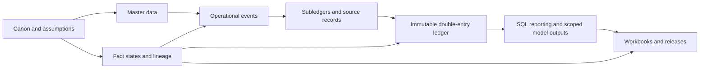

# Architecture

SQLAlchemy metadata is shared across SQLite and PostgreSQL. Alembic owns database creation. Decimal-backed numeric columns carry money; deterministic UUIDv5 identities are public durable keys. The CLI is intentionally small and no service/API/frontend precedes the accounting kernel.

## Dimension ADR

The initial design is hybrid: high-value reporting dimensions—entity, book, account, period, segment, cost center, project, and intercompany counterparty—are dedicated columns. Domain-specific objects such as contracts, workers, assets, sites, batches, waybills, and recovery runs have stable foreign keys. A generalized dimension-assignment table is deferred until real query patterns justify its complexity. This optimizes traceability and practical reporting while retaining an extension path.
