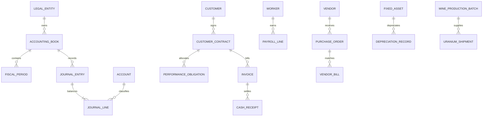

# Data model

Material master and fact records preserve temporal meaning instead of treating one `as_of` value as
both event time and knowledge time. Legal entities and sites carry effective/valid, recorded, known,
and superseded dates plus a source reference; contracts, workers, assets, and operational facts retain
their applicable effective or event dates. Journal dates, periods, source IDs, posting timestamps,
and source-record timestamps remain distinct.

`EpistemicState` distinguishes `LOCKED`, `DERIVED`, `SUPPORTED_ESTIMATE`,
`PROVISIONAL_ASSUMPTION`, `SCENARIO`, `OPEN`, `CONFLICT`, and `SUPERSEDED`. Legal-entity existence,
identity, relationship, and effective-date states are separate facets: a dedicated operator can have
locked existence while its exact name, jurisdiction, and effective mechanics remain open or
provisional. The aggregate `fact_state` remains available for compatibility and must not elevate an
open facet. Posted journals are immutable; corrections use reversal entries. Domain additions
currently include mining, logistics, recovery, research, payroll, procurement, assets, and debt.
