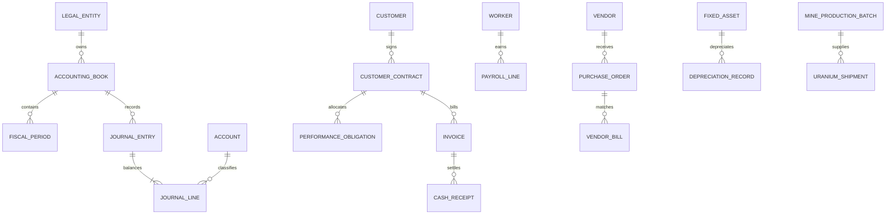

# Data model

Effective dates are present on material entity, contract, worker, asset, site, and operational records. Journal dates, periods, source IDs, posting timestamps, and source-record timestamps remain distinct. Posted journals are immutable; corrections use reversal entries. Domain additions currently include mining, logistics, recovery, research, payroll, procurement, assets, and debt.
