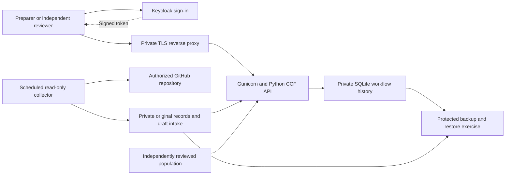

# A practical first CCF system

Build a private pilot on one Linux machine, prove sign-in and one real evidence path, then admit actual operators and assessment records. The first useful outcome is a GitHub change-review assessment that someone can prepare, someone else can review, and both can trace back to retained original records. This proposal supplies defaults so the owner does not need to design infrastructure before work can proceed.

This is a proposed implementation architecture, not a deployment receipt. Corporate shared controls, Reno primary and Boise recovery remain the approved **reference assessment scope**. Running a pilot on one machine does not establish either site's deployment or recovery capability. No PHI processing, HIPAA role appointment, customer commitment or actual assurance acceptance is inferred. Compliance-Atlas remains a read-only reference; code, workpapers and evidence belong in SABLEHARBOR.

## Proposed defaults and the few eventual choices

| Area | Proposed default | Why | What the owner ultimately chooses |
|---|---|---|---|
| First environment | Isolated localhost rehearsal on the existing development machine | Proves the mechanics without buying infrastructure or exposing a service | No further infrastructure choice for this isolated local rehearsal |
| Shared pilot | One private Linux host; access through the approved private network | Keeps administration and recovery understandable | Which existing host or approved hosting account to use; spending ceiling if a new host is necessary |
| Sign-in | Local Keycloak with test identities first | Exercises a real identity provider without presuming an existing company directory | Keep Keycloak or connect the company's existing sign-in provider when known |
| First evidence | Read-only GitHub PR-review collection for SH-ENG-002 | A concrete, inspectable source already relevant to this repository | SABLEHARBOR PR146 supplies the initial public acquisition; choose the complete actual assessment population later |
| People | Separate preparer, reviewer and platform-operator accounts | Makes independent review enforceable | Names of the actual preparer, independent reviewer and accountable operator |
| Frameworks | SOC 2 + HIPAA baseline; ISO 27001, ISO 42001 and C5 remain selectable | Preserves the approved product direction | Which additional framework to activate for an actual assessment |

Local preparation proceeds on the existing machine with the public SABLEHARBOR acquisition. Before shared operation, the owner chooses the host or spending ceiling and names the accountable people. Issuer URLs, signing-key formats, reverse-proxy headers and collector configuration are implementation work derived from those choices. A real read credential is delivered privately when the authorized source is connected.

## How the parts fit

An **identity provider**, or IdP, is the sign-in service: it checks who someone is and issues a signed, short-lived token. Keycloak fills that role in the pilot. The CCF API separately decides what that person may do and which boundaries they may see; a successful login never automatically appoints a control owner or reviewer.

For the first rehearsal, the supplied launcher runs privately retained Keycloak and Java distributions with listeners bound to `127.0.0.1`, explicit local TLS trust and separate per-pilot identity storage. The CCF API uses direct TLS on loopback. Docker daemon access is not required. Keycloak's development file database is restricted to this isolated pilot; switching its bind address does not make it a production deployment. [Keycloak configuration](https://www.keycloak.org/server/configuration).

For a shared pilot, put the CCF API behind the supplied TLS reverse proxy, keep Gunicorn inaccessible to direct clients, and trust only that proxy's forwarded headers. This follows Gunicorn's deployment guidance. The existing Python API and command workflow remain the application layer; a complete browser assessment interface is separate product work and must not be implied by a working sign-in/API rehearsal. [Gunicorn deployment](https://gunicorn.org/deploy/).

Keep the CCF SQLite database and evidence files on private local storage under a dedicated service account. Start with one application instance and serialized writes; this proposal does not claim high availability. Keycloak's own production database is a separate concern: use its supported production database configuration, such as PostgreSQL, before making Keycloak the shared sign-in authority. Do not repurpose the CCF SQLite database as Keycloak storage. [Keycloak database configuration](https://www.keycloak.org/server/db).

## Phases and completion evidence

1. **Local identity and workflow rehearsal.** Start an isolated Keycloak instance, obtain genuine provider-issued tokens for test identities, bind those identities to scoped CCF principals, and exercise preparation, rejection, independent review and revocation through the API. Retain results showing that wrong issuer/audience, expired credentials, unauthorized boundaries and self-review fail. These are real protocol tests using fictional identities, not actual appointments.

2. **First source connection.** Select one authorized repository and closed assessment period. Collect its PR/review records read-only, retain original response pages and transformation provenance, and prepare an independently reviewable population and intake packet. No automated step grants itself source authority or marks missing manual tests complete.

3. **Private shared pilot.** Configure the approved host, TLS name, production sign-in configuration, protected storage and backup destination. Map named people to grants, validate proxy/issuer settings, rehearse recovery, and run one complete assessment with actual source records. Keep collection separate from independent population registration and assessment acceptance. Keycloak documents hostname, HTTPS and production deployment considerations that must be applied here. [Keycloak production configuration](https://www.keycloak.org/server/configuration-production).

4. **Broaden deliberately.** Add source translations for other computable controls, then expand the actual operating period and selected frameworks. Observe contention, storage growth and recovery needs before introducing multiple application nodes or changing the workflow database. Corporate/Reno/Boise deployment and any recovery commitments require actual infrastructure facts and separate validation.

## What the GitHub pilot can establish

SH-ENG-002 concerns independent review of the exact proposed revision and protected-branch controls. GitHub review responses provide reviewer identity, review state, submission time and `commit_id`; those are useful original facts, not an assessment conclusion. [GitHub PR-review API](https://docs.github.com/en/rest/pulls/reviews).

Preserve original Git object IDs. A merge commit may differ legitimately from the reviewed PR head, and an original Git ID must not be relabeled a SHA256 artifact digest. Record any normalization explicitly. Reconcile selected merged PRs to the authorized repository and period, preserve all pages, challenge stale or dismissed approvals, and compare the approved revision with the relevant pre-merge revision.

A current branch-protection response cannot by itself prove historical settings. Missing historical protection, bypass, identity-independence or exact-revision evidence remains an explicit limitation requiring source evidence and human review. The initial connector must not turn unavailable facts into `true`. The existing release tests, emergency workflow and other controls retain their own duties.

## Ownership, preservation and go-live checks

The named **platform operator** maintains host access, upgrades, sign-in configuration and protected backups. The **preparer** supplies evidence and remediation. An **independent reviewer** approves the population and tests; the operator role alone does not confer that authority. Backup custody and restoration access must remain available if the usual operator is absent.

Use a consistent SQLite backup rather than copying a live database file arbitrarily; SQLite provides an online backup API for that purpose. Retain the accompanying evidence, manifests, exact evaluator revision and configuration so replay is meaningful. Protect signing material and credentials separately with restricted recovery access. [SQLite online backup API](https://www.sqlite.org/backup.html).

Before an evaluator upgrade, use the verified history migration into a new private path. Require old/new replay equivalence, preserved event/credential/revocation records, and a recoverable original. Quiesce the old writer at cutover so later events are not stranded in the old copy. Prove restoration on an isolated path, including evidence hashes, failed-history retention and revoked-access behavior; a backup file's existence is insufficient.

A shared pilot is ready only when its named users can complete the first authorized assessment, prohibited actions fail, evidence populations reconcile, missing evidence remains untested, and a restore has been independently checked. Actual mappings and framework-specific applicability still require qualified acceptance.

The current library supports **24 controls with bounded automated assertions**. The 70-control baseline therefore has **46 manual-only controls**; selecting all three extensions yields 86 controls with **62 manual-only controls**. Every automated control also retains mandatory human duties. Automating a record assertion does not automate the entire control, complete an external audit, or establish customer assurance.
