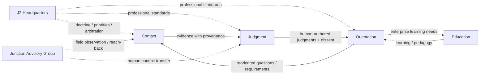

# J2 OPERATING MODEL

**Document ID:** `SH-J2-OPS-001` | **Version:** 1.0.0 | **State:** LOCKED DIRECTION
**Owner:** J2 Headquarters | **Related:** Contact, Judgment, Orientation, JAG, Education | **Cross-reference:** `J2_CHARTER.md`; `J2_HEADQUARTERS.md`

## High-level organization

See the [current J2 organization chart](../organization/charts/corporate-j2.md). The chart distinguishes institutional membership from the CEO reporting direction whose details remain open.

## Functional loop

Solid arrows are work-product flows, not reporting lines. Dotted edges are doctrine, collection, reach-back, cross-cutting-arm, or learning relationships. HQ is not a giant command tower.

Contact collection is directed broadly by Orientation's enterprise priorities and specifically by Judgment Officers' collection requirements/RFIs. HQ arbitrates conflicts/scarcity. Contact chooses lawful source, method, timing, and provenance. Judgment Watch belongs to Judgment but works at Contact intake; it triages and correlates signals, routes them to live problems, or proposes a new problem. Once assigned, the Judgment Officer owns the problem.

J2 outputs connect to governance: material findings may trigger rapid adjudication; board and executive Orientation officers protect epistemic integrity; JAG may surge as a fact witness/ground-truth collector; Education converts important learning into instruction. None of these relationships creates line command.
