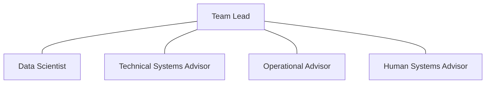

# JUNCTION ADVISORY GROUP — FIELD DOCTRINE

**Document ID:** `SH-J2-JAG-001` | **Version:** 1.0.0 | **State:** LOCKED DIRECTION

Each standard JAG team has exactly five billets: senior management-track **Team Lead**, quantitative **Data Scientist**, software/systems-heavy **Technical Systems Advisor**, line/field **Operational Advisor**, and human-factors/culture/incentives **Human Systems Advisor**. Research is everyone's job; no generic research-analyst seat is added.

The roughly one-year tour has: a 30–45 day first embed to learn/observe/map/build relationships; several months at J2/Willow/experts building and testing; a 30–45 day return embed to implement/test against reality; and approximately 90 days stewarding lessons, teaching, mentoring, updating J2, and supporting course/team redesign.

Teams belong to J2, rotate rather than attach permanently, and target roughly two touches per business line per year. Six active teams (about 30 billets) is working scale. Later teams deliberately test earlier intervention with fresh eyes. This is not consulting tourism.

J2 may surge a team for crisis, serious failure, major adverse finding/board dissent, or consequential uncertainty. It may appear to the board as fact witness, ground-truth collector, or conditions investigator. JAG does not arbitrate, command, audit, or punish. It returns evidence/context, supports Willow reach-back, and transfers context to the relevant JO in person.
