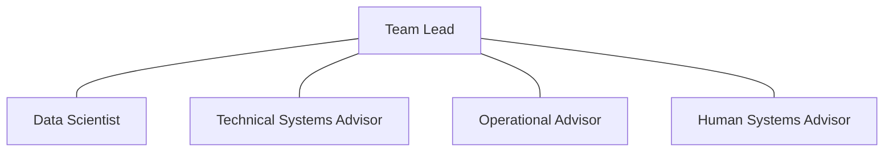

# JUNCTION ADVISORY GROUP — FIELD DOCTRINE

**Document ID:** `SH-J2-JAG-001` | **Version:** 1.0.0 | **State:** LOCKED DIRECTION
**Owner:** Junction Advisory Group | **Related:** Contact, Judgment, Willow, Education | **Cross-reference:** `CONTACT_COLLECTION_MANAGEMENT.md`; `JUDGMENT_OFFICER_PROFESSION.md`; `EDUCATION.md`

Each standard JAG team has exactly five billets: senior management-track **Team Lead**, quantitative **Data Scientist**, software/systems-heavy **Technical Systems Advisor**, line/field **Operational Advisor**, and human-factors/culture/incentives **Human Systems Advisor**. Research is everyone's job; no generic research-analyst seat is added.

The roughly one-year tour has: a 30–45 day first embed to learn/observe/map/build relationships; several months at J2/Willow/experts building and testing; a 30–45 day return embed to implement/test against reality; and approximately 90 days stewarding lessons, teaching, mentoring, updating J2, and supporting course/team redesign.

Teams belong to J2, rotate rather than attach permanently, and target roughly two touches per business line per year. Six active teams (about 30 billets) is working scale. Later teams deliberately test earlier intervention with fresh eyes. This is not consulting tourism.

J2 may surge a team for crisis, serious failure, major adverse finding/board dissent, or consequential uncertainty. It may appear to the board as fact witness, ground-truth collector, or conditions investigator. JAG does not arbitrate, command, audit, or punish. It returns evidence/context, supports Willow reach-back, and transfers context to the relevant JO in person.

## Team philosophy and billet contribution

The Team Lead is a senior management-track professional in the post-Senior-Manager/pre-national-enterprise-leadership career stage. The tour is a career-making broadening assignment because the lead must see across the company without acquiring line command over the host.

The Data Scientist investigates quantitatively and tests whether patterns survive disciplined analysis. The Technical Systems Advisor understands software, development, interfaces, and system behavior. The Operational Advisor tests whether a proposed idea survives actual line or field execution. The Human Systems Advisor studies human factors, organizational behavior, culture, incentives, and why organizations behave as they do; the role is not generic HR. Research belongs to all five billets, so no generic research-analyst seat is added.

## Deployment compact

Before deployment, J2 states the question, host environment, access/safety boundaries, relationships to live Judgment Problems and Contact requirements, and expected handoffs without predetermining conclusions. The host understands that JAG observes and assists but does not evaluate personnel or take command.

The first 30–45 day embed privileges learning, observation, mapping, problem discovery, and human trust. The middle build period uses J2, Willow, and relevant experts to create and test interventions. The second 30–45 day embed returns to implement or test and determine whether the idea survives reality. The final approximately 90 days preserves lessons, teaches, mentors, updates J2, supports course redesign, and helps other teams.

Two different JAG touches per business line per year is a working operating aim, not two permanently assigned teams. Rotation creates constructive replication: a later team tests what happened with fresh eyes. Teams belong to J2 and cannot become a host leader's private staff.

## Surge and board fact-finding

A surge is scoped to conditions and evidence. In a crisis, serious failure, adverse finding, board dissent, or consequential uncertainty, JAG can establish what is occurring, what people are seeing, what artifacts exist, and which context is missing. Before the board, it speaks as fact witness or collector, clearly separating observation, source report, analysis, and uncertainty. It does not arbitrate the dispute or recommend itself into authority.

## Willow and closure

JAG provides a direct route from operating reality to Willow technical support where a bounded experiment or build is appropriate. Willow does not turn the host into an uncontrolled laboratory; JAG does not promise a technical solution before evidence. Closure includes host read-back, evidence transfer to Contact/Judgment, intervention outcome, follow-up ownership, reusable lesson disposition, and Education handoff where warranted.
