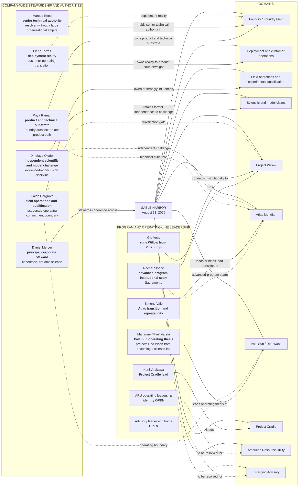

# SABLE HARBOR — AUGUST 31, 2026 LEADERSHIP AND AUTHORITY MAP

**Map ID:** `SH-ORG-002`  
**Status:** Canon-derived roles; exact titles and reporting lines remain open  
**Important:** The arrows below mean **domain responsibility, authority, or institutional interface**. They do not mean “reports to.”

## Governance and continuity outside the operating map

- **Jon Bell** left the executive team in 2023 and remains formally associated, most plausibly through the board and retained ownership. He is not shown as an operating executive.
- **Rachel Kim** departed voluntarily in 2024 after professionalizing finance and operations. She has no August 31, 2026 operating role.
- The six Original Eight members still employed in the working 2026 lore are Daniel, Priya, Elena, Marcus, Maya, and Caleb.

## Guardrails preserved by the map

- Gid cannot unilaterally move Willow experiments into production operations.
- Pale Sun is an operation first and proving ground second.
- Operational accountability owns the immediate consequence; technical and capital authority remain distinct.
- Maya's challenge function must not be collapsed into Atlas product enthusiasm.
- Marcus's technical authority must not be translated into a large management empire or renewed key-person opacity.
- Rachel Sloane is an institutional seam, not Gid's boss.

## Controlling decisions

Primary anchors include `PPL-003` through `PPL-013`, `WIL-012` through `WIL-014`, `ATL-013` through `ATL-015`, `PS-003`, `PS-005`, `PS-015`, `CRD-003`, `ARU-006`, `ARU-009`, `ADV-002`, and `ID-004`.
