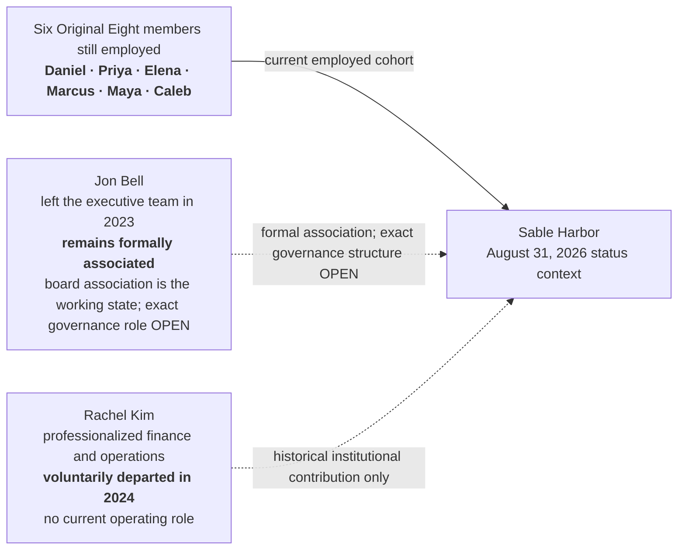

# SABLE HARBOR — AUGUST 31, 2026 LEADERSHIP AND AUTHORITY MAP

**Map ID:** `SH-ORG-002`  
**Version:** 0.2.0  
**Canonical date:** August 31, 2026  
**Map type:** Role, authority, and institutional-interface map  
**Edge meaning:** A documented domain of stewardship, authority, leadership, challenge, or institutional connection. **Edges are not reporting lines.**

```mermaid
flowchart TB
    SH["SABLE HARBOR<br/>August 31, 2026"]

    subgraph STEWARDSHIP["CORPORATE STEWARDSHIP"]
        DANIEL["Daniel Mercer<br/><b>principal corporate steward</b><br/>coherence rather than possession of every answer"]
    end

    subgraph CROSS["CROSS-COMPANY DOMAIN AUTHORITIES"]
        PRIYA["Priya Raman<br/><b>product and technical substrate</b><br/>primary Foundry product and architectural force"]
        ELENA["Elena Torres<br/><b>deployment reality</b><br/>customer-operating translation"]
        CALEB["Caleb Hargrove<br/><b>field operations and experimental qualification</b><br/>test-versus-operating-commitment boundary"]
        MAYA["Dr. Maya Okafor<br/><b>independent scientific and model challenge</b><br/>evidence-to-conclusion discipline"]
        MARCUS["Marcus Reed<br/><b>senior technical authority</b><br/>resolver without a management empire or sole-knowledge dependency"]
    end

    subgraph LEADS["PROGRAM AND OPERATING-LINE LEADERSHIP"]
        GID["Gid Voss<br/><b>runs Willow from Pittsburgh</b><br/>experimental and epistemic authority"]
        SLOANE["Rachel Sloane<br/><b>advanced-program institutional seam</b><br/>Sacramento connection and accountability<br/><i>not Gid's boss</i>"]
        SIMONE["Simone Vale<br/><b>Atlas transition / product leadership</b><br/>repeatability and product boundaries"]
        MARI["Marianne “Mari” Varela<br/><b>Pale Sun operating thesis</b><br/>protects Red Wash from becoming a science fair"]
        KENJI["Kenji Arakawa<br/><b>Project Cradle lead</b><br/>extractive metallurgy"]
        ARULEAD["ARU operating leader<br/><b>OPEN</b>"]
        ADVLEAD["Advisory leader and organizational home<br/><b>OPEN</b>"]
    end

    subgraph DOMAINS["DOCUMENTED DOMAINS"]
        COMPANY["Enterprise coherence"]
        FOUNDRY["Foundry and Foundry Field"]
        DEPLOY["Deployment and customer operations"]
        QUALIFY["Field operations and experimental qualification"]
        CLAIMS["Scientific and model claims"]
        TECHAUTH["Senior technical authority"]
        WILLOW["Project Willow"]
        ATLAS["Atlas Meridian"]
        PALE["Pale Sun and Red Wash"]
        CRADLE["Project Cradle"]
        ARU["American Resource Utility"]
        ADVISORY["Emerging Advisory"]
    end

    DANIEL -->|stewards| COMPANY
    COMPANY --- SH

    PRIYA -->|owns product and technical substrate| FOUNDRY
    ELENA -->|owns deployment reality and translation| DEPLOY
    CALEB -->|owns or strongly influences| QUALIFY
    MAYA -->|retains formal independence to challenge| CLAIMS
    MARCUS -->|holds| TECHAUTH

    GID -->|runs| WILLOW
    SLOANE -.->|institutional connection and accountability| WILLOW
    SLOANE -.->|advanced-program seam| ATLAS
    SIMONE -->|leads or helps lead the transition of| ATLAS
    MARI -->|leads the operating thesis of| PALE
    KENJI -->|leads| CRADLE
    ARULEAD -.->|not yet named for| ARU
    ADVLEAD -.->|not yet resolved for| ADVISORY

    PRIYA -.->|technical substrate| ATLAS
    ELENA -.->|deployment counterweight| FOUNDRY
    CALEB -.->|qualification boundary| WILLOW
    CALEB -.->|operating boundary| PALE
    MAYA -.->|independent challenge| ATLAS

    SH --- FOUNDRY
    SH --- DEPLOY
    SH --- QUALIFY
    SH --- CLAIMS
    SH --- TECHAUTH
    SH --- WILLOW
    SH --- ATLAS
    SH --- PALE
    SH --- CRADLE
    SH --- ARU
    SH -.-> ADVISORY
```

## Governance and continuity status

## Authority boundaries preserved

- Gid cannot unilaterally move Willow experiments into production operations.
- Rachel Sloane connects Willow and advanced programs to the institution; she is not Gid's manager.
- Atlas Meridian remains decision support. Human operators and executives retain decision ownership.
- Pale Sun is an operation first and proving ground second.
- Operational accountability owns an immediate operating consequence; technical and capital authority remain distinct.
- Maya's independent challenge function is not subordinated to product enthusiasm.
- Marcus's authority does not create a large organizational empire or revive sole-person knowledge dependency.

## Controlling canon

Primary anchors: corporate-lore canon sections 5, 7.8, 9.9, 10.11, 12.4–12.6, and 13.1; decision-register IDs `PPL-003`–`PPL-013`, `PPL-016`, `WIL-012`–`WIL-014`, `ATL-013`–`ATL-015`, `PS-003`, `PS-005`, `PS-015`, `CRD-003`, `ARU-006`, `ARU-009`, `ADV-002`, and `ID-004`.
