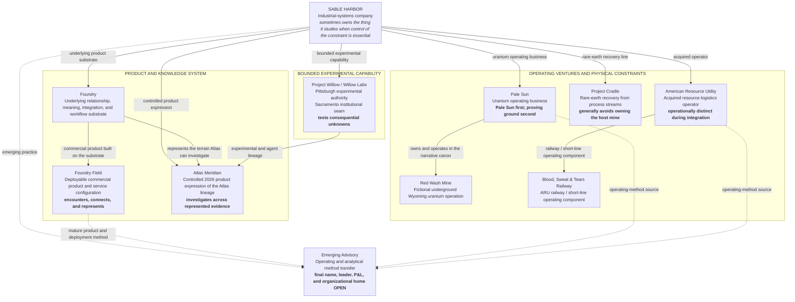

# SABLE HARBOR — AUGUST 31, 2026 OPERATING TOPOLOGY

**Map ID:** `SH-ORG-001`  
**Version:** 0.2.0  
**Canonical date:** August 31, 2026  
**Map type:** Operating topology  
**Edge meaning:** Portfolio relationship, product lineage, operating ownership in the narrative canon, or documented institutional interface. **No edge in this map means “reports to.”**

## Canonical reading

The seven top-level 2026 lines of work—and the Foundry substrate beneath Foundry Field—retain distinct purposes:

| Line | Canonical role |
|---|---|
| **Foundry** | Underlying relationship-and-meaning substrate. |
| **Foundry Field** | Mature deployable commercial product and service configuration built on Foundry. |
| **Willow** | Bounded experimental capability whose unit of work is a consequential industrial question. |
| **Atlas Meridian** | Disciplined investigative product operating across represented evidence; decision support, not autonomous decision authority. |
| **Pale Sun** | Uranium operating business centered on ownership and operation of Red Wash. |
| **Cradle** | Rare-earth recovery line that seeks value in host-created process seams rather than generally owning the host mine. |
| **ARU / BS&T** | Acquired logistics operator and its railway or short-line component. |
| **Advisory** | Emerging transfer of Sable Harbor's method to operators who should own the resulting system. |

## Deliberately unresolved

This map does not choose the legal form of Foundry, Willow, Atlas Meridian, Pale Sun, Red Wash, Cradle, ARU, BS&T, or Advisory. It does not assign executive titles, direct reports, headcount, P&Ls, ownership percentages, intercompany agreements, or final ARU and Advisory leadership.

## Controlling canon

Primary anchors: corporate-lore canon sections 6, 7, 9, 10, 11, 12, and 13; decision-register IDs `FF-001`–`FF-007`, `WIL-011`–`WIL-014`, `ATL-012`–`ATL-015`, `PS-001`, `PS-006`, `PS-015`, `CRD-001`–`CRD-002`, `ARU-001`–`ARU-006`, `ADV-001`–`ADV-002`, and `ID-001`–`ID-003`.
