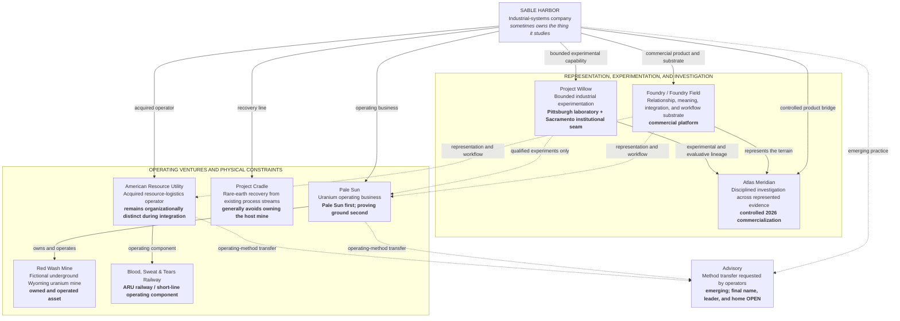

# SABLE HARBOR — AUGUST 31, 2026 OPERATING TOPOLOGY

**Map ID:** `SH-ORG-001`  
**Status:** Canon-derived  
**Important:** This is an operating-topology map, **not** a legal-entity chart and **not** a reporting-line chart.

## How to read the map

- **Solid edges from Sable Harbor** identify the canonical relationship of each capability or operating line to the company. They do not establish a legal form or reporting relationship.
- **Solid edges between units** identify a locked ownership, component, or product-lineage relationship.
- **Dashed edges** identify method, information, experimentation, or emerging-practice relationships rather than ownership.
- **Advisory remains emerging.** Its final name, leader, organizational home, pricing, and P&L are intentionally not shown as settled.

## What is deliberately absent

- a final parent/subsidiary tree;
- exact executive titles and direct reports;
- headcount by unit or location;
- ARU's final integration model and named operating leader;
- the legal form of Pale Sun, Red Wash, Cradle, Willow, or Advisory;
- customer, revenue, and product-P&L allocations.

Those belong to the revised operating-model workstream rather than this canon-derived map.

## Controlling decisions

Primary decision-register anchors include `ID-001` through `ID-003`, `FF-001` through `FF-007`, `WIL-011` through `WIL-014`, `ATL-012` through `ATL-015`, `PS-001`, `PS-006`, `PS-015`, `CRD-001`, `CRD-002`, `ARU-001` through `ARU-006`, and `ADV-001` through `ADV-002`.
