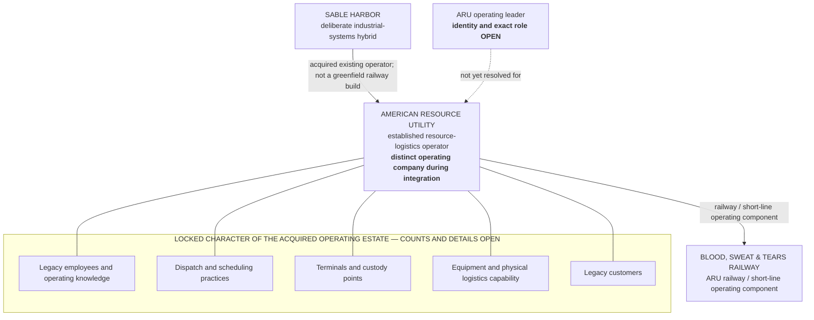
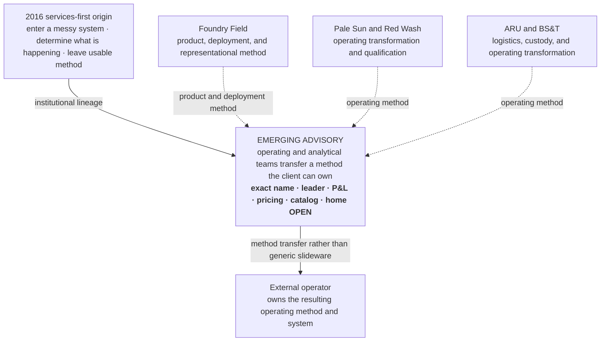
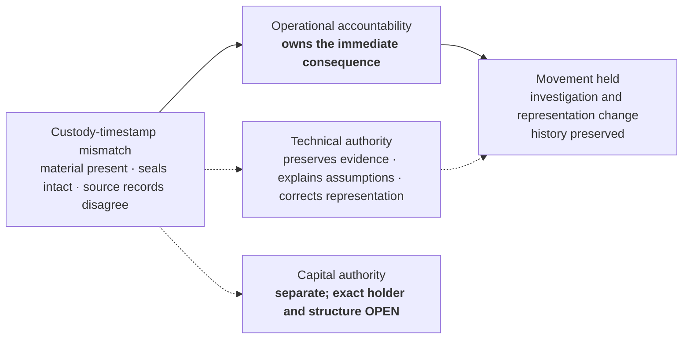

# SABLE HARBOR — ARU, BS&T, AND EMERGING ADVISORY ORGANIZATION MAP

**Map ID:** `SH-ORG-010`  
**Version:** 0.2.0  
**Canonical date:** August 31, 2026  
**Map type:** Acquired-operator, operating-component, and method-transfer map  
**Edge meaning:** Acquisition, operating component, retained operating estate, historical contribution, or method transfer. **No edge establishes an unresolved legal ownership chain or reporting line.**

## American Resource Utility and Blood, Sweat & Tears Railway

The map does not invent routes, terminals, equipment counts, rolling stock, interchange relationships, workforce, customers, acquisition terms, or the exact legal relationship between ARU and BS&T.

## Advisory's return

## Authority boundary from the 2026 custody incident

## Controlling canon

Primary anchors: corporate-lore canon sections 12 and 13; decision-register IDs `ARU-001`–`ARU-009`, `ADV-001`–`ADV-002`, `FND-001`, `FF-003`, and `ID-001`–`ID-003`.
