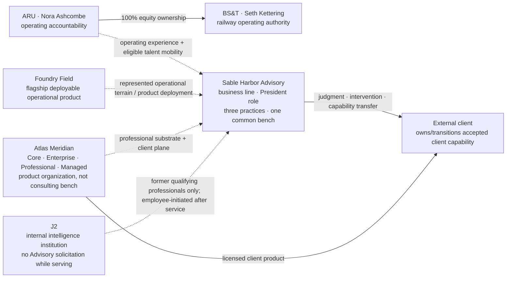

# ARU, BS&T AND THE ADVISORY INTERFACE

**Map ID:** `SH-ORG-010` | **Version:** 2.1.0  
**Canonical date:** September 9, 2026 | **Available on:** 2026-09-09  
**State:** Current organization/interface map  
**Controlling Advisory decision:** [`SH-ADV-ATL-DR-003`](../canon/DECISION_REGISTER_ADDENDUM_2026-09-09_ADVISORY_TIER1.md)

**Map type:** Acquired operator, operating-experience and professional-services interface  
**Edge meaning:** Labeled ownership, operating responsibility, experience flow or professional transfer. Edges are not implied reporting lines or custody permissions.

[The current ARU chart](ARU_BST_ORGANIZATION.md) establishes SHI → SHIH → ARU → BS&T and operators Nora Ashcombe and Seth Kettering. The acquired estate contributes real operating experience to Sable Harbor. That experience may later move into Advisory through ordinary talent mobility, but Advisory does not obtain operating authority over ARU or BS&T merely because it advises clients.

## Advisory practices

Advisory operates three market-facing practices from one professional bench:

1. **Intelligence Advisory** — establish what is actually happening, what can responsibly be believed, and what a consequential decision should take into account.
2. **Intelligence Capability** — help a client build durable intelligence capability adapted to its own institution.
3. **Operational Excellence** — improve hard physical and organizational operations using Sable Harbor's operating experience without transferring protected Sable Harbor trade secrets or operating-business IP.

The practice labels do not create separate staffing silos.

## Governance and professional hierarchy

Advisory is an operating business line led by a President. The individual appointment remains a personnel decision. Management and professional authority are separate: the professional ladder culminates in Distinguished Principal, allowing elite matter leadership, review, method ownership and economics without requiring line command.

## Talent boundary

Advisory may recruit actively from Sable Harbor operating lines, including by name, subject to enterprise continuity and mobility rules.

Advisory **may not recruit, solicit, court, pre-negotiate with, reserve a role for, discuss carry with, or open an application for any serving J2 professional**. Former qualifying J2 professionals may approach Advisory on their own once service is complete. There is no post-service cooling-off period.

Carry is restricted to former J2 professionals who meet the explicit qualification gates in [`SH-ADV-003`](../advisory/TALENT_MOBILITY_AND_CARRY.md). Carry economics are controlled by [`SH-ADV-005`](../advisory/CARRY_PLAN_STANDARD.md) and do not create line authority.

## Product boundary

Foundry Field remains Sable Harbor's flagship deployable operational product.

Atlas Meridian is both a commercial client product and the professional matter system for Advisory. Its dedicated organization is a product-development organization, not a consulting pool. Atlas has Core, Enterprise, Professional and Managed product configurations; institutional/tenant licensing and product controls are defined in [`SH-ATL-017`](../advisory/ATLAS_MERIDIAN_COMMERCIAL_PRODUCT_STANDARD.md).

Atlas may receive generalized product requirements from client work under proper confidentiality and IP controls; its people do not become Advisory professionals merely because they support the product used on a matter.

## Professional authority boundary

Methods and capability may transfer without transferring ownership or operating authority. A client's operating management remains accountable for its operation unless a contract and applicable law explicitly establish a different relationship.

The custody-timestamp incident preserves the same narrow rule in Sable Harbor's own industrial estate: operational accountability owns the immediate consequence; technical authority preserves sources and corrects representation; capital authority remains separate. No model, consultant or common ownership silently manufactures custody or operating authority.

## Controlling sources

- [September 9 Advisory Tier 1 decision addendum](../canon/DECISION_REGISTER_ADDENDUM_2026-09-09_ADVISORY_TIER1.md)
- [Advisory firm manual](../advisory/SABLE_HARBOR_ADVISORY_FIRM_MANUAL_2026-09-09.md)
- [Advisory operating model](../advisory/OPERATING_MODEL.md)
- [Talent, mobility and carry](../advisory/TALENT_MOBILITY_AND_CARRY.md)
- [Carry plan](../advisory/CARRY_PLAN_STANDARD.md)
- [Atlas professional platform](../advisory/ATLAS_MERIDIAN_PROFESSIONAL_PLATFORM.md)
- [Atlas commercial product standard](../advisory/ATLAS_MERIDIAN_COMMERCIAL_PRODUCT_STANDARD.md)
- [Industrial closeout](../canon/INDUSTRIAL_CLOSEOUT_2026-09-05.md)
- [Authority](../../industrial/corporate/LEADERSHIP_AND_AUTHORITY.md)

Historical anchors remain `ARU-001`–`ARU-009` and `ADV-001`–`ADV-002`; September 8 and September 9 Advisory decisions supersede prior OPEN structure where explicitly resolved.
