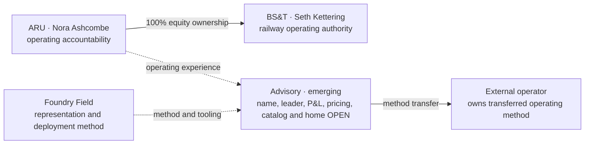

# ARU, BS&T and the Advisory interface

**Map ID:** SH-ORG-010 | **Version:** 1.0.0
**Canonical date:** September 5, 2026 | **Available on:** 2026-09-05
**Created at:** 2026-09-05T22:16:52-07:00
**State:** Accepted synthetic case with reconstructed institutional evidence

**Map type:** Acquired operator and method-transfer interface
**Edge meaning:** Labeled ownership, operating responsibility or method transfer; no implied custody permission

[The current ARU chart](ARU_BST_ORGANIZATION.md) establishes SHI → SHIH → ARU → BS&T and operators Nora Ashcombe and Seth Kettering. The 131-FTE acquired estate includes diversified terminal/trucking/warehouse services and an existing railway. [Diligence](../../industrial/transaction/03_ARU_DILIGENCE_MEMORANDUM.md) retains railway maintenance, environmental/claim and customer risks instead of treating Red Wash as a captive customer that automatically justifies ownership.

Advisory draws from the services-first 2016 origin, Foundry Field deployments and industrial experience. This closeout does not appoint its leader, create a legal entity, settle commercial terms or put it above ARU. Methods transfer without transferring ownership or operating authority.

The custody-timestamp incident preserves a narrow rule: operational accountability owns the immediate consequence; technical authority preserves sources and corrects representation; capital authority remains separate. A held movement is not released because a model is elegant or ownership is common. No ARU/BS&T uranium custody is established.

Sources: [industrial closeout](../canon/INDUSTRIAL_CLOSEOUT_2026-09-05.md), [authority](../../industrial/corporate/LEADERSHIP_AND_AUTHORITY.md), corporate-lore §§12–13 and base `ARU-001`–`ARU-009`, `ADV-001`–`ADV-002`. Current industrial detail supersedes earlier OPEN labels; unrelated Advisory uncertainty remains.
