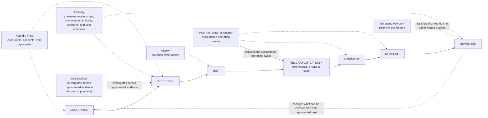
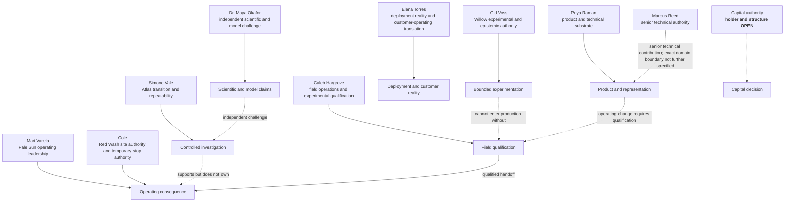
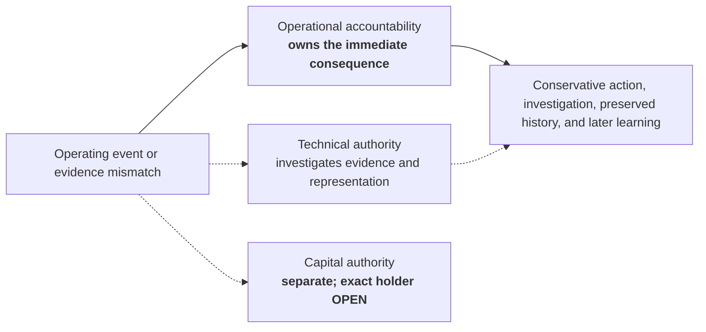

# SABLE HARBOR — DECISION RIGHTS AND OPERATING GATES

**Map ID:** `SH-ORG-011`  
**Version:** 0.2.0  
**Canonical date:** August 31, 2026  
**Map type:** Cross-company authority and operating-gate map  
**Edge meaning:** Contribution to the locked operating sequence, documented authority, required qualification, retained operating ownership, or a separation of authority. **This map does not assign direct reports or identify an unresolved capital-authority holder.**

## Operating sequence and the production boundary

The sequence below is the canon's analytical model, not a claim that every engagement follows one rigid workflow.

The gate is the canonically locked boundary: Willow, Foundry, Atlas, or any other Sable Harbor unit may test work at Red Wash only through field qualification and an operating owner. The chart does not invent a universal detailed gate procedure.

## Named authority domains

## Immediate-consequence rule

## Non-negotiable boundaries

- No source or model is authoritative for every purpose.
- Foundry may represent a claim and its authority without declaring the claim physically true.
- Willow experiments require a bounded question loop and a continue, change, transfer, or kill decision.
- A successful laboratory result is not automatically operationally viable.
- Gid cannot unilaterally place an experiment into production.
- Red Wash accepts tests only through field qualification and an operating owner.
- Atlas Meridian investigates and supports decisions; it does not own final acquisition, capital, or operating decisions.
- When records disagree during an operating event, operational accountability owns the immediate consequence. Technical and capital authority remain distinct.
- Exact unresolved executive titles, reporting lines, and numeric management thresholds remain open. Board delegation bands and committee/capital oversight identities are controlled by the current governance instruments.

## Controlling canon

Primary anchors: corporate-lore canon sections 6.2–6.4, 7.7–7.8, 9.8–9.9, 10.9–10.11, 12.4–12.5, 13.1, and 14; decision-register IDs `FF-006`, `WIL-012`–`WIL-013`, `ATL-010`–`ATL-015`, `PS-012`–`PS-015`, `ARU-008`–`ARU-009`, `PPL-004`, and `PPL-007`–`PPL-010`.
