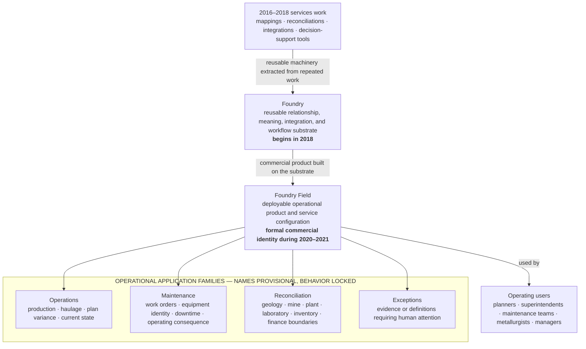
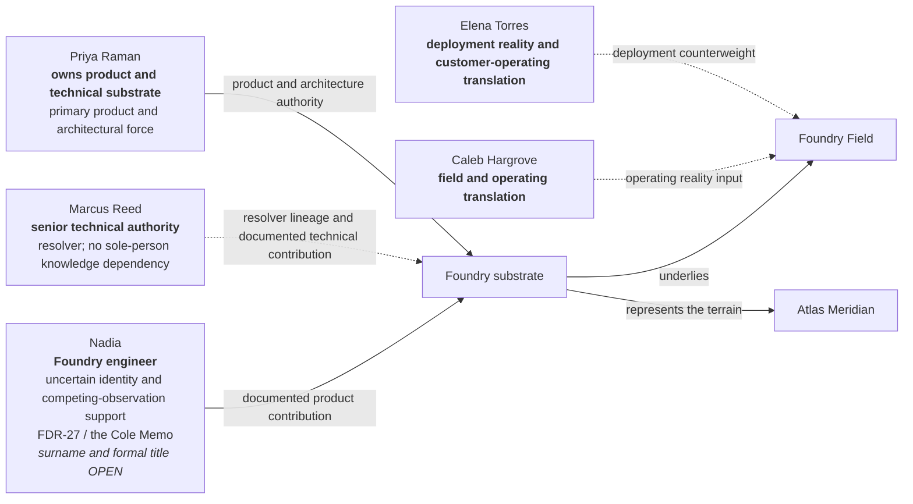

# SABLE HARBOR — FOUNDRY AND FOUNDRY FIELD ORGANIZATION MAP

**Map ID:** `SH-ORG-006`  
**Version:** 0.2.0  
**Canonical date:** August 31, 2026  
**Map type:** Product, authority, and operating-interface map  
**Edge meaning:** Product lineage, documented authority, contribution, or operating interface. **No edge establishes a reporting line.**

## Product architecture

## Authority and contribution map

## Locked distinctions

- Foundry is the substrate; Foundry Field is the deployable commercial product and service configuration.
- Integrations are necessary plumbing, not the central invention. The invention is the knowledge layer preserving relationships and meaning.
- Authority is purpose-specific. Foundry records what a source is authoritative for, during which period, under which definition, and with which limitations.
- The mature loop is **Observe → relate → reconcile → surface → act → record → learn**.
- Foundry represents observations, records, claims, transformations, authority, and change. It does not certify the physical world as ground truth.
- Generalization must not erase the local meaning that made a variation useful.
- Exact team size, management hierarchy, application names, P&L, and legal form remain unresolved.

## Controlling canon

Primary anchors: corporate-lore canon sections 5.1, 6.1–6.8, 8.4–8.5, 9.1–9.2, 10.10, and 13.1; decision-register IDs `PPL-004`, `PPL-007`–`PPL-010`, `PPL-017`, `FF-001`–`FF-008`, `CRX-001`–`CRX-005`, `ATL-014`, and `PS-014`.
