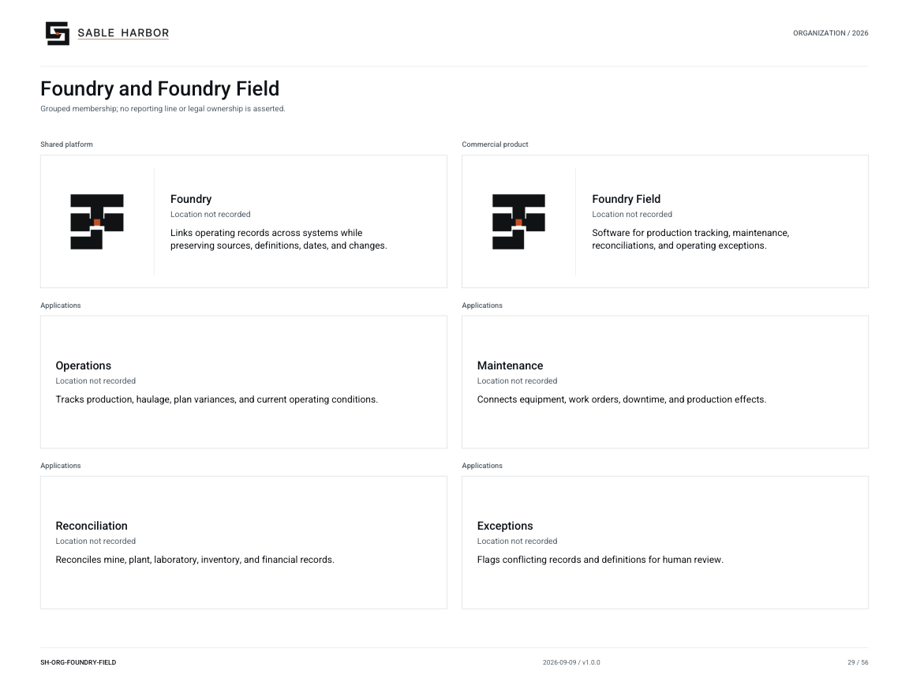

# Foundry and Foundry Field

[Current chart](charts/foundry-field.md) · [Related people or reference chart](charts/people-foundry-field.md) · [Complete chart index](README.md)

This page preserves the existing URL and links to the shared current publication. Source qualifications and relationship meanings are on the chart page. [Prior artwork](CHART_MIGRATION.md) is retained as history.
