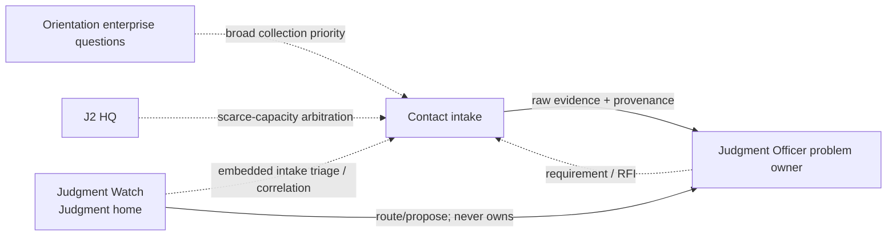
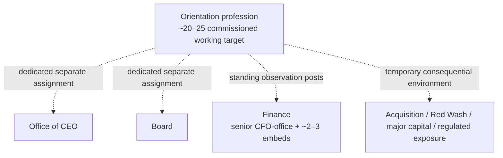

# J2 ORGANIZATION CHARTS

**Map ID:** `SH-ORG-J2-001` | **Version:** 1.0.0 | **State:** LOCKED DIRECTION  
**Edge rule:** Solid arrows are work-product flows. Dotted lines are advisory, collection-direction, assignment, or standards relationships—not HR reporting unless explicitly stated.

## Contact / Judgment interface

## Orientation / decision interface

Executive assignments rotate about 24–36 months. Presence follows decision environment, not prestige. See `docs/j2/J2_OPERATING_MODEL.md` for the high-level loop and `docs/j2/JUNCTION_ADVISORY_GROUP.md` for the five-billet JAG chart.
