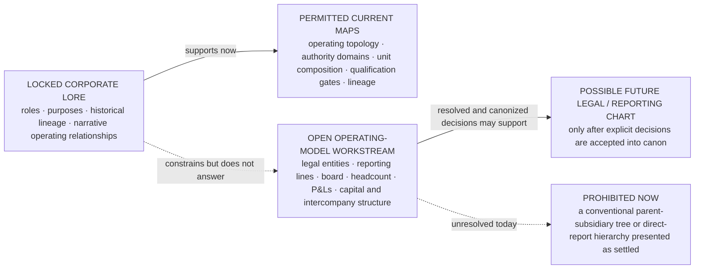

# SABLE HARBOR — LEGAL AND REPORTING STRUCTURE STATUS

**Map ID:** `SH-ORG-005`  
**Version:** 0.3.0
**Canonical date:** September 2, 2026
**Status:** PARTIALLY RESOLVED legal-and-reporting workstream guardrail
**Map type:** Open-workstream boundary and publication-status map  
**Edge meaning:** Supportability, constraint, or prerequisite relationship. **No edge establishes a legal entity, ownership chain, title, or reporting line.**  
**Purpose:** Prevent canon-derived organization maps from silently becoming a final legal-entity tree, executive hierarchy, or quantitative operating model.

## Status diagram

The dotted edge identifies the present prohibition. A conventional legal or reporting chart becomes supportable only after the open operating-model decisions are explicitly resolved and accepted.

## What is locked strongly enough to chart

- Sable Harbor is primarily one operating company with business lines, not a conglomerate of named capabilities.
- ARU is a controlled acquired subsidiary; BS&T is a legal subsidiary beneath ARU.
- Red Wash operates through a dedicated legal operating company; Pale Sun remains the strategic/business-line identity.
- Foundry, Foundry Field, Willow, Atlas Meridian, Emberline, Cradle, Advisory, and J2 are not separate legal entities merely because they have names.

- Sable Harbor was incorporated in Sacramento in 2016 and is the controlling corporate identity for the narrative.
- Foundry is the underlying relationship-and-meaning substrate.
- Foundry Field is the mature deployable commercial product and service configuration built on Foundry.
- Willow is the bounded experimental capability created when Evalon ended as an operating concept in 2022.
- Atlas Meridian is the controlled 2026 product expression of the longer Atlas lineage.
- Pale Sun is a uranium operating business and owns and operates Red Wash in the narrative canon.
- Cradle is a rare-earth recovery line that generally avoids owning the host mine.
- Sable Harbor acquired American Resource Utility.
- ARU remains a distinct operating company during integration.
- Blood, Sweat & Tears Railway is ARU's railway or short-line operating component.
- Advisory is emerging but not fully institutionalized.
- Named people have locked domains of stewardship, authority, challenge, leadership, or institutional connection.

These are sufficient for operating and authority maps. They are not sufficient for a complete legal or reporting chart.

## What remains OPEN

1. The exact legal form and jurisdiction of the August 31, 2026 parent entity.
2. Exact internal divisional/program form for named business capabilities, without changing their non-entity default.
3. Exact formal legal names/jurisdictions in the locked Sable Harbor→ARU→BS&T and Sable Harbor→dedicated Red Wash operator relationships.
4. Pale Sun and Red Wash transaction entities, financing, liability allocation, intercompany services, and governance.
5. Cradle's process-right, equipment, royalty, recovery-right, or participation structures.
6. ARU's final integration model and named operating leader.
7. Advisory's final name, leader, P&L, pricing, service catalog, launch date, and organizational home.
8. Exact executive titles and direct-report relationships.
9. Exact legal-document implementation of the locked board/committee/delegation architecture; composition and Jon Bell's non-management directorship are resolved.
10. Headcount allocation by function, office, product, program, or operating company.
11. Product, venture, and operating-company P&Ls.
12. Capital authority, acquisition consideration, debt, ownership percentages, and intercompany arrangements.

## Relationship to the prior operating-model branch

The earlier `architecture/corporate-operating-model-v0.1` branch contains a detailed provisional legal, workforce, leadership, board, and financial model. The corporate-lore v0.2 package explicitly makes that draft noncontrolling where it conflicts with:

- Willow;
- Red Wash and Pale Sun;
- Project Cradle;
- ARU and BS&T;
- emerging Advisory;
- Emberline's historical 2026 status;
- the reconciled leadership and authority state.

Useful scale assumptions may later be reconsidered, but the previous tree must not be copied into a polished chart and treated as settled canon.

## Required future decisions

A later operating-model workstream should resolve, in order:

1. parent and subsidiary architecture;
2. operating-company boundaries and intercompany services;
3. board and executive leadership model;
4. domain and decision rights;
5. direct-report structure;
6. headcount and office allocation;
7. P&L and capital-accountability structure;
8. chart publication and effective date.

Until that work is accepted, `2026_OPERATING_TOPOLOGY.md`, `2026_LEADERSHIP_AND_AUTHORITY_MAP.md`, and `DECISION_RIGHTS_AND_OPERATING_GATES.md` are the correct public diagram forms.

## Controlling canon

Primary anchors: corporate-lore canon sections 13, 15, and the document-control scope statement; decision-register IDs `ID-006`–`ID-008`, `PS-011`, `PS-016`–`PS-017`, `ARU-006`–`ARU-007`, and `ADV-002`.
