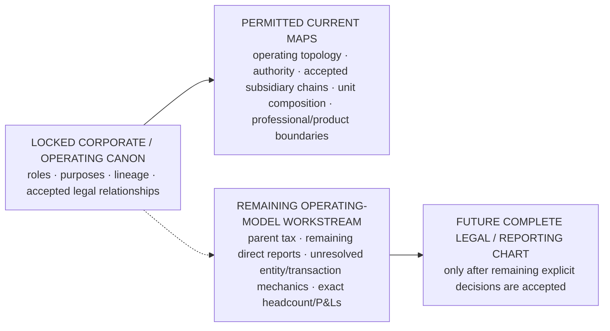

# SABLE HARBOR — LEGAL AND REPORTING STRUCTURE STATUS

**Map ID:** `SH-ORG-005`  
**Version:** 0.4.0  
**Canonical date:** September 9, 2026  
**Status:** PARTIALLY RESOLVED legal-and-reporting workstream guardrail  
**Map type:** Open-workstream boundary and publication-status map  
**Edge meaning:** Supportability, constraint, or prerequisite relationship. **No edge establishes a legal entity, ownership chain, title, or reporting line unless a controlling legal/canon source does so.**

## Status diagram

## What is locked strongly enough to chart

- Sable Harbor is primarily one operating company with business lines, not a conglomerate of named capabilities.
- ARU is a controlled acquired subsidiary; BS&T is a legal subsidiary beneath ARU.
- Red Wash operates through a dedicated legal operating company; Pale Sun remains the strategic/business-line identity.
- Foundry, Foundry Field, Willow, Atlas Meridian, Cradle, Advisory, and J2 are not separate legal entities merely because they have names.
- Sable Harbor was incorporated in Sacramento in 2016 and is the controlling corporate identity for the narrative.
- Foundry is the underlying relationship-and-meaning substrate.
- Foundry Field is the flagship deployable operational product/service configuration built on Foundry.
- Willow is the bounded experimental capability created when Evalon ended as an operating concept in 2022.
- Atlas Meridian is the commercial product expression of the Atlas lineage and is also Advisory's professional matter substrate; its dedicated organization is a product organization.
- Pale Sun is a uranium operating business and owns/operates Red Wash in the accepted case.
- Cradle is a rare-earth recovery line that generally avoids owning the host mine.
- Sable Harbor acquired American Resource Utility; ARU remains a distinct operating company during integration.
- Blood, Sweat & Tears Railway is ARU's railway/short-line operating component.
- **Sable Harbor Advisory is now institutionally defined as a business line of the existing controlling Sable Harbor contracting entity unless a later approved transaction creates a separate entity.** It is not an implied subsidiary or partnership.
- Advisory has three practices on one common bench, a President role, dual management/professional ladders, matter governance, outcome/capability pricing, carry architecture, conflicts/IP/quality standards, and Atlas product relationship under `SH-ADV-ATL-DR-003`.
- Named people have locked domains of stewardship, authority, challenge, leadership, or institutional connection where separately canonized.

These facts are sufficient for current operating, authority, product and professional maps. They do not create a complete conventional HR reporting tree.

## What remains OPEN

1. The exact tax classification/elections and any resulting owner-versus-entity tax treatment of the parent.
2. Remaining exact direct-report relationships not separately established.
3. Any future SPV, financing, tax-consolidation or entity mechanics for transactions not yet approved.
4. Cradle's future contract/right/equipment/royalty structures where not already established for a specific matter.
5. Any remaining unsettled integration/reporting mechanics outside accepted ARU/BS&T legal facts.
6. The **individual appointment** to President, Sable Harbor Advisory. The role and business architecture are not open.
7. Exact headcount allocation by function, office, product, program or business line where no accepted case supplies it.
8. Exact product/business-line P&Ls beyond the existing finance model's stated synthetic/management status.
9. Remaining capital/intercompany arrangements not established by current accepted transaction records.

## Advisory supersession

Earlier sources that described Advisory's final name, legal form, pricing, service catalog and organizational home as wholly OPEN are superseded in those respects by:

- `SH-ADV-ATL-DR-002` — September 8 operating architecture;
- `SH-ADV-ATL-DR-003` — September 9 Tier 1 operating-system closeout;
- `SH-ADV-MAN-001` — integrated Advisory Firm Manual.

Current operating decision:

- name: **Sable Harbor Advisory**;
- legal form: **business line of the existing controlling Sable Harbor contracting entity**, absent a later approved entity transaction;
- leader: **President role locked; individual appointment open**;
- service architecture: three practices / one bench;
- pricing architecture: matter classes, value/capability/fixed/managed models controlled;
- professional hierarchy: dual management/professional ladders;
- carry: J2-restricted phantom carry architecture controlled;
- Atlas relationship: product organization + commercial product + Advisory professional substrate controlled.

Qualified legal, tax, insurance, privacy, security and trademark execution remains required before actual external commercialization. Execution work does not reopen settled operating design.

## Relationship to prior operating-model branches

Earlier provisional architecture remains noncontrolling where it conflicts with current canon. Useful scale assumptions may be reconsidered, but old entity/reporting structures must not be copied into polished current diagrams without accepted support.

## Required future decisions

Remaining legal/reporting work should now focus only on actual unresolved enterprise mechanics:

1. parent tax/election decisions;
2. remaining exact reporting relationships;
3. transaction-specific SPVs/financing/intercompany agreements when real scenarios require them;
4. accepted quantitative headcount/P&L/capital models where the current finance system still marks values synthetic or model-proposed;
5. complete publication of the final legal/reporting chart after those residual items are resolved.

## Controlling canon

Primary current anchors include corporate-lore canon sections 13 and 15, accepted industrial/legal closeouts, `ID-006`–`ID-008`, and [`SH-ADV-ATL-DR-003`](../canon/DECISION_REGISTER_ADDENDUM_2026-09-09_ADVISORY_TIER1.md).
