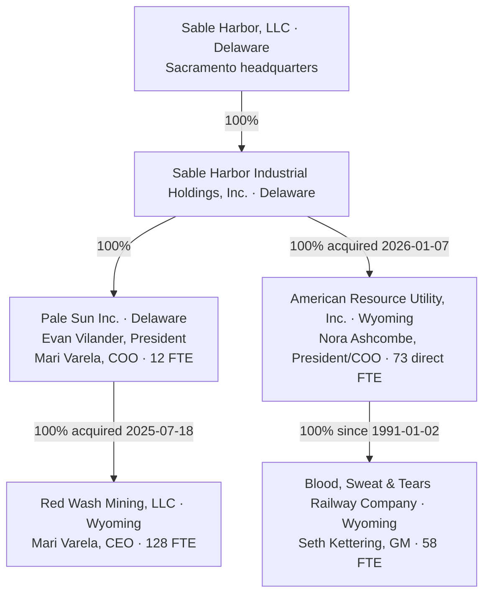

# Sable Harbor — current legal and reporting structure

**Map ID:** SH-ORG-LEGAL-001 | **Version:** 1.0.0
**Canonical date:** September 5, 2026 | **Available on:** 2026-09-05
**Created at:** 2026-09-05T22:16:52-07:00
**State:** Accepted synthetic case with reconstructed institutional evidence

**Map type:** Legal ownership and expressly appointed operating officers
**Edge meaning:** Labeled 100% equity ownership; no unlabeled line creates a reporting relationship

The adopted [industrial closeout](../canon/INDUSTRIAL_CLOSEOUT_2026-09-05.md) resolves the parent and industrial legal tree. Earlier legal-OPEN maps are preserved in [history](history/v0.3.0/HISTORY.md). Foundry, Foundry Field, Willow, Atlas Meridian, Cradle, Advisory and J2 remain capabilities or institutions within the company unless separately decided.

The six entities retain separate legal identities and traceable books. SHI is a stable system key, not an Inc. suffix. The existing contractual LLC board and delegation architecture remain unchanged; this chart creates no extra directors, holding-company executive staff or parent tax classification. PS and SHIH are modeled C corporations. ARU's pre-close S and BS&T's QSub treatment depend on explicit synthetic eligibility assumptions and the [tax memorandum](../../industrial/transaction/07_ARU_TAX_STRUCTURE_MEMORANDUM.md).

Pale Sun's 12 and Red Wash's 128 total 140. Mari's two titles occupy one PS billet. ARU's 73 and BS&T's 58 total 131. These are selected cases, not a newly reconciled enterprise-wide census. [Finance](../../industrial/source/finance.json) controls ARU payroll/statements; [entities](../../industrial/source/entities.json) controls legal identifiers; [leadership](../../industrial/corporate/LEADERSHIP_AND_AUTHORITY.md) controls named responsibility.

Exact title and ownership closure does not grant uranium custody, certify railroad rights, establish actual tax filing or decide unrelated Advisory structure. Cole's surname remains unestablished; Walt Sutter remains external. [Current Red Wash canon](../canon/RED_WASH_TRANSACTION_OPERATING_RECORD_2026-09-05_R2.md) preserves mining economics while correcting legal/geographic assumptions.
