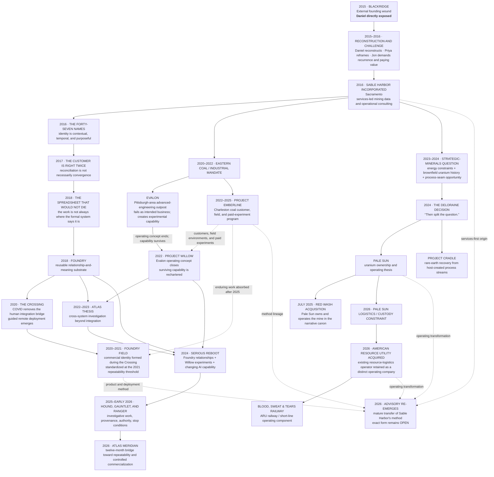

# SABLE HARBOR — ORGANIZATIONAL LINEAGE, 2015–2026

**Map ID:** `SH-ORG-004`  
**Version:** 0.2.0  
**Canonical date:** August 31, 2026  
**Map type:** Historical and institutional lineage  
**Edge meaning:** Chronology, causal influence, rechartering, product lineage, acquisition rationale, or historical absorption. **This is not a present-day reporting tree.**

## Historical status at August 31, 2026

- **Blackridge** is an external antecedent, not a Sable Harbor business unit.
- **Evalon** is historical. Its operating concept ended in 2022; Willow preserves the capability, not the failed business thesis.
- **Emberline** is historical as a standalone venture after 2025. Its enduring work moved into Foundry, Willow, field operations, and emerging Advisory.
- **Foundry** and **Foundry Field** are distinct: substrate first, commercial product and service configuration second.
- **Atlas Meridian** is the 2026 product expression of a research lineage dating to 2022.
- **Pale Sun** and **Cradle** are deliberately different businesses created by the Deloraine Decision.
- **ARU** is an acquired operator rather than a greenfield railway build.
- **Advisory** is a return of the services-first method in a more mature form, not generic consulting.

## Controlling canon

Primary anchors: corporate-lore canon sections 2–4 and 6–13; decision-register IDs `BR-001`–`BR-004`, `FND-001`–`FND-005`, `FF-001`–`FF-003`, `CRX-001`–`CRX-005`, `WIL-003`, `EMB-001`–`EMB-002`, `WIL-011`, `ATL-001`–`ATL-015`, `AUS-004`, `PS-001`–`PS-015`, `CRD-001`–`CRD-009`, `ARU-001`–`ARU-009`, and `ADV-001`.
