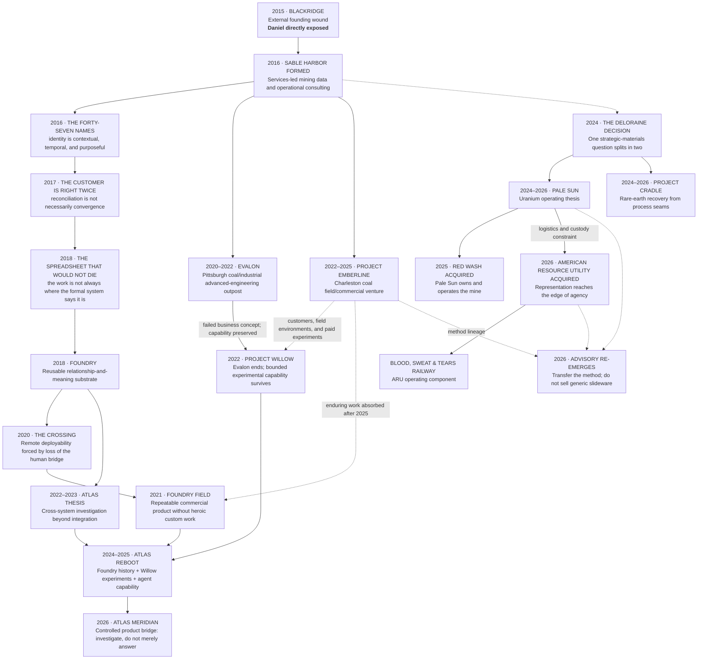

# SABLE HARBOR — ORGANIZATIONAL LINEAGE, 2015–2026

**Map ID:** `SH-ORG-004`  
**Status:** Canon-derived historical and organizational lineage  
**Important:** This map shows causation and institutional descent, not a present-day reporting tree.

## Present-day interpretation

- **Evalon** is historical. It is not a 2026 business unit; it was closed as a concept and rechartered as Willow.
- **Emberline** is historical as a standalone venture after 2025. Its enduring work is absorbed into Foundry, Willow, field operations, and emerging Advisory.
- **Foundry Field** remains the mature commercial engine and representational substrate.
- **Atlas Meridian** is the product expression of a longer Atlas research lineage.
- **Pale Sun and Cradle** are not two versions of the same strategic-minerals business; the Deloraine Decision intentionally gives them different ownership models.
- **ARU** is an acquired operating company, not a greenfield railway project.
- **Advisory** is a return of Sable Harbor's original method in mature form, not a newly invented generic consulting practice.

## Controlling decisions

Primary anchors include `BR-001` through `BR-004`, `FND-001` through `FND-005`, `FF-001` through `FF-003`, `CRX-001` through `CRX-005`, `WIL-003`, `EMB-001`, `WIL-011` through `WIL-018`, `ATL-001` through `ATL-015`, `AUS-004`, `PS-001` through `PS-015`, `CRD-001` through `CRD-009`, `ARU-001` through `ARU-009`, and `ADV-001`.
