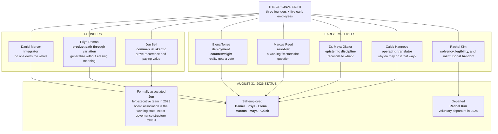

# SABLE HARBOR — THE ORIGINAL EIGHT

**Map ID:** `SH-ORG-003`  
**Version:** 0.2.0  
**Canonical date:** August 31, 2026  
**Map type:** Founding cohort and current-status map  
**Edge meaning:** Membership in the Original Eight and documented August 31, 2026 status. **No edge establishes ownership, rank, or a reporting line.**

The Original Eight are the three founders and five early employees who coalesced through Sable Harbor's 2016–2017 work. They were **not** an eight-person Blackridge team. Daniel Mercer is the only future Sable Harbor leader directly exposed to the Blackridge failure.

## Formation sequence

- Daniel brings the system-level wound and the need to see the whole.
- Priya identifies the semantic and structural class of problem.
- Jon demands proof that the problem recurs and that customers will pay to solve it.
- Elena, Marcus, Maya, Caleb, and Rachel join through the 2016–2017 operating work rather than being inserted into Blackridge.
- The Forty-Seven Names, the Customer Is Right Twice, and the Spreadsheet That Would Not Die reveal different disciplines inside the founding cohort.
- Nora Singh is an important 2017 side-door hire but is not one of the Original Eight.
- Ray Baca is a recurring external customer-side reality check and is not a Sable Harbor employee.

## What this map does not claim

- equal founder or employee ownership;
- a present-day executive committee;
- exact titles, compensation, equity, or reporting lines;
- that every member was present at incorporation;
- that Jon retains day-to-day operating authority;
- a final board structure;
- any August 31, 2026 employment role for Rachel Kim.

## Controlling canon

Primary anchors: corporate-lore canon sections 2.1, 3, and 5.1; decision-register IDs `BR-002`–`BR-004` and `PPL-001`–`PPL-013`.
