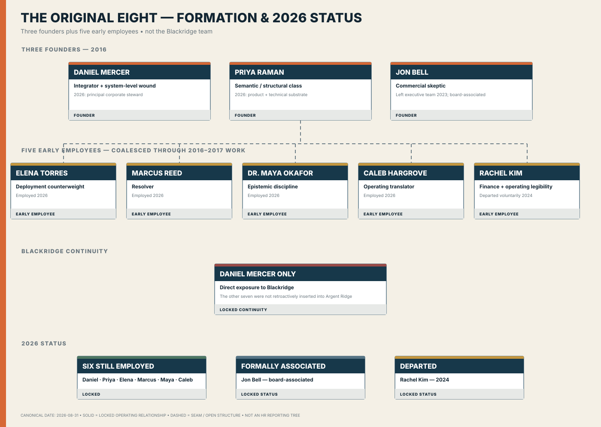

# THE ORIGINAL EIGHT — FORMATION & STATUS

**Chart ID:** `SH-ORG-009`
**Canonical date:** August 31, 2026
**Canon reviewed through:** September 5, 2026
**Status:** Canon-derived visual organization chart
**Purpose:** Three founders plus five early employees, Blackridge continuity and 2026 status.

## Interpretation

This chart renders only relationships that the corporate canon actually locks. Where
represented, Sable Harbor controls ARU, and BS&T is a wholly owned legal subsidiary
beneath ARU.
The industrial closeout expressly supplies current legal names, ownership and appointed
officers; other unprovided reporting lines remain unresolved. Where headcount appears, it is a
source-backed synthetic selected-case value, not an implied enterprise total or
reporting structure. Dashed structures identify an institutional seam,
historical/functional relationship, or deliberately OPEN detail.

## Controlling sources

- [Industrial closeout](../canon/INDUSTRIAL_CLOSEOUT_2026-09-05.md)
- [`SABLE_HARBOR_CORPORATE_LORE_CANON_v0.3.md`](../canon/SABLE_HARBOR_CORPORATE_LORE_CANON_v0.3.md)
- [`DECISION_REGISTER.md`](../canon/DECISION_REGISTER.md)
- [`DECISION_REGISTER_ADDENDUM_2026-09-03.md`](../canon/DECISION_REGISTER_ADDENDUM_2026-09-03.md)
- [`CHART_GOVERNANCE.md`](CHART_GOVERNANCE.md)

The SVG is a repository artifact generated by [`scripts/build_organization_charts.py`](../../scripts/build_organization_charts.py).
