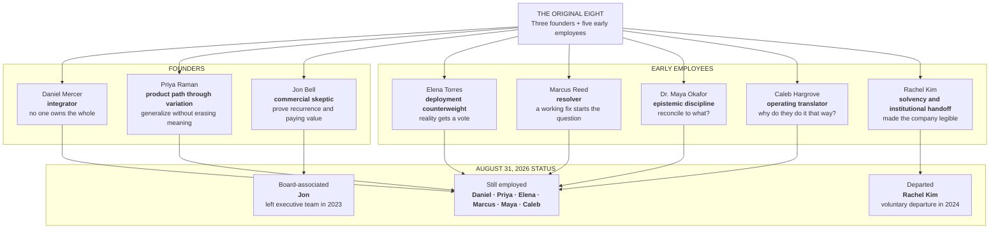

# SABLE HARBOR — THE ORIGINAL EIGHT

**Map ID:** `SH-ORG-003`  
**Status:** LOCKED identities and broad through-lines; exact 2026 titles remain outside this map

The Original Eight are the three founders and five early employees who coalesced through Sable Harbor's 2016–2017 work. They were **not** an eight-person team at Blackridge. Daniel Mercer is the only future Sable Harbor leader directly exposed to the Blackridge failure.

## Canonical formation sequence

- Daniel, Priya, and Jon form the company around three distinct necessities: the system-level wound, the semantic class of problem, and the recurrence/commercial test.
- Elena, Marcus, Maya, Caleb, and Rachel join through the 2016–2017 operating work rather than being inserted into Blackridge.
- The Forty-Seven Names, the Customer Is Right Twice, and the Spreadsheet That Would Not Die reveal the different disciplines the Original Eight bring to the company.

## What this map does not claim

- equal founder or employee ownership;
- a present-day executive committee;
- exact titles or reporting lines;
- that every member was present at incorporation;
- that Jon retains operating authority;
- that Rachel Kim remains an employee, adviser, or contractor.

## Controlling decisions

Primary anchors are `PPL-001` through `PPL-013`, together with `BR-002` through `BR-004` and `FND-001` through `FND-005`.
