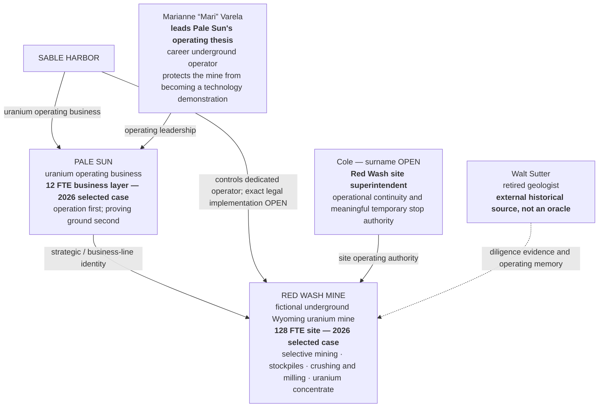
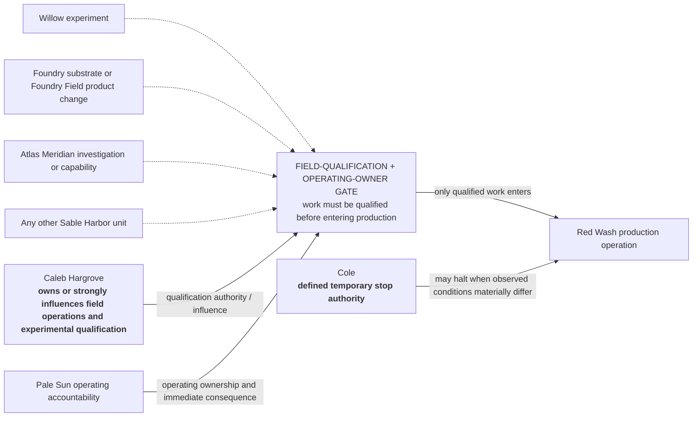

# SABLE HARBOR — PALE SUN AND RED WASH ORGANIZATION MAP

**Map ID:** `SH-ORG-008`
**Version:** 0.3.0
**Canonical date:** August 31, 2026
**Canon reviewed through:** September 5, 2026
**Map type:** Operating line, site authority, and qualification-gate map
**Edge meaning:** Narrative operating ownership, documented leadership or site authority, external evidence relationship, or a required qualification interface. **No edge establishes an unapproved legal entity or reporting line.**
**Epistemic note:** The 2026 workforce values are approved synthetic selected-case inputs, not external actuals.

## Operating structure

Walt's dotted line does not indicate employment. Dedicated Red Wash operating-company direction
is LOCKED. The selected transaction structure is also LOCKED: $28.0 million cash consideration,
$3.0 million environmental/title escrow, $0.5 million holdback, no transaction debt, and no
goodwill. `Northstar Resources` remains the PROVISIONAL working seller name. The seller's and Red
Wash operating company's exact legal names, suffixes, and jurisdictions—and detailed legal,
ownership, liability-allocation, intercompany, and governance mechanics—remain OPEN.

## Approved 2026 workforce envelope

| Organizational layer | FTE | State and interpretation |
|---|---:|---|
| Pale Sun business layer | 12 | LOCKED synthetic selected-case input; no unapproved leader, title, or reporting-line detail is inferred |
| Red Wash site | 128 | LOCKED synthetic selected-case input; the count does not turn a functional establishment into an HR reporting tree |
| Combined Pale Sun / Red Wash establishment | 140 | Arithmetic control: `12 + 128 = 140` |

The split controls the 2026 Red Wash case. It does not settle enterprise-wide headcount, the exact
legal employer of each billet, or the internal allocation of the 12 Pale Sun positions.

## Field qualification and operating-ownership gate

## Transport boundary and limited ARU/BS&T screen

```mermaid
flowchart LR
    REDWASH["RED WASH<br/>operating owner"]
    CARRIER["QUALIFIED EXTERNAL CARRIERS<br/><b>all 2025 movements</b><br/>transport authority remains external"]
    SEARCH["REPLACEMENT / ADDITIONAL<br/>QUALIFIED-CARRIER SEARCH<br/>2025 concentration and capacity response"]
    MAPPING["RAIL / INTERFACE MAPPING<br/><b>“Whose line is this?”</b>"]
    ARU["AMERICAN RESOURCE UTILITY<br/>target surfaced through operating analysis"]
    BST["BLOOD, SWEAT & TEARS RAILWAY<br/>ARU railway / short-line component"]
    GAPS["OPEN FIT GATES<br/>no direct mine connection<br/>no suitable secure transload<br/>no demonstrated uranium capability or custody"]

    CARRIER -->|qualified 2025 transport| REDWASH
    REDWASH -->|dependency response| SEARCH
    SEARCH -->|question broadens| MAPPING
    MAPPING -.->|discovery, not service authority| ARU
    ARU -->|operating component| BST
    ARU -.->|bounded interface screen| GAPS
    BST -.->|not yet a Red Wash carrier| GAPS
```

This is a dependency and diligence path, not an acquisition timeline or reporting structure. Red
Wash had no pre-existing commercial relationship with ARU or BS&T. Qualified external carriers
handled every 2025 movement, and the bridge changes neither 2025 annual sales nor revenue.

The ARU/BS&T interface remains contingent. A $15 million preliminary screen is unbooked planning
input, not purchase price or approved capital. Limited service can begin only after the applicable
physical, regulatory, training, insurance, security, equipment, route, interchange, custody, and
customer gates pass; the planning sequence is approximately 0–18 months after a separately
controlled acquisition date. No exact route, terminal, fleet, workforce, management team,
acquisition term, service rate, committed Red Wash volume, or direct uranium-custody role is
created by this map.

## Locked operating doctrine

- Pale Sun owns and operates Red Wash in the narrative canon; its exact corporate and legal form remains open.
- Red Wash is not a laboratory with a mine attached.
- Information quality is not the same as operability.
- A human claim can remain uncertain while the claimant's authority requires a pause, stop, review, or escalation.
- Cole's stop event does not make him an oracle. It demonstrates conservative action under defined authority followed by evidence consistent with his concern.
- Willow, Foundry, Atlas, and every other Sable Harbor unit must pass the same operating-ownership and field-qualification gate before testing work at Red Wash.
- Pale Sun does not perform enrichment or fuel fabrication.
- The approved transaction and 2026 operating case are synthetic diegetic facts; they are not external actuals or a public S-K 1300 reserve disclosure.
- Exact Red Wash legal name, suffix and jurisdiction; future mine-plan revisions; and post-2026 expansion remain open.
- Exact ARU acquisition, legal, network, customer, asset, workforce, financial and custody details remain reserved for a later full case.

## Controlling canon

Primary anchors: corporate-lore canon v0.3 sections 10.1–10.11, 12.1–12.5, 13.1,
and 17; `SH-PS-RW-TOR-001`; `SH-PS-RW-LOG-001`; base decision-register IDs
`PPL-010`, `PS-001`–`PS-017`, `ARU-001`–`ARU-009`, and `ID-002`; and
`SH-PS-RW-DR-001` bridge decisions `RW-017`–`RW-025`.
