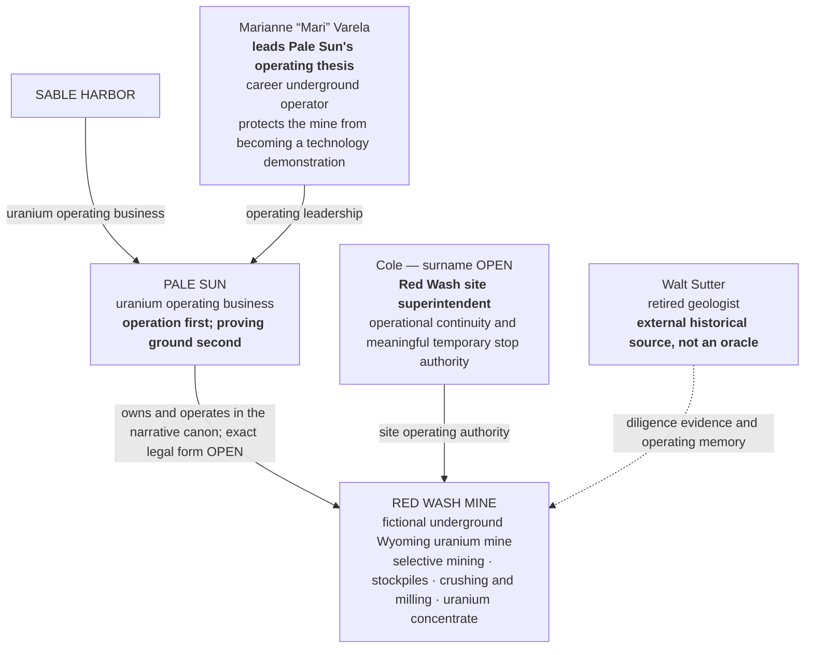
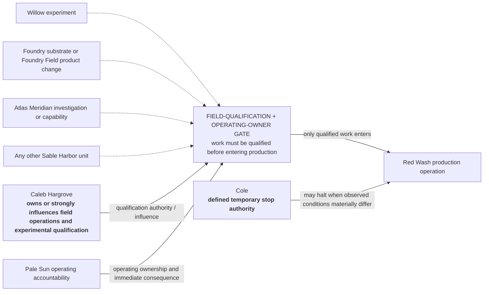

# SABLE HARBOR — PALE SUN AND RED WASH ORGANIZATION MAP

**Map ID:** `SH-ORG-008`  
**Version:** 0.2.0  
**Canonical date:** August 31, 2026  
**Map type:** Operating line, site authority, and qualification-gate map  
**Edge meaning:** Narrative operating ownership, documented leadership or site authority, external evidence relationship, or a required qualification interface. **No edge establishes an unapproved legal entity or reporting line.**

## Operating structure

Walt's dotted line does not indicate employment. The seller, transaction structure, acquisition price, financing, and exact legal ownership chain remain open; the provisional Northstar Resources and Martin Shaw names are therefore not presented as current organizational facts.

## Field qualification and operating-ownership gate

## Locked operating doctrine

- Pale Sun owns and operates Red Wash in the narrative canon; its exact corporate and legal form remains open.
- Red Wash is not a laboratory with a mine attached.
- Information quality is not the same as operability.
- A human claim can remain uncertain while the claimant's authority requires a pause, stop, review, or escalation.
- Cole's stop event does not make him an oracle. It demonstrates conservative action under defined authority followed by evidence consistent with his concern.
- Willow, Foundry, Atlas, and every other Sable Harbor unit must pass the same operating-ownership and field-qualification gate before testing work at Red Wash.
- Pale Sun does not perform enrichment or fuel fabrication.
- Reserves, mine plan, workforce, permits, production rates, closure obligations, and economics remain open.

## Controlling canon

Primary anchors: corporate-lore canon sections 10.1–10.11, 12.4–12.5, and 13.1; decision-register IDs `PPL-010`, `PS-001`–`PS-017`, `ARU-004`, `ARU-008`–`ARU-009`, and `ID-002`.
