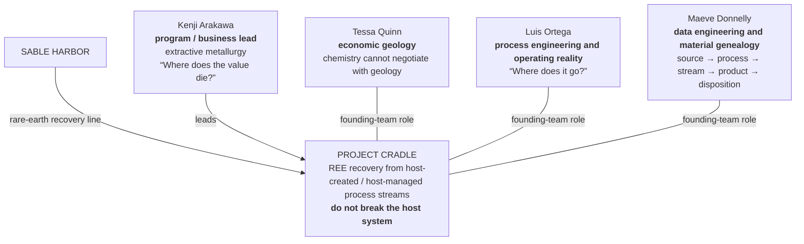
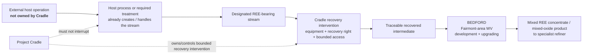

# SABLE HARBOR — PROJECT CRADLE ORGANIZATION MAP

**Map ID:** `SH-ORG-009`  
**Version:** 0.3.0  
**Canonical date:** September 6, 2026  
**Map type:** Program/business operating-boundary map  
**Current authority:** [`CRADLE_CLOSEOUT_2026-09-06.md`](../canon/CRADLE_CLOSEOUT_2026-09-06.md)

## Founding team

## Current operating boundary

## Reference cases

### Stream 17 — Kelly Gang Mining, Tasmania

- first commercial reference case;
- monazite-bearing heavy-mineral side stream created by the host's existing physical separation process;
- Cradle-owned bolt-on recovery equipment;
- exclusive right to recover the designated stream during the agreement term;
- title transfers at the defined capture point;
- Kelly Gang Mining retains host operating authority and receives negotiated participation in realized product value;
- recovered mixed REE mineral concentrate goes to a specialist downstream refiner;
- host production can continue when Cradle is bypassed.

### Morrow Run — first U.S. reference deployment

- north-central West Virginia acid-mine-drainage treatment setting;
- fictional Morrow Run Reclamation Services is the host operator;
- Gen 1 is a containerized / skid-based controlled-slipstream recovery module;
- normal treatment remains continuously available through hard bypass;
- host retains treatment, compliance and immediate stop/bypass authority;
- Cradle owns the module and recovery right, not the mine or remediation system;
- Gen 1 fouling under variable chemistry drives Gen 2 characterization and maintainability improvements;
- intermediate product is shipped to Bedford.

## Bedford

**Bedford** is Cradle's U.S. recovery-development and upgrading center in the Fairmont area of north-central West Virginia, on a fictional redeveloped industrial brownfield of approximately 15–20 acres.

It is distinct from both the external host sites and the historical Emberline / Willow geography. Exact parcel geometry remains geospatial implementation work.

## Maeve's material-genealogy doctrine

Wallaby remains dead. Maeve's contribution is recognizing that an operator's description of the physical process contradicts the official flowsheet and administrative sampling categories, then reconstructing what actually happens to the material.

The commercial chain is:

> **source → host process → designated stream → sample/assay → recovery run → captured intermediate → Bedford batch → outbound product → downstream acceptance → host settlement → financial record**

## Locked distinctions

- Cradle is an REE-recovery business, not a conventional rare-earth mine owner.
- The orebody is not necessarily the business boundary.
- Cradle seeks the smallest useful recovery intervention that does not break the host operation.
- Stream rights, equipment ownership and commercial participation do not imply host-mine ownership.
- Ned Kelly, Wallaby and Stream 17 are program/product-development history, not separate departments.
- Cradle does not commercially manufacture magnets or fully separate every individual rare-earth element in the 2026 state.
- The former Gunns placeholder and Belle / Kanawha Valley Cradle-site direction are superseded by the September 6 closeout.
- Exact legal-entity mechanics remain governed by the enterprise legal-structure workstream; this map does not create a new subsidiary.

## Controlling canon

Primary anchors: [`CRADLE_CLOSEOUT_2026-09-06.md`](../canon/CRADLE_CLOSEOUT_2026-09-06.md), corporate-lore canon sections 10.6 and 11, and decision-register IDs `AUS-004` and `CRD-001`–`CRD-010` as superseded within the closeout's stated scope.
