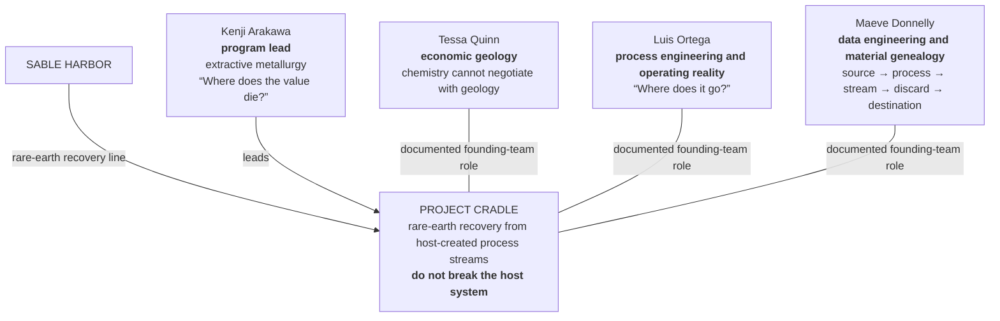
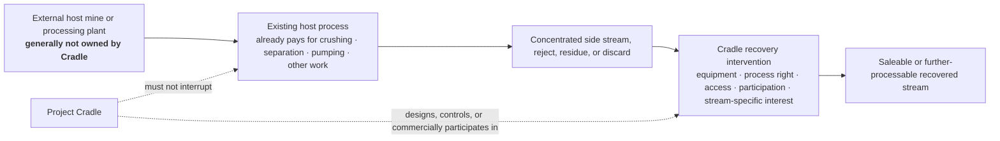

# SABLE HARBOR — PROJECT CRADLE ORGANIZATION MAP

**Map ID:** `SH-ORG-009`  
**Version:** 0.2.0  
**Canonical date:** August 31, 2026  
**Map type:** Program team and business-boundary map  
**Edge meaning:** Documented team participation, program leadership, process flow, or commercial/technical interface. **No edge means that Cradle owns the host mine or that one team member reports to another.**

## Founding team

## Business boundary

## Locked distinctions

- Cradle is not a conventional rare-earth mining company.
- The orebody is not necessarily the business boundary.
- Cradle generally seeks the smallest recovery intervention that creates value without breaking the host operation.
- The business may own or control equipment, process rights, access, recovery rights, a royalty, or another stream-specific interest; exact legal structures remain open.
- Ned Kelly, Wallaby, and Stream 17 are program and product-development history, not separate departments.
- The first host customer, material, process, economics, agreement, and legal structure remain open.

## Controlling canon

Primary anchors: corporate-lore canon sections 10.6 and 11; decision-register IDs `AUS-004` and `CRD-001`–`CRD-010`.
