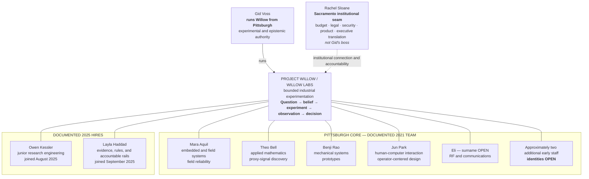
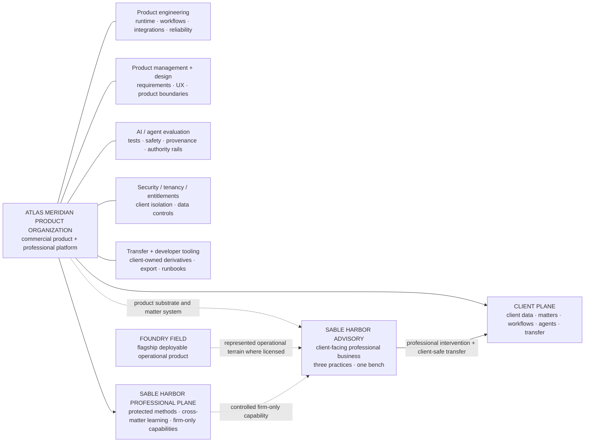

# SABLE HARBOR — WILLOW AND ATLAS MERIDIAN ORGANIZATION MAP

**Map ID:** `SH-ORG-007`  
**Version:** 0.3.0  
**Canonical date:** September 8, 2026  
**Map type:** Laboratory composition, product lineage, and current product-organization boundary  
**Edge meaning:** Documented membership, contribution, authority, lineage, or product/professional interface. **Edges are not reporting lines unless explicitly stated as “runs.”**

## Willow's two centers of gravity

The membership lines show documented participation in Willow, not a direct-report hierarchy. The exact August 31, 2026 laboratory headcount, the identities of the remaining early staff, and formal titles other than locked role descriptions remain open.

## Atlas lineage

The historical bridge remains part of Atlas's formation. The September 8 closeout changes the **current organizational interpretation**, not the lineage: the dedicated Atlas organization is now a product-development organization rather than a cross-functional professional-services bench.

## Current Atlas Meridian organization boundary

The nodes inside the Atlas product organization are capability groupings, not locked departments or headcount allocations. Exact org structure, titles and staffing remain implementation decisions unless separately canonized.

## Product and professional boundaries

- Willow's unit of work is a consequential problem, not a discipline.
- Failure is survivable; quiet drift into unsupported production is not.
- Gid can freeze experimental expansion but cannot unilaterally deploy Willow work into a production operation.
- Rachel Sloane is the Sacramento institutional seam, not Gid's manager.
- Simone's historical bridge role remains to stop uncontrolled capability growth long enough to prove repeatability and define product boundaries.
- Atlas Meridian remains a disciplined investigative system. It preserves provenance, stops when authority is missing, and admits when evidence does not support an answer.
- Atlas Meridian supports human decisions; it does not autonomously make acquisition, capital, or operating decisions.
- Atlas Meridian is both client product and Sable Harbor Advisory's professional workbench.
- The Atlas team builds the machine; Advisory owns client professional work.
- Product developers may support product incidents, requirements and controlled design partnerships but do not become a shadow consulting bench.
- Where Advisory creates a durable agent/workflow capability, Atlas must support a hardened client-ownable derivative without leaking Sable Harbor's protected professional plane.
- Foundry Field remains the flagship deployable operational product and is not reduced to an Atlas feature.

## Controlling canon

Primary historical anchors remain corporate-lore canon sections 7.4–7.8, 8, 9 and 13.1; decision-register IDs `PPL-016`, `WIL-004`–`WIL-018`, and `ATL-001`–`ATL-015`.

Current product/advisory interpretation is controlled by:

- [`SH-ADV-ATL-DR-001`](../canon/ADVISORY_ATLAS_MERIDIAN_CLOSEOUT_2026-09-08.md)
- [`SH-ATL-016`](../advisory/ATLAS_MERIDIAN_PROFESSIONAL_PLATFORM.md)
- [`SH-ADV-001`](../advisory/OPERATING_MODEL.md)
