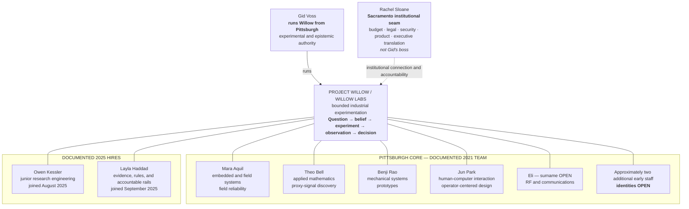
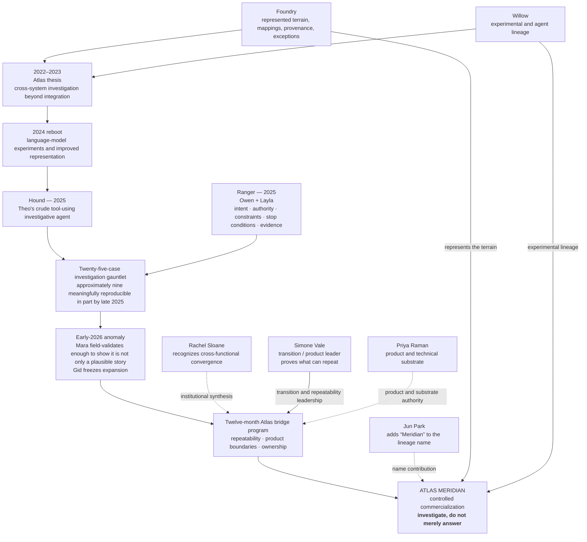

# SABLE HARBOR — WILLOW AND ATLAS MERIDIAN ORGANIZATION MAP

**Map ID:** `SH-ORG-007`  
**Version:** 0.2.0  
**Canonical date:** August 31, 2026  
**Map type:** Laboratory composition, institutional seam, and product-lineage map  
**Edge meaning:** Documented membership, contribution, authority, or lineage. **Edges are not reporting lines unless explicitly stated as “runs.”**

## Willow's two centers of gravity

The membership lines show documented participation in Willow, not a direct-report hierarchy. The exact August 31, 2026 laboratory headcount, the identities of the remaining early staff, and formal titles other than the locked role descriptions remain open.

## Atlas lineage and 2026 bridge

## Production and decision boundaries

- Willow's unit of work is a consequential problem, not a discipline.
- Failure is survivable; quiet drift into unsupported production is not.
- Gid can freeze experimental expansion but cannot unilaterally deploy Willow work into a production operation.
- Rachel Sloane is the Sacramento institutional seam, not Gid's manager.
- Simone's role is to stop uncontrolled capability growth long enough to prove repeatability and define product boundaries.
- Atlas Meridian is a disciplined investigative system. It preserves provenance, stops when authority is missing, and admits when evidence does not support an answer.
- Atlas Meridian supports human decisions; it does not autonomously make acquisition, capital, or operating decisions.

## Controlling canon

Primary anchors: corporate-lore canon sections 7.4–7.8, 8, 9, and 13.1; decision-register IDs `PPL-016`, `WIL-004`–`WIL-018`, and `ATL-001`–`ATL-015`.
