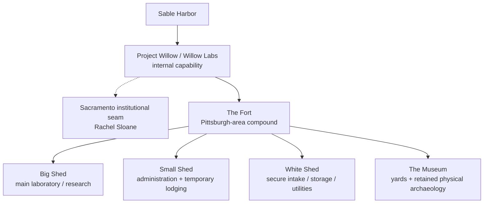

# Willow / Klein — corporate and site record

**Naming revision:** September 7, 2026, under the [Klein decision](../canon/KLEIN_NAME_AND_IDENTITY_2026-09-07.md). The substantive September 6 closeout remains in force.

**Document ID:** `SH-ORG-WIL-KLEIN-001`
**Version:** 1.1.0
**Canonical date:** September 6, 2026
**State:** Canon-derived corporate/site record

## Corporate boundary

Willow is an internal Sable Harbor capability and laboratory, not a separate corporation. Klein was the 2020–2022 eastern coal/industrial mandate and Pittsburgh advanced-engineering outpost that preceded Willow; it is closed as an operating concept and does not persist as a shadow division.

Gid Voss runs Willow from Pittsburgh. Rachel Sloane provides the Sacramento institutional seam and is not Gid's boss. Pittsburgh holds experimental and epistemic authority; Sacramento provides budget, legal, security, product and executive connection.

## The Fort

Willow's Pittsburgh-area physical center is **the Fort**, a roughly 10–20-acre working industrial research compound.

### Big Shed

Primary research/laboratory building. Most experimentation, instrumentation, prototyping, integration and hands-on research occurs here. It is not the principal administrative building and is not bulk storage.

### Small Shed

Administrative offices plus a small attached internal lodging component for short-duration stays by visiting personnel and collaborators. It is not permanent housing and not a public hotel business.

### White Shed

Controlled intake, secure storage, utility/mechanical, staging and quarantine space for unusual equipment, samples and field material that should not move directly onto the Big Shed floor.

### The Museum

The working yards and retained outdoor collection. Retired rigs, obsolete prototypes, industrial fragments and odd equipment can remain where they preserve useful physical history. “Museum” is an internal name, not a public museum designation.

## Klein archaeology

Klein survives inside Willow as history rather than authority. Original labels, stickers, stencils, prototype names, equipment markings and a historical sign may remain on surviving objects. Retired artifacts may enter the Museum. Long-tenured employees may use “Klein crew” informally for the original cohort.

The historical Klein logo is the September 7 owner-selected petrol-blue and graphite mechanical K mark, **KLEIN** wordmark, and `COAL & INDUSTRIAL SOLUTIONS` descriptor. Its controlling PNG is `assets/brand/logos/klein__primary-horizontal.png`; `assets/brand/klein_visual_manifest.json` records source integrity and approval. Willow retains its own separate identity.

## People closed in this record

- **Gid Voss** — Willow leader and systems engineer; 2018 coal-preparation mass-balance incident establishes his physical-world investigative reputation.
- **Ellis “Eli” Hoberg** — RF/communications engineer; forestry-communications background and founder of Quality Forest Communications before Sable Harbor.

## Controlling sources

- `docs/canon/WILLOW_KLEIN_CLOSEOUT_2026-09-06.md`
- `docs/canon/SABLE_HARBOR_CORPORATE_LORE_CANON_v0.3.1.md`
- `docs/finance/WILLOW_KLEIN_FINANCE_AND_CORPORATE_MODEL_2026-09-06.md`
