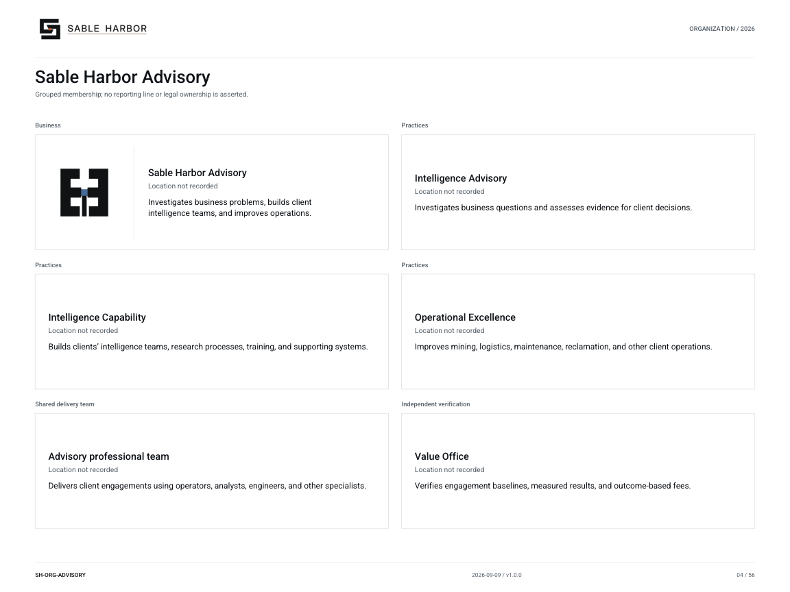

# Sable Harbor Advisory

**SH-ORG-ADVISORY · 2026-09-09 · v1.0.0**

Grouped membership; no reporting line or legal ownership is asserted.

[Vector artwork](../assets/current/advisory.svg) · [Complete chart book](../assets/current/Sable-Harbor-Organization-Charts.pdf)

The September 9 Tier 1 decision preserves Advisory as a business line of the existing contracting entity and Atlas as a separate product organization. Edition names, professional ranks and matter roles are listed in the supporting register; they do not create subsidiaries or named employees.

| Name | Location | Actual work |
| --- | --- | --- |
| Sable Harbor Advisory | Location not recorded | Investigates business problems, builds client intelligence teams, and improves operations. |
| Intelligence Advisory | Location not recorded | Investigates business questions and assesses evidence for client decisions. |
| Intelligence Capability | Location not recorded | Builds clients’ intelligence teams, research processes, training, and supporting systems. |
| Operational Excellence | Location not recorded | Improves mining, logistics, maintenance, reclamation, and other client operations. |
| Advisory professional team | Location not recorded | Delivers client engagements using operators, analysts, engineers, and other specialists. |
| Value Office | Location not recorded | Verifies engagement baselines, measured results, and outcome-based fees. |

## Source qualifications

- **Sable Harbor Advisory:** Current descriptive commercial label; final protectable name, permanent legal form and office remain OPEN.
- **Intelligence Advisory:** Three practices use one common professional team; no separate practice headcount silos. Value Office independent of delivery. "Advisory professional team" is a plain display label for the common bench, not new unit canon.
- **Intelligence Capability:** Three practices use one common professional team; no separate practice headcount silos. Value Office independent of delivery. "Advisory professional team" is a plain display label for the common bench, not new unit canon.
- **Operational Excellence:** Three practices use one common professional team; no separate practice headcount silos. Value Office independent of delivery. "Advisory professional team" is a plain display label for the common bench, not new unit canon.
- **Advisory professional team:** Three practices use one common professional team; no separate practice headcount silos. Value Office independent of delivery. "Advisory professional team" is a plain display label for the common bench, not new unit canon.
- **Value Office:** Three practices use one common professional team; no separate practice headcount silos. Value Office independent of delivery. "Advisory professional team" is a plain display label for the common bench, not new unit canon.

## Sources

- [docs/canon/ADVISORY_ATLAS_MERIDIAN_CLOSEOUT_2026-09-08.md](../../../docs/canon/ADVISORY_ATLAS_MERIDIAN_CLOSEOUT_2026-09-08.md)
- [docs/canon/DECISION_REGISTER_ADDENDUM_2026-09-09_ADVISORY_TIER1.md](../../../docs/canon/DECISION_REGISTER_ADDENDUM_2026-09-09_ADVISORY_TIER1.md)
