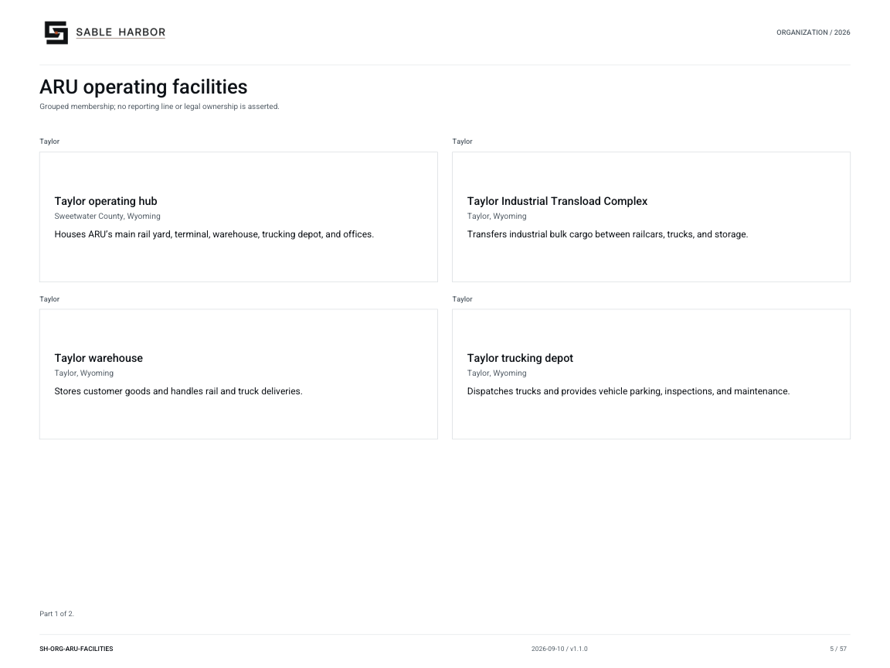
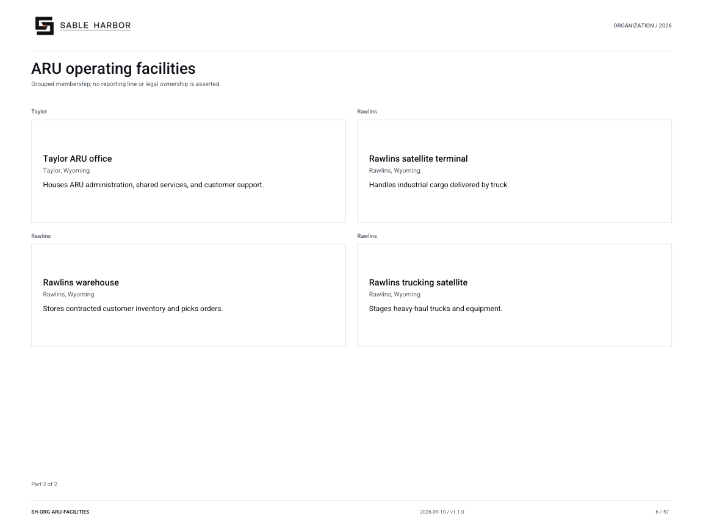

# ARU operating facilities

**SH-ORG-ARU-FACILITIES · 2026-09-10 · v1.1.0**

Grouped membership; no reporting line or legal ownership is asserted.

[Vector artwork](../assets/current/aru-facilities.svg) · [Complete chart book](../assets/current/Sable-Harbor-Organization-Charts.pdf)

[Vector artwork](../assets/current/aru-facilities-02.svg) · [Complete chart book](../assets/current/Sable-Harbor-Organization-Charts.pdf)

| Name | Location | Actual work |
| --- | --- | --- |
| Taylor operating hub | Sweetwater County, Wyoming | Houses ARU’s main rail yard, terminal, warehouse, trucking depot, and offices. |
| Taylor Industrial Transload Complex | Taylor, Wyoming | Transfers industrial bulk cargo between railcars, trucks, and storage. |
| Taylor warehouse | Taylor, Wyoming | Stores customer goods and handles rail and truck deliveries. |
| Taylor trucking depot | Taylor, Wyoming | Dispatches trucks and provides vehicle parking, inspections, and maintenance. |
| Taylor ARU office | Taylor, Wyoming | Houses ARU administration, shared services, and customer support. |
| Rawlins satellite terminal | Rawlins, Wyoming | Handles industrial cargo delivered by truck. |
| Rawlins warehouse | Rawlins, Wyoming | Stores contracted customer inventory and picks orders. |
| Rawlins trucking satellite | Rawlins, Wyoming | Stages heavy-haul trucks and equipment. |

## Source qualifications

- **Taylor operating hub:** Fictional industrial town/hub at 42.12,-108.10. Municipal ownership is not asserted; individual facilities listed separately.
- **Taylor Industrial Transload Complex:** Authored synthetic operating case; property envelope is not surveyed.
- **Taylor warehouse:** Authored synthetic operating case; property envelope is not surveyed.
- **Taylor trucking depot:** Authored synthetic operating case; property envelope is not surveyed.
- **Taylor ARU office:** Authored synthetic operating case; property envelope is not surveyed.
- **Rawlins satellite terminal:** Authored synthetic operating case; property envelope is not surveyed.
- **Rawlins warehouse:** Authored synthetic operating case; property envelope is not surveyed.
- **Rawlins trucking satellite:** Authored synthetic operating case; property envelope is not surveyed.

## Sources

- [industrial/source/operations.json](../../../industrial/source/operations.json)
