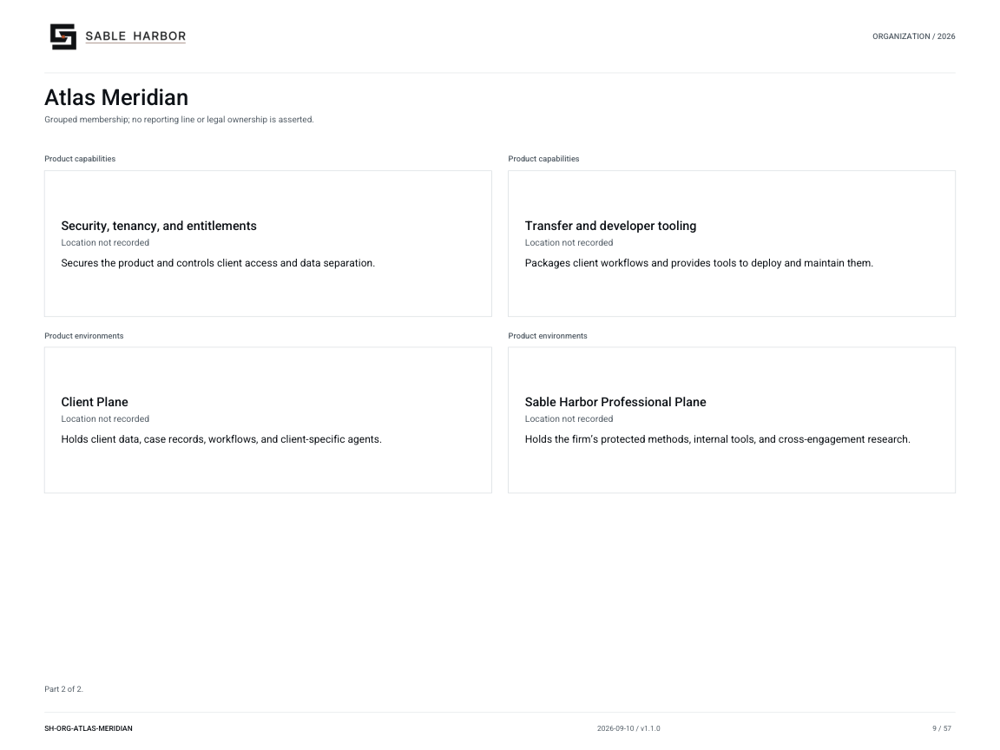

# Atlas Meridian

**SH-ORG-ATLAS-MERIDIAN · 2026-09-10 · v1.1.0**

Grouped membership; no reporting line or legal ownership is asserted.

[Vector artwork](../assets/current/atlas-meridian.svg) · [Complete chart book](../assets/current/Sable-Harbor-Organization-Charts.pdf)

[Vector artwork](../assets/current/atlas-meridian-02.svg) · [Complete chart book](../assets/current/Sable-Harbor-Organization-Charts.pdf)

The September 9 Tier 1 decision preserves Advisory as a business line of the existing contracting entity and Atlas as a separate product organization. Edition names, professional ranks and matter roles are listed in the supporting register; they do not create subsidiaries or named employees.

| Name | Location | Actual work |
| --- | --- | --- |
| Atlas Meridian | Location not recorded | Software for investigating operating data, reviewing evidence, and managing client work. |
| Product engineering | Location not recorded | Builds and maintains Atlas Meridian software. |
| Product management and design | Location not recorded | Plans product features and designs how customers use Atlas Meridian. |
| AI and agent evaluation | Location not recorded | Tests Atlas Meridian agents for accuracy, reliability, and permitted behavior. |
| Security, tenancy, and entitlements | Location not recorded | Secures the product and controls client access and data separation. |
| Transfer and developer tooling | Location not recorded | Packages client workflows and provides tools to deploy and maintain them. |
| Client Plane | Location not recorded | Holds client data, case records, workflows, and client-specific agents. |
| Sable Harbor Professional Plane | Location not recorded | Holds the firm’s protected methods, internal tools, and cross-engagement research. |

## Source qualifications

- **Atlas Meridian:** Dedicated team is product organization. Bridge history is not current Advisory staffing bench. Product location explicitly OPEN in Geo SH-SITE-0018.
- **Product engineering:** Product capability or environment. Do not draw as a separately staffed department.
- **Product management and design:** Product capability or environment. Do not draw as a separately staffed department.
- **AI and agent evaluation:** Product capability or environment. Do not draw as a separately staffed department.
- **Security, tenancy, and entitlements:** Product capability or environment. Do not draw as a separately staffed department.
- **Transfer and developer tooling:** Product capability or environment. Do not draw as a separately staffed department.
- **Client Plane:** Product capability or environment. Do not draw as a separately staffed department.
- **Sable Harbor Professional Plane:** Product capability or environment. Do not draw as a separately staffed department.

## Sources

- [docs/canon/ADVISORY_ATLAS_MERIDIAN_CLOSEOUT_2026-09-08.md](../../../docs/canon/ADVISORY_ATLAS_MERIDIAN_CLOSEOUT_2026-09-08.md)
- [docs/canon/DECISION_REGISTER_ADDENDUM_2026-09-09_ADVISORY_TIER1.md](../../../docs/canon/DECISION_REGISTER_ADDENDUM_2026-09-09_ADVISORY_TIER1.md)
