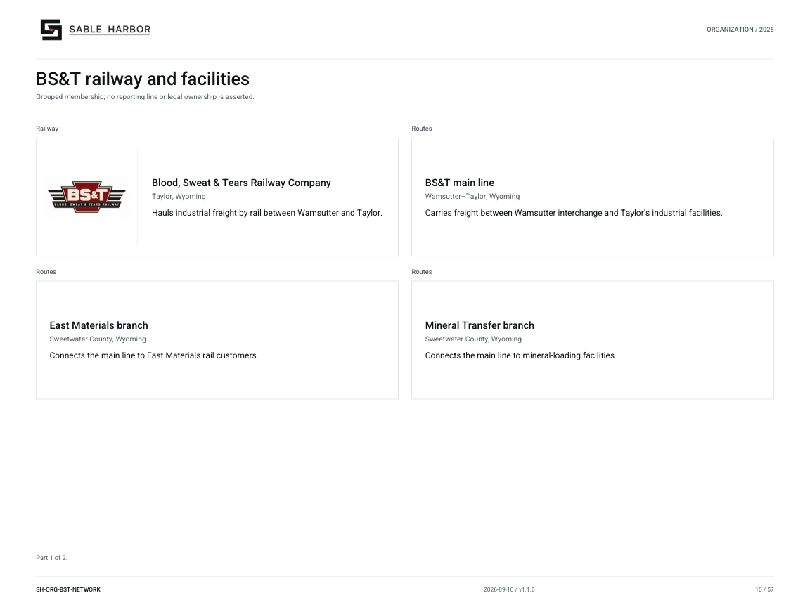
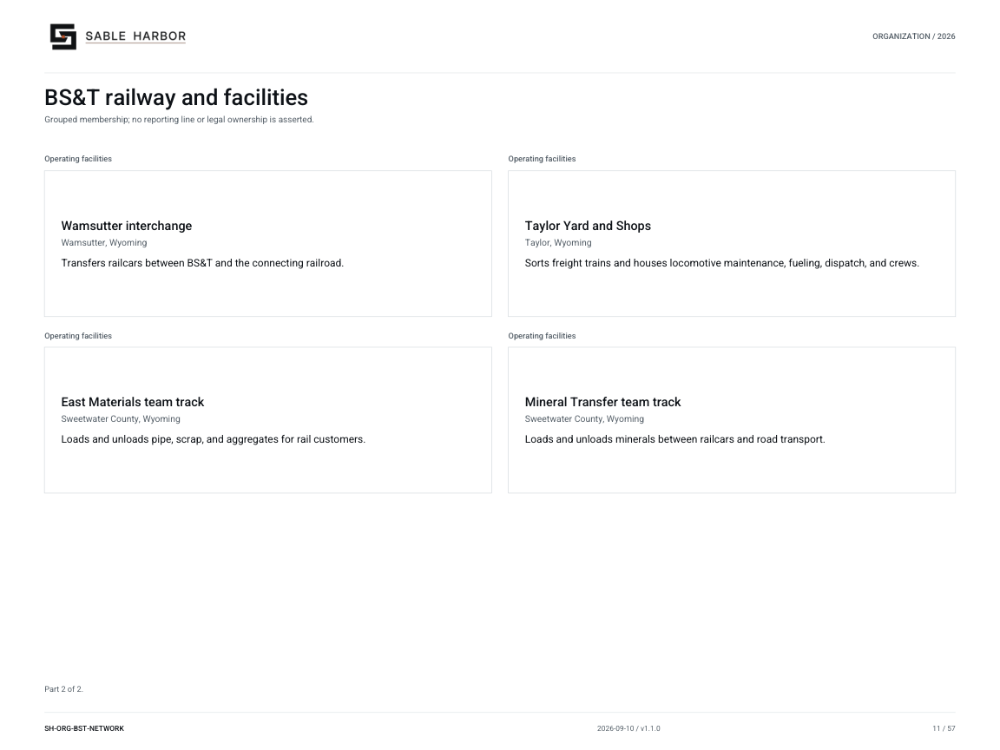

# BS&T railway and facilities

**SH-ORG-BST-NETWORK · 2026-09-10 · v1.1.0**

Grouped membership; no reporting line or legal ownership is asserted.

[Vector artwork](../assets/current/bst-network.svg) · [Complete chart book](../assets/current/Sable-Harbor-Organization-Charts.pdf)

[Vector artwork](../assets/current/bst-network-02.svg) · [Complete chart book](../assets/current/Sable-Harbor-Organization-Charts.pdf)

| Name | Location | Actual work |
| --- | --- | --- |
| Blood, Sweat & Tears Railway Company | Taylor, Wyoming | Hauls industrial freight by rail between Wamsutter and Taylor. |
| BS&T main line | Wamsutter–Taylor, Wyoming | Carries freight between Wamsutter interchange and Taylor’s industrial facilities. |
| East Materials branch | Sweetwater County, Wyoming | Connects the main line to East Materials rail customers. |
| Mineral Transfer branch | Sweetwater County, Wyoming | Connects the main line to mineral-loading facilities. |
| Wamsutter interchange | Wamsutter, Wyoming | Transfers railcars between BS&T and the connecting railroad. |
| Taylor Yard and Shops | Taylor, Wyoming | Sorts freight trains and houses locomotive maintenance, fueling, dispatch, and crews. |
| East Materials team track | Sweetwater County, Wyoming | Loads and unloads pipe, scrap, and aggregates for rail customers. |
| Mineral Transfer team track | Sweetwater County, Wyoming | Loads and unloads minerals between railcars and road transport. |

## Source qualifications

- **Blood, Sweat & Tears Railway Company:** 100% owned by ARU. 40 unique route miles. No Rawlins branch or Red Wash mine spur.
- **BS&T main line:** Part of 40 unique route miles. Track-segment records retained in detailed asset appendix.
- **East Materials branch:** Part of 40 unique route miles. Track-segment records retained in detailed asset appendix.
- **Mineral Transfer branch:** Part of 40 unique route miles. Track-segment records retained in detailed asset appendix.
- **Wamsutter interchange:** Authored synthetic operating case; property envelope is not surveyed.
- **Taylor Yard and Shops:** Authored synthetic operating case; property envelope is not surveyed.
- **East Materials team track:** Authored synthetic operating case; property envelope is not surveyed.
- **Mineral Transfer team track:** Authored synthetic operating case; property envelope is not surveyed.

## Sources

- [industrial/source/entities.json](../../../industrial/source/entities.json)
- [industrial/source/operations.json](../../../industrial/source/operations.json)
