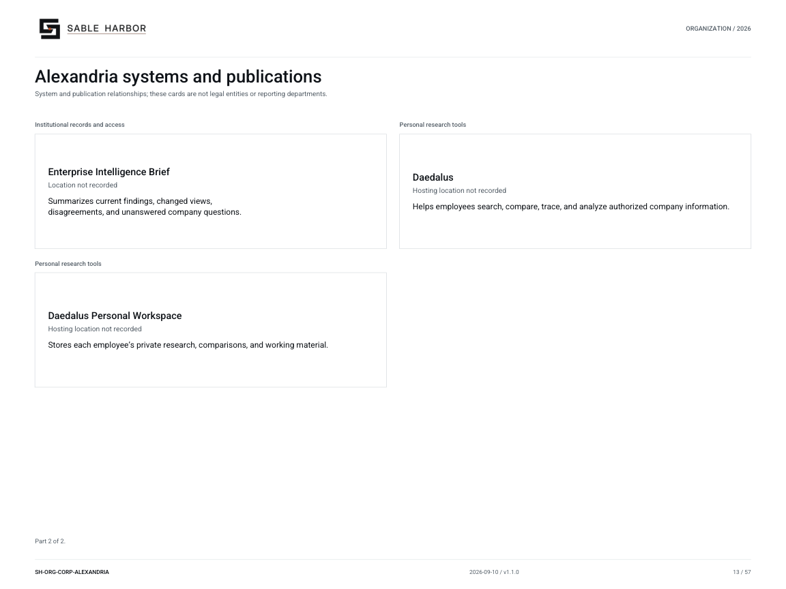

# Alexandria systems and publications

**SH-ORG-CORP-ALEXANDRIA · 2026-09-10 · v1.1.0**

System and publication relationships; these cards are not legal entities or reporting departments.

[Vector artwork](../assets/current/corporate-alexandria.svg) · [Complete chart book](../assets/current/Sable-Harbor-Organization-Charts.pdf)

[Vector artwork](../assets/current/corporate-alexandria-02.svg) · [Complete chart book](../assets/current/Sable-Harbor-Organization-Charts.pdf)

| Name | Location | Actual work |
| --- | --- | --- |
| Alexandria | Hosting location not recorded | Connects company evidence, decisions, financial records, and historical research. |
| Pinakes | Hosting location not recorded | Provides a searchable catalog and entry point to company records. |
| Canon | Hosting location not recorded | Maintains current company findings and the evidence and changes behind them. |
| Semaphore | Hosting location not recorded | Records and distributes intelligence reports, decision context, corrections, and follow-up. |
| Enterprise Intelligence Brief | Location not recorded | Summarizes current findings, changed views, disagreements, and unanswered company questions. |
| Daedalus | Hosting location not recorded | Helps employees search, compare, trace, and analyze authorized company information. |
| Daedalus Personal Workspace | Hosting location not recorded | Stores each employee’s private research, comparisons, and working material. |

## Source qualifications

- **Alexandria:** Architecture/doctrine exists; runtime implementation is not asserted. No separate legal entity or employee reporting chain.
- **Pinakes:** Architecture/doctrine exists; runtime implementation is not asserted. No separate legal entity or employee reporting chain.
- **Canon:** Architecture/doctrine exists; runtime implementation is not asserted. No separate legal entity or employee reporting chain.
- **Semaphore:** Architecture/doctrine exists; runtime implementation is not asserted. No separate legal entity or employee reporting chain.
- **Daedalus:** Architecture/doctrine exists; runtime implementation is not asserted. No separate legal entity or employee reporting chain.
- **Daedalus Personal Workspace:** Architecture/doctrine exists; runtime implementation is not asserted. No separate legal entity or employee reporting chain.

## Sources

- [docs/j2/alexandria/ALEXANDRIA_CHARTER.md](../../../docs/j2/alexandria/ALEXANDRIA_CHARTER.md)
- [docs/j2/alexandria/PINAKES_PORTAL_AND_UX.md](../../../docs/j2/alexandria/PINAKES_PORTAL_AND_UX.md)
- [docs/j2/alexandria/CANON_INSTITUTIONAL_KNOWLEDGE.md](../../../docs/j2/alexandria/CANON_INSTITUTIONAL_KNOWLEDGE.md)
- [docs/j2/alexandria/SEMAPHORE_TRAFFIC_SYSTEM.md](../../../docs/j2/alexandria/SEMAPHORE_TRAFFIC_SYSTEM.md)
- [docs/j2/EIB_AND_ENTERPRISE_QUESTIONS.md](../../../docs/j2/EIB_AND_ENTERPRISE_QUESTIONS.md)
- [docs/j2/alexandria/DAEDALUS_OPERATING_DOCTRINE.md](../../../docs/j2/alexandria/DAEDALUS_OPERATING_DOCTRINE.md)
- [docs/j2/alexandria/DAEDALUS_PERSONAL_INSTANCE_AND_WORKSPACE.md](../../../docs/j2/alexandria/DAEDALUS_PERSONAL_INSTANCE_AND_WORKSPACE.md)
