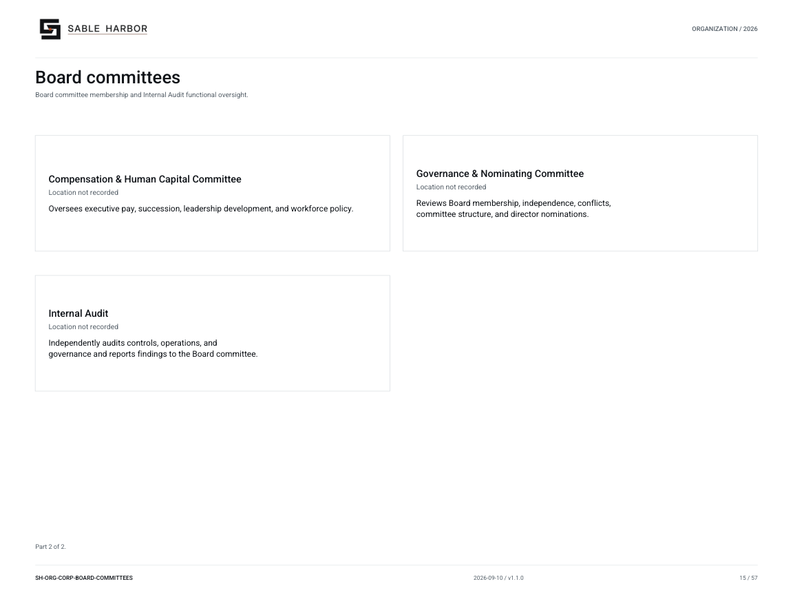

# Board committees

**SH-ORG-CORP-BOARD-COMMITTEES · 2026-09-10 · v1.1.0**

Board committee membership and Internal Audit functional oversight.

[Vector artwork](../assets/current/corporate-board-committees.svg) · [Complete chart book](../assets/current/Sable-Harbor-Organization-Charts.pdf)

[Vector artwork](../assets/current/corporate-board-committees-02.svg) · [Complete chart book](../assets/current/Sable-Harbor-Organization-Charts.pdf)

| Name | Location | Actual work |
| --- | --- | --- |
| Board of Directors | Location not recorded | Oversees management, approves major commitments, and appoints senior leadership. |
| Audit & Compliance Committee | Location not recorded | Oversees financial reporting, controls, compliance, whistleblowing, and independent audit. |
| Finance & Investment Committee | Location not recorded | Reviews capital allocation, liquidity, borrowing, major investments, and acquisitions. |
| Technology & Operations Committee | Location not recorded | Oversees technology risk, cybersecurity, operational reliability, and asset integrity. |
| Compensation & Human Capital Committee | Location not recorded | Oversees executive pay, succession, leadership development, and workforce policy. |
| Governance & Nominating Committee | Location not recorded | Reviews Board membership, independence, conflicts, committee structure, and director nominations. |
| Internal Audit | Location not recorded | Independently audits controls, operations, and governance and reports findings to the Board committee. |

## Source qualifications

- **Board of Directors:** Sacramento is proposed from the headquarters relationship; this unit’s geographic address is not separately recorded.
- **Audit & Compliance Committee:** Sacramento is proposed from the headquarters relationship; this unit’s geographic address is not separately recorded.
- **Finance & Investment Committee:** Sacramento is proposed from the headquarters relationship; this unit’s geographic address is not separately recorded.
- **Technology & Operations Committee:** Sacramento is proposed from the headquarters relationship; this unit’s geographic address is not separately recorded.
- **Compensation & Human Capital Committee:** Sacramento is proposed from the headquarters relationship; this unit’s geographic address is not separately recorded.
- **Governance & Nominating Committee:** Sacramento is proposed from the headquarters relationship; this unit’s geographic address is not separately recorded.
- **Internal Audit:** Functional reporting to committee. ESS may supply administration but has no control over audit work. Sacramento is proposed from the headquarters relationship; this unit’s geographic address is not separately recorded.

## Sources

- [docs/governance/BOARD_AND_CAPITAL_GOVERNANCE_v1.0.1.md](../../../docs/governance/BOARD_AND_CAPITAL_GOVERNANCE_v1.0.1.md)
- [docs/governance/committees/AUDIT_AND_COMPLIANCE_COMMITTEE_CHARTER.md](../../../docs/governance/committees/AUDIT_AND_COMPLIANCE_COMMITTEE_CHARTER.md)
- [docs/governance/committees/FINANCE_AND_INVESTMENT_COMMITTEE_CHARTER.md](../../../docs/governance/committees/FINANCE_AND_INVESTMENT_COMMITTEE_CHARTER.md)
- [docs/governance/committees/TECHNOLOGY_AND_OPERATIONS_COMMITTEE_CHARTER.md](../../../docs/governance/committees/TECHNOLOGY_AND_OPERATIONS_COMMITTEE_CHARTER.md)
- [docs/governance/committees/COMPENSATION_AND_HUMAN_CAPITAL_COMMITTEE_CHARTER.md](../../../docs/governance/committees/COMPENSATION_AND_HUMAN_CAPITAL_COMMITTEE_CHARTER.md)
- [docs/governance/committees/GOVERNANCE_AND_NOMINATING_COMMITTEE_CHARTER.md](../../../docs/governance/committees/GOVERNANCE_AND_NOMINATING_COMMITTEE_CHARTER.md)
- [docs/canon/CORPORATE_HEADQUARTERS_CLOSEOUT_2026-09-03.md](../../../docs/canon/CORPORATE_HEADQUARTERS_CLOSEOUT_2026-09-03.md)
- [docs/governance/ENTERPRISE_SUPPORT_SERVICES_AND_INDEPENDENCE.md](../../../docs/governance/ENTERPRISE_SUPPORT_SERVICES_AND_INDEPENDENCE.md)
