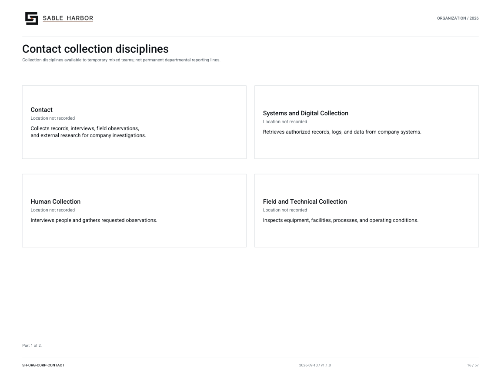
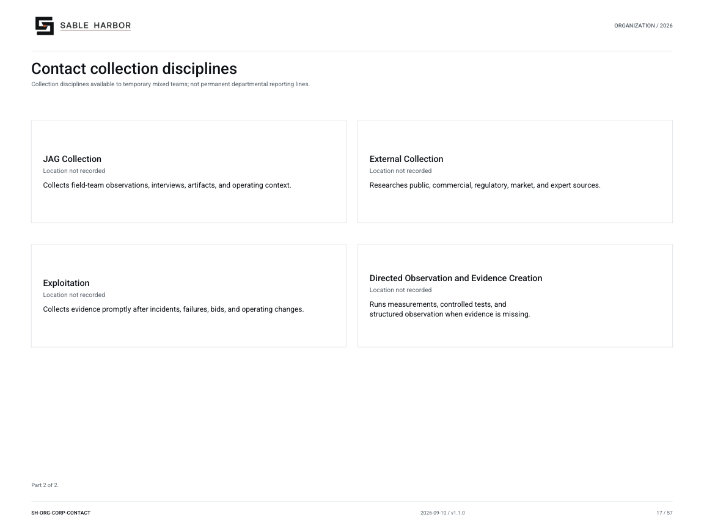

# Contact collection disciplines

**SH-ORG-CORP-CONTACT · 2026-09-10 · v1.1.0**

Collection disciplines available to temporary mixed teams; not permanent departmental reporting lines.

[Vector artwork](../assets/current/corporate-contact-disciplines.svg) · [Complete chart book](../assets/current/Sable-Harbor-Organization-Charts.pdf)

[Vector artwork](../assets/current/corporate-contact-disciplines-02.svg) · [Complete chart book](../assets/current/Sable-Harbor-Organization-Charts.pdf)

| Name | Location | Actual work |
| --- | --- | --- |
| Contact | Location not recorded | Collects records, interviews, field observations, and external research for company investigations. |
| Systems and Digital Collection | Location not recorded | Retrieves authorized records, logs, and data from company systems. |
| Human Collection | Location not recorded | Interviews people and gathers requested observations. |
| Field and Technical Collection | Location not recorded | Inspects equipment, facilities, processes, and operating conditions. |
| JAG Collection | Location not recorded | Collects field-team observations, interviews, artifacts, and operating context. |
| External Collection | Location not recorded | Researches public, commercial, regulatory, market, and expert sources. |
| Exploitation | Location not recorded | Collects evidence promptly after incidents, failures, bids, and operating changes. |
| Directed Observation and Evidence Creation | Location not recorded | Runs measurements, controlled tests, and structured observation when evidence is missing. |

## Source qualifications

- **Contact:** 78 authorized billets; teams deployed across sites. Base city not separately established.
- **Systems and Digital Collection:** Disciplines form temporary mixed teams, not permanent departments.
- **Human Collection:** Disciplines form temporary mixed teams, not permanent departments.
- **Field and Technical Collection:** Disciplines form temporary mixed teams, not permanent departments.
- **JAG Collection:** Disciplines form temporary mixed teams, not permanent departments.
- **External Collection:** Disciplines form temporary mixed teams, not permanent departments.
- **Exploitation:** Disciplines form temporary mixed teams, not permanent departments.
- **Directed Observation and Evidence Creation:** Disciplines form temporary mixed teams, not permanent departments.

## Sources

- [docs/canon/DECISION_REGISTER_ADDENDUM_2026-09-03.md](../../../docs/canon/DECISION_REGISTER_ADDENDUM_2026-09-03.md)
- [docs/j2/CONTACT_COLLECTION_MANAGEMENT.md](../../../docs/j2/CONTACT_COLLECTION_MANAGEMENT.md)
